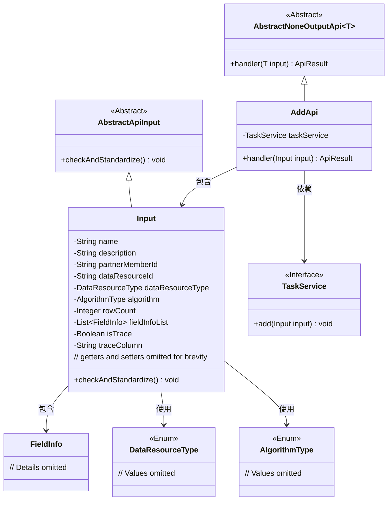

# 基础信息

|      |      |
|------|------|
| 名称 | AddApi |
| 编码语言 | .java |
| 代码路径 | WeFe/fusion/fusion-service/src/main/java/com/welab/wefe/data/fusion/service/api/task/AddApi.java |
| 包名 | com.welab.wefe.data.fusion.service.api.task |
| 依赖项 | ['com.welab.wefe.common.StatusCode', 'com.welab.wefe.common.exception.StatusCodeWithException', 'com.welab.wefe.common.fieldvalidate.annotation.Check', 'com.welab.wefe.common.util.StringUtil', 'com.welab.wefe.common.web.api.base.AbstractNoneOutputApi', 'com.welab.wefe.common.web.api.base.Api', 'com.welab.wefe.common.web.dto.AbstractApiInput', 'com.welab.wefe.common.web.dto.ApiResult', 'com.welab.wefe.data.fusion.service.enums.AlgorithmType', 'com.welab.wefe.data.fusion.service.enums.DataResourceType', 'com.welab.wefe.data.fusion.service.service.TaskService', 'com.welab.wefe.data.fusion.service.utils.primarykey.FieldInfo', 'org.apache.commons.collections4.CollectionUtils', 'org.springframework.beans.factory.annotation.Autowired', 'java.util.List'] |
| 概述说明 | 添加对齐任务的API接口，包含任务名称、描述、合作方成员ID、数据资源ID等参数，并进行参数校验。 |

# 说明

该代码定义了一个名为AddApi的API类，用于添加对齐任务。API路径为task/add，接受输入参数Input，包含任务名称、描述、合作方成员ID、数据资源ID、数据资源类型、算法类型、样本量、主键处理字段列表、是否追溯及追溯字段等属性。输入参数通过注解进行校验，包括必填项、长度限制等。handler方法调用taskService.add处理输入数据。Input类还包含自定义校验逻辑，确保数据样本、合作方、主键设置等必填项有效，并检查追溯字段不与主键字段冲突。所有属性均提供getter和setter方法。

# 类列表 Class Summary

| 名称   | 类型  | 说明 |
|-------|------|-------------|
| AddApi | class | 添加对齐任务的API接口，包含任务名称、描述、合作方成员ID、数据资源ID等参数，并进行参数校验和标准化处理。 |

## 类 AddApi

|      |      |
|------|------|
| 访问范围 | @Api(path = "task/add", name = "添加对齐任务", desc = "添加对齐任务");public |
| 类型 | class |
| 名称 | AddApi |
| 说明 | 添加对齐任务的API接口，包含任务名称、描述、合作方成员ID、数据资源ID等参数，并进行参数校验和标准化处理。 |

### UML类图

这段代码描述了一个添加对齐任务的API实现。AddApi继承自AbstractNoneOutputApi，处理Input类型的输入参数，通过TaskService执行实际任务添加操作。Input类继承自AbstractApiInput，包含任务名称、描述、合作方成员ID等字段，并通过checkAndStandardize方法进行参数校验和标准化处理。类图展示了各组件间的继承、依赖和包含关系，体现了清晰的层次结构和职责划分。

### 内部方法调用关系图

```mermaid
graph TD
    A["类AddApi"]
    B["继承: AbstractNoneOutputApi<Input>"]
    C["依赖: TaskService taskService"]
    D["重写方法: handler(Input input)"]
    E["嵌套类: Input"]
    F["属性: String name"]
    G["属性: String description"]
    H["属性: String partnerMemberId"]
    I["属性: String dataResourceId"]
    J["属性: DataResourceType dataResourceType"]
    K["属性: AlgorithmType algorithm"]
    L["属性: Integer rowCount"]
    M["属性: List<FieldInfo> fieldInfoList"]
    N["属性: Boolean isTrace"]
    O["属性: String traceColumn"]
    P["方法: checkAndStandardize()"]
    Q["方法: 各属性的getter/setter"]

    A --> B
    A --> C
    A --> D
    A --> E
    E --> F
    E --> G
    E --> H
    E --> I
    E --> J
    E --> K
    E --> L
    E --> M
    E --> N
    E --> O
    E --> P
    E --> Q
```

该流程图展示了AddApi类的完整结构，包含其继承关系、依赖服务、核心处理方法和嵌套的Input类。Input类包含12个带校验规则的属性和参数标准化方法，其中handler方法通过taskService.add()处理输入参数。所有属性都配有标准getter/setter，checkAndStandardize()方法实现了7种业务参数校验逻辑，包括空值检查、字段互斥性校验等核心验证规则。

### 字段列表 Field List

| 名称  | 类型  | 说明 |
|-------|-------|------|
| taskService | TaskService | 自动注入TaskService实例。 |

### 方法列表

| 名称  | 类型  | 说明 |
|-------|-------|------|
| handler | ApiResult | 方法重写处理输入，调用任务服务添加输入后返回成功结果。若异常则抛出状态码异常。 |

