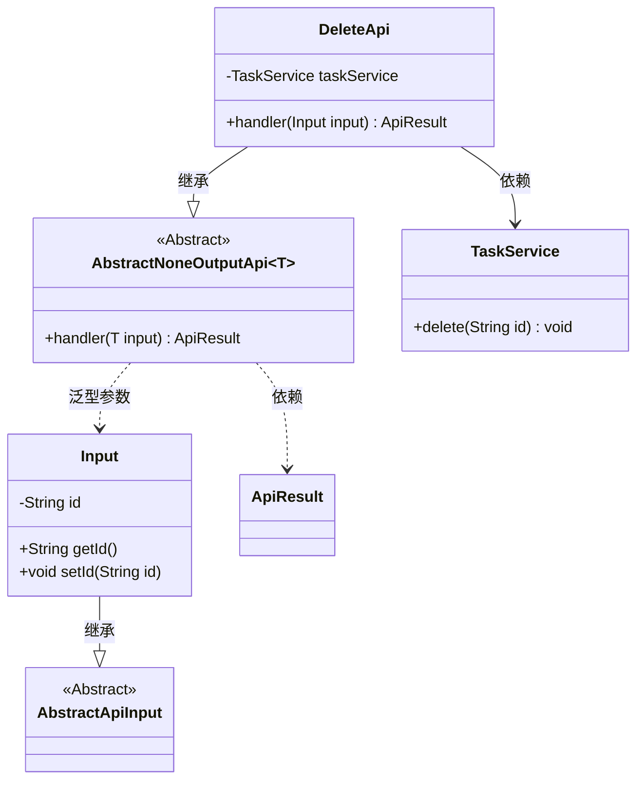

# 基础信息

|      |      |
|------|------|
| 名称 | DeleteApi |
| 编码语言 | .java |
| 代码路径 | WeFe/fusion/fusion-service/src/main/java/com/welab/wefe/data/fusion/service/api/task/DeleteApi.java |
| 包名 | com.welab.wefe.data.fusion.service.api.task |
| 依赖项 | ['com.welab.wefe.common.exception.StatusCodeWithException', 'com.welab.wefe.common.fieldvalidate.annotation.Check', 'com.welab.wefe.common.web.api.base.AbstractNoneOutputApi', 'com.welab.wefe.common.web.api.base.Api', 'com.welab.wefe.common.web.dto.AbstractApiInput', 'com.welab.wefe.common.web.dto.ApiResult', 'com.welab.wefe.data.fusion.service.service.TaskService', 'org.springframework.beans.factory.annotation.Autowired'] |
| 概述说明 | 删除合作方的API接口，需登录，调用taskService删除指定ID的合作方，成功返回空结果。输入参数为必填的ID字符串。 |

# 说明

这是一个名为DeleteApi的Java类，用于删除合作方任务。该类继承自AbstractNoneOutputApi，使用泛型指定输入参数类型为内部类Input。通过@Api注解定义了API路径为"task/delete"，需要登录验证。核心逻辑在handler方法中，调用taskService的delete方法完成删除操作。输入参数Input包含一个必填字段id，通过@Check注解进行校验。整个API设计简洁，实现了基本的删除功能。

# 类列表 Class Summary

| 名称   | 类型  | 说明 |
|-------|------|-------------|
| DeleteApi | class | 删除合作方的API接口，需登录，接收id参数并调用taskService执行删除操作。 |

## 类 DeleteApi

|      |      |
|------|------|
| 访问范围 | @Api(path = "task/delete", name = "删除合作方", desc = "删除合作方", login = true);public |
| 类型 | class |
| 名称 | DeleteApi |
| 说明 | 删除合作方的API接口，需登录，接收id参数并调用taskService执行删除操作。 |

### UML类图

这段代码定义了一个删除任务的API接口`DeleteApi`，它继承自泛型抽象类`AbstractNoneOutputApi`，并处理`Input`类型的输入参数。`DeleteApi`通过`TaskService`执行实际删除操作，输入参数`Input`继承自`AbstractApiInput`并包含一个必填的`id`字段。类图清晰地展示了类之间的继承、依赖和泛型关系，体现了API处理流程中各个组件的协作方式。

### 内部方法调用关系图

```mermaid
graph TD
    A["类DeleteApi"]
    B["注解: @Api"]
    C["继承: AbstractNoneOutputApi<Input>"]
    D["依赖注入: @Autowired TaskService"]
    E["重写方法: handler(Input input)"]
    F["静态内部类: Input"]
    G["校验注解: @Check String id"]
    H["方法: getId/setId"]
    I["调用: taskService.delete"]
    J["返回: success()"]

    A --> B
    A --> C
    A --> D
    A --> E
    E --> I
    E --> J
    A --> F
    F --> G
    F --> H
```

流程图展示了DeleteApi类的结构和工作流程。该类通过@Api注解定义接口元数据，继承抽象模板类处理输入参数。核心handler方法调用taskService执行删除操作后返回成功结果，内部类Input包含经过校验的id字段及访问方法。整体流程清晰展现了从请求处理到服务调用的完整链路。

### 字段列表 Field List

| 名称  | 类型  | 说明 |
|-------|-------|------|
| taskService | TaskService | 自动注入TaskService实例。 |

### 方法列表

| 名称  | 类型  | 说明 |
|-------|-------|------|
| handler | ApiResult | 删除指定ID的任务并返回成功结果。 |

