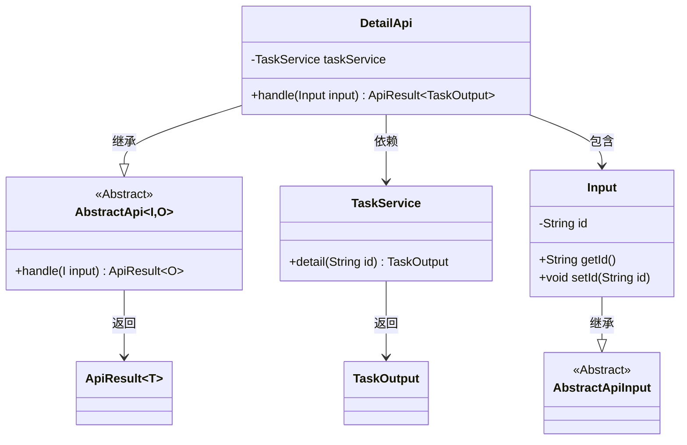

# 基础信息

|      |      |
|------|------|
| 名称 | DetailApi |
| 编码语言 | .java |
| 代码路径 | WeFe/fusion/fusion-service/src/main/java/com/welab/wefe/data/fusion/service/api/task/DetailApi.java |
| 包名 | com.welab.wefe.data.fusion.service.api.task |
| 依赖项 | ['com.welab.wefe.common.exception.StatusCodeWithException', 'com.welab.wefe.common.fieldvalidate.annotation.Check', 'com.welab.wefe.common.web.api.base.AbstractApi', 'com.welab.wefe.common.web.api.base.Api', 'com.welab.wefe.common.web.dto.AbstractApiInput', 'com.welab.wefe.common.web.dto.ApiResult', 'com.welab.wefe.data.fusion.service.dto.entity.TaskOutput', 'com.welab.wefe.data.fusion.service.service.TaskService', 'org.springframework.beans.factory.annotation.Autowired'] |
| 概述说明 | 任务详情API类，通过taskId查询任务详情，继承抽象API类，使用TaskService处理请求，返回任务输出结果。 |

# 说明

该代码定义了一个名为DetailApi的API类，用于处理任务详情查询。类路径为"task/detail"，名称为"任务列表"。它继承自AbstractApi，输入类型为DetailApi.Input，输出类型为TaskOutput。通过自动注入的TaskService调用detail方法获取任务详情。输入类Input继承AbstractApiInput，包含一个必填字段id，用于指定要查询的任务ID。API处理逻辑封装在handle方法中，成功时返回任务详情数据。

# 类列表 Class Summary

| 名称   | 类型  | 说明 |
|-------|------|-------------|
| DetailApi | class | 任务详情API类，路径为task/detail，通过taskId查询任务详情，返回TaskOutput结果。输入参数为必须的id字段。 |

## 类 DetailApi

|      |      |
|------|------|
| 访问范围 | @Api(path = "task/detail", name = "任务列表", desc = "任务列表");public |
| 类型 | class |
| 名称 | DetailApi |
| 说明 | 任务详情API类，路径为task/detail，通过taskId查询任务详情，返回TaskOutput结果。输入参数为必须的id字段。 |

### UML类图

这段代码展示了一个任务详情API的实现结构。DetailApi继承自泛型抽象类AbstractApi，处理Input输入并返回包含TaskOutput的ApiResult。内部类Input继承自AbstractApiInput，包含任务ID字段。DetailApi通过依赖注入的TaskService获取任务详情，体现了清晰的层级关系和职责划分。注解表明这是一个处理任务详情的REST接口，输入参数需要校验非空。整体设计符合面向对象原则，通过泛型和继承实现了代码复用。

### 内部方法调用关系图

```mermaid
graph TD
    A["类DetailApi"]
    B["注解: @Api"]
    C["继承: AbstractApi<Input, TaskOutput>"]
    D["依赖注入: @Autowired TaskService"]
    E["重写方法: handle(Input input)"]
    F["静态内部类: Input"]
    G["属性: String id"]
    H["校验注解: @Check"]
    I["方法: getId()"]
    J["方法: setId(String id)"]
    K["调用: taskService.detail(input.id)"]
    L["返回: ApiResult.success()"]

    A --> B
    A --> C
    A --> D
    A --> E
    E --> K
    K --> L
    A --> F
    F --> G
    F --> H
    F --> I
    F --> J
```

该流程图展示了DetailApi类的结构，它是一个带有@Api注解的REST接口类，继承自AbstractApi并注入TaskService。核心方法handle通过taskService查询任务详情并返回结果。Input作为静态内部类包含任务ID字段及其getter/setter，并通过@Check注解进行参数校验。整体流程清晰展现了从请求处理到结果返回的调用链路。

### 字段列表 Field List

| 名称  | 类型  | 说明 |
|-------|-------|------|
| taskService | TaskService | 自动注入TaskService实例。 |

### 方法列表

| 名称  | 类型  | 说明 |
|-------|-------|------|
| handle | ApiResult<TaskOutput> | 处理任务详情请求，调用任务服务获取详情并返回成功结果。 |

