# 基础信息

|      |      |
|------|------|
| 名称 | HandleApi |
| 编码语言 | .java |
| 代码路径 | WeFe/fusion/fusion-service/src/main/java/com/welab/wefe/data/fusion/service/api/task/HandleApi.java |
| 包名 | com.welab.wefe.data.fusion.service.api.task |
| 依赖项 | ['com.welab.wefe.common.StatusCode', 'com.welab.wefe.common.exception.StatusCodeWithException', 'com.welab.wefe.common.fieldvalidate.annotation.Check', 'com.welab.wefe.common.util.StringUtil', 'com.welab.wefe.common.web.api.base.AbstractNoneOutputApi', 'com.welab.wefe.common.web.api.base.Api', 'com.welab.wefe.common.web.dto.AbstractApiInput', 'com.welab.wefe.common.web.dto.ApiResult', 'com.welab.wefe.data.fusion.service.enums.DataResourceType', 'com.welab.wefe.data.fusion.service.service.TaskService', 'com.welab.wefe.data.fusion.service.utils.primarykey.FieldInfo', 'org.springframework.beans.factory.annotation.Autowired', 'java.util.List'] |
| 概述说明 | 任务处理API类，接收任务ID、数据资源ID、类型、样本量等参数，验证主键和追溯字段后调用任务服务处理。 |

# 说明

HandleApi是一个任务处理接口，继承自AbstractNoneOutputApi，路径为task/handle。它依赖TaskService处理输入参数Input。Input类包含任务Id、数据资源id、数据资源类型、样本量、主键处理字段列表、是否追溯及追溯字段等属性，均带有校验注解。输入参数需满足特定条件：若数据资源类型为DataSet，主键处理字段列表不能为空；若开启追溯，追溯字段不能为空。类提供各属性的getter和setter方法，并在checkAndStandardize方法中进行参数校验。

# 类列表 Class Summary

| 名称   | 类型  | 说明 |
|-------|------|-------------|
| HandleApi | class | HandleApi是任务处理接口，继承AbstractNoneOutputApi，输入参数包括任务ID、数据资源ID、类型、样本量、主键处理字段、是否追溯及追溯字段。参数校验确保数据集类型时主键非空，追溯时字段非空。调用taskService处理任务并返回成功结果。 |


## 类 HandleApi

|      |      |
|------|------|
| 访问范围 | @Api(path = "task/handle", name = "任务处理", desc = "任务处理");public |
| 类型 | class |
| 名称 | HandleApi |
| 说明 | HandleApi是任务处理接口，继承AbstractNoneOutputApi，输入参数包括任务ID、数据资源ID、类型、样本量、主键处理字段、是否追溯及追溯字段。参数校验确保数据集类型时主键非空，追溯时字段非空。调用taskService处理任务并返回成功结果。 |


### UML类图

```mermaid
classDiagram
    class HandleApi {
        -TaskService taskService
        +handler(HandleApi~Input~ input) ApiResult
    }
    HandleApi --> TaskService : 依赖
    HandleApi --> AbstractNoneOutputApi~HandleApi~Input~~ : 继承

    class AbstractNoneOutputApi~T~ {
        <<Abstract>>
        +handler(T input) ApiResult
    }

    class HandleApi~Input~ {
        -String id
        -String dataResourceId
        -DataResourceType dataResourceType
        -Integer rowCount
        -List~FieldInfo~ fieldInfoList
        -Boolean isTrace
        -String traceColumn
        +checkAndStandardize() void
        // getters/setters省略
    }
    HandleApi~Input~ --> AbstractApiInput : 继承

    class AbstractApiInput {
        <<Abstract>>
        +checkAndStandardize() void
    }

    class TaskService {
        +handle(HandleApi~Input~ input) void
    }
```

这段代码展示了一个任务处理API（HandleApi）的类结构，继承自泛型抽象类AbstractNoneOutputApi。核心包含三个层级：1) HandleApi作为入口类，依赖TaskService执行具体处理；2) Input作为嵌套静态类，继承AbstractApiInput，包含任务处理所需参数和校验逻辑；3) 抽象基类提供通用行为。类图清晰地展现了继承关系、依赖关系和泛型参数的使用，特别是Input类作为泛型参数的特殊用法。校验逻辑集中在Input类中，确保参数合法性。


### 内部方法调用关系图

```mermaid
graph TD
    A["类HandleApi"]
    B["注解: @Api"]
    C["继承: AbstractNoneOutputApi<Input>"]
    D["依赖注入: @Autowired TaskService"]
    E["重写方法: handler(Input input)"]
    F["内部类: Input"]
    G["属性: String id"]
    H["属性: String dataResourceId"]
    I["属性: DataResourceType dataResourceType"]
    J["属性: Integer rowCount"]
    K["属性: List<FieldInfo> fieldInfoList"]
    L["属性: Boolean isTrace"]
    M["属性: String traceColumn"]
    N["方法: checkAndStandardize()"]
    O["方法: getter/setter"]

    A --> B
    A --> C
    A --> D
    A --> E
    A --> F
    F --> G
    F --> H
    F --> I
    F --> J
    F --> K
    F --> L
    F --> M
    F --> N
    F --> O
    E -->|调用| D
    E -->|返回| C
    N -->|验证| G
    N -->|验证| H
    N -->|验证| I
    N -->|验证| J
    N -->|验证| K
    N -->|验证| L
    N -->|验证| M
```



这段代码展示了一个任务处理API类HandleApi，它继承自抽象类AbstractNoneOutputApi并包含一个输入参数内部类Input。流程图清晰地呈现了类结构、属性依赖和方法调用关系，重点包括API注解、服务注入、输入参数校验逻辑以及参数间的约束关系。Input类通过checkAndStandardize()方法实现参数校验，确保数据资源类型与主键设置的匹配性以及追溯字段的完整性。

### 字段列表 Field List

| 名称  | 类型  | 说明 |
|-------|-------|------|
| taskService | TaskService | 自动注入TaskService实例。 |

### 方法列表

| 名称  | 类型  | 说明 |
|-------|-------|------|
| handler | ApiResult | Java方法重写，调用taskService处理输入并返回成功结果。 |


