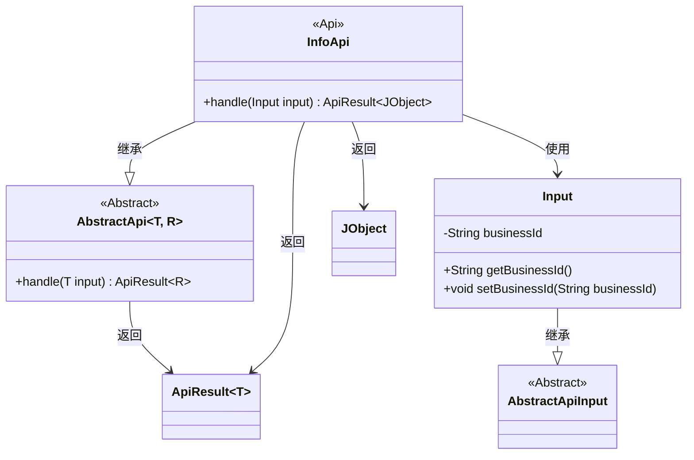

# 基础信息

|      |      |
|------|------|
| 名称 | InfoApi |
| 编码语言 | .java |
| 代码路径 | WeFe/fusion/fusion-service/src/main/java/com/welab/wefe/data/fusion/service/api/task/InfoApi.java |
| 包名 | com.welab.wefe.data.fusion.service.api.task |
| 依赖项 | ['com.welab.wefe.common.exception.StatusCodeWithException', 'com.welab.wefe.common.fieldvalidate.annotation.Check', 'com.welab.wefe.common.util.JObject', 'com.welab.wefe.common.web.api.base.AbstractApi', 'com.welab.wefe.common.web.api.base.Api', 'com.welab.wefe.common.web.dto.AbstractApiInput', 'com.welab.wefe.common.web.dto.ApiResult', 'com.welab.wefe.data.fusion.service.manager.ActuatorManager'] |
| 概述说明 | 任务信息API类，通过businessId获取任务信息，输入需包含必填字段taskId。 |

# 说明

该代码定义了一个名为InfoApi的API类，用于获取任务信息。API路径为"task/info"，接受一个包含必填字段businessId的输入参数Input，并通过ActuatorManager.getTaskInfo方法获取任务信息后返回JObject格式的结果。输入类Input继承自AbstractApiInput，包含businessId的getter和setter方法。整个API处理逻辑封装在handle方法中，成功时返回ApiResult包装的JObject数据。

# 类列表 Class Summary

| 名称   | 类型  | 说明 |
|-------|------|-------------|
| InfoApi | class | 这是一个获取任务信息的API类，路径为"task/info"，需要传入必填参数businessId，返回任务信息。 |

## 类 InfoApi

|      |      |
|------|------|
| 访问范围 | @Api(path = "task/info", name = "获取任务信息", desc = "获取任务信息");public |
| 类型 | class |
| 名称 | InfoApi |
| 说明 | 这是一个获取任务信息的API类，路径为"task/info"，需要传入必填参数businessId，返回任务信息。 |

### UML类图

这段代码展示了一个任务信息获取API的实现结构。InfoApi继承自泛型抽象类AbstractApi，指定了输入类型为内部类Input，返回类型为JObject。Input类继承自AbstractApiInput，包含一个必填的businessId字段及其getter/setter。InfoApi通过handle方法处理输入参数，调用ActuatorManager获取任务信息并返回封装在ApiResult中的结果。整体设计遵循了API开发的常见模式，实现了请求参数与业务逻辑的分离。

### 内部方法调用关系图

```mermaid
graph TD
    A["类InfoApi"]
    B["继承: AbstractApi<Input, JObject>"]
    C["注解: @Api"]
    D["方法: handle(Input input)"]
    E["调用: ActuatorManager.getTaskInfo"]
    F["返回: success(JObject)"]
    G["嵌套类Input"]
    H["继承: AbstractApiInput"]
    I["属性: String businessId"]
    J["注解: @Check"]
    K["方法: getBusinessId()"]
    L["方法: setBusinessId()"]

    A --> B
    A --> C
    A --> D
    D --> E
    D --> F
    A --> G
    G --> H
    G --> I
    G --> J
    G --> K
    G --> L
```

这段代码定义了一个名为InfoApi的API类，用于获取任务信息。该类继承自AbstractApi，包含一个处理请求的handle方法，该方法通过ActuatorManager获取任务信息并返回成功结果。内部类Input用于封装输入参数，包含一个必填的businessId字段及其getter/setter方法。流程图清晰地展示了类之间的继承关系、方法调用链和属性结构。

### 字段列表 Field List

| 名称  | 类型  | 说明 |
|-------|-------|------|

### 方法列表

| 名称  | 类型  | 说明 |
|-------|-------|------|
| handle | ApiResult<JObject> | 代码重写handle方法，调用ActuatorManager获取任务信息并返回成功结果。 |

