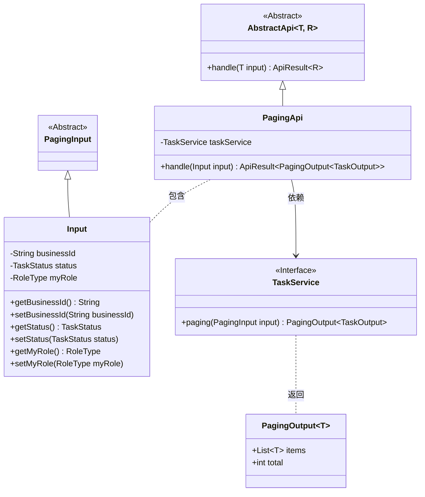

# 基础信息

|      |      |
|------|------|
| 名称 | PagingApi |
| 编码语言 | .java |
| 代码路径 | WeFe/fusion/fusion-service/src/main/java/com/welab/wefe/data/fusion/service/api/task/PagingApi.java |
| 包名 | com.welab.wefe.data.fusion.service.api.task |
| 依赖项 | ['com.welab.wefe.common.exception.StatusCodeWithException', 'com.welab.wefe.common.fieldvalidate.annotation.Check', 'com.welab.wefe.common.web.api.base.AbstractApi', 'com.welab.wefe.common.web.api.base.Api', 'com.welab.wefe.common.web.dto.ApiResult', 'com.welab.wefe.data.fusion.service.dto.base.PagingInput', 'com.welab.wefe.data.fusion.service.dto.base.PagingOutput', 'com.welab.wefe.data.fusion.service.dto.entity.TaskOutput', 'com.welab.wefe.data.fusion.service.enums.RoleType', 'com.welab.wefe.data.fusion.service.enums.TaskStatus', 'com.welab.wefe.data.fusion.service.service.TaskService', 'org.springframework.beans.factory.annotation.Autowired'] |
| 概述说明 | 任务分页查询API，接收业务ID、状态和角色参数，返回分页任务列表。 |

# 说明

PagingApi是一个处理任务分页列表的API类，路径为task/paging，继承自AbstractApi，输入为Input类，输出为分页的TaskOutput。Input类包含businessId、status和myRole三个字段，分别表示任务ID、任务状态和角色类型，并提供对应的getter和setter方法。API通过taskService的paging方法处理输入并返回结果。

# 类列表 Class Summary

| 名称   | 类型  | 说明 |
|-------|------|-------------|
| PagingApi | class | 分页查询任务API，接收业务ID、任务状态和角色类型参数，返回分页任务列表。 |

## 类 PagingApi

|      |      |
|------|------|
| 访问范围 | @Api(path = "task/paging", name = "任务列表", desc = "任务列表");public |
| 类型 | class |
| 名称 | PagingApi |
| 说明 | 分页查询任务API，接收业务ID、任务状态和角色类型参数，返回分页任务列表。 |

### UML类图

该类图展示了分页API的结构，PagingApi继承自泛型抽象类AbstractApi，处理Input参数并返回分页结果。Input类继承自PagingInput，包含业务ID、任务状态和角色类型等字段。TaskService接口提供分页查询功能，返回包含任务列表的PagingOutput对象。整体设计体现了清晰的层级关系和依赖，通过泛型实现了类型安全的输入输出处理。

### 内部方法调用关系图

```mermaid
graph TD
    A["类PagingApi"]
    B["注解: @Api(path='task/paging', name='任务列表', desc='任务列表')"]
    C["继承: AbstractApi<Input, PagingOutput<TaskOutput>>"]
    D["依赖注入: @Autowired TaskService"]
    E["重写方法: handle(Input input)"]
    F["内部类: Input"]
    G["继承: PagingInput"]
    H["属性: @Check String businessId"]
    I["属性: @Check TaskStatus status"]
    J["属性: @Check RoleType myRole"]
    K["getter/setter方法组"]

    A --> B
    A --> C
    A --> D
    A --> E
    A --> F
    F --> G
    F --> H
    F --> I
    F --> J
    F --> K
    E --> D
    E --> F
```

该流程图展示了PagingApi类的完整结构，包含API注解、父类继承关系、服务注入和输入参数处理流程。核心是handle方法通过taskService处理分页请求，Input内部类继承PagingInput并包含三个带校验注解的字段及其访问方法。整体呈现了从API入口到业务处理的完整调用链路，体现了Spring Boot应用中典型的控制器层结构。

### 字段列表 Field List

| 名称  | 类型  | 说明 |
|-------|-------|------|
| taskService | TaskService | 自动注入TaskService实例。 |

### 方法列表

| 名称  | 类型  | 说明 |
|-------|-------|------|
| handle | ApiResult<PagingOutput<TaskOutput>> | 重写handle方法，调用taskService分页查询并返回结果。 |

