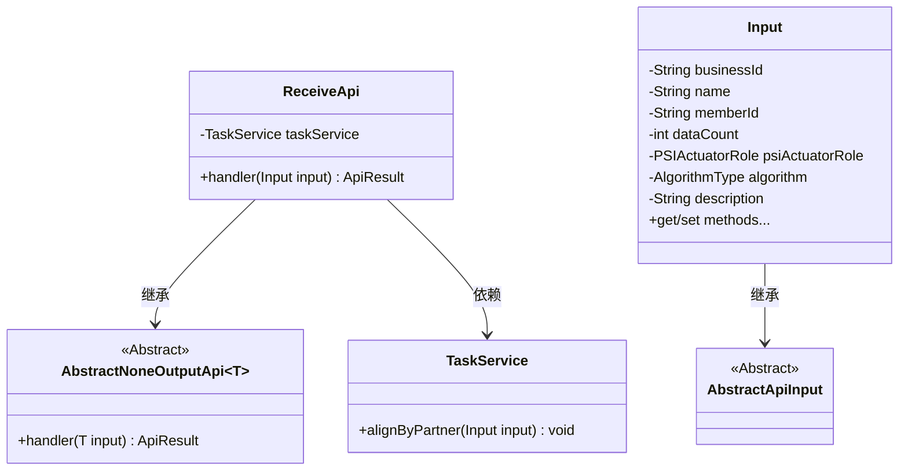
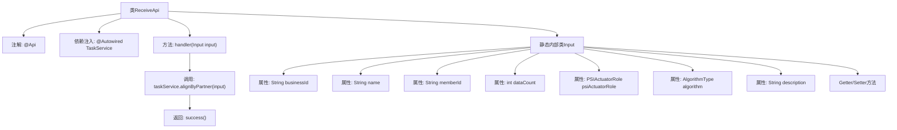

# 基础信息

|      |      |
|------|------|
| 名称 | ReceiveApi |
| 编码语言 | .java |
| 代码路径 | WeFe/fusion/fusion-service/src/main/java/com/welab/wefe/data/fusion/service/api/task/ReceiveApi.java |
| 包名 | com.welab.wefe.data.fusion.service.api.task |
| 依赖项 | ['com.welab.wefe.common.exception.StatusCodeWithException', 'com.welab.wefe.common.fieldvalidate.annotation.Check', 'com.welab.wefe.common.web.api.base.AbstractNoneOutputApi', 'com.welab.wefe.common.web.api.base.Api', 'com.welab.wefe.common.web.dto.AbstractApiInput', 'com.welab.wefe.common.web.dto.ApiResult', 'com.welab.wefe.data.fusion.service.enums.AlgorithmType', 'com.welab.wefe.data.fusion.service.enums.PSIActuatorRole', 'com.welab.wefe.data.fusion.service.service.TaskService', 'org.springframework.beans.factory.annotation.Autowired'] |
| 概述说明 | 接收对齐请求API，需传入businessId、任务名称、合作方成员ID、数据量、对齐角色、算法和描述等参数，调用taskService处理请求。 |

# 说明

ReceiveApi是一个用于接收对齐请求的API类，路径为task/receive，允许带签名访问。它继承自AbstractNoneOutputApi，输入参数为内部类Input。Input包含多个必填字段：businessId、name、memberId、psiActuatorRole和algorithm，以及可选字段dataCount和description（限制1024字符）。handler方法调用taskService的alignByPartner处理输入并返回成功结果。所有字段都有校验注解和getter/setter方法。

# 类列表 Class Summary

| 名称   | 类型  | 说明 |
|-------|------|-------------|
| ReceiveApi | class | 接收对齐请求API，需传入businessId、任务名称、合作方成员id、数据量、对齐角色、算法和描述，调用taskService.alignByPartner处理。 |

## 类 ReceiveApi

|      |      |
|------|------|
| 访问范围 | @Api(path = "task/receive", name = "接收对齐请求", desc = "接收对齐请求", allowAccessWithSign = true);public |
| 类型 | class |
| 名称 | ReceiveApi |
| 说明 | 接收对齐请求API，需传入businessId、任务名称、合作方成员id、数据量、对齐角色、算法和描述，调用taskService.alignByPartner处理。 |

### UML类图

类图描述：该图展示了接收对齐请求API的类结构。ReceiveApi继承自泛型类AbstractNoneOutputApi<Input>，并依赖TaskService进行业务处理。Input类继承自AbstractApiInput，包含多个带校验注解的字段及其getter/setter方法。整体结构体现了API处理请求时从输入验证到业务处理的完整流程。

### 内部方法调用关系图

这段代码是一个接收对齐请求的API实现类，包含注解配置、服务调用和输入参数验证等功能。流程图展示了类结构关系，从主类ReceiveApi开始，通过注解配置API路径，注入TaskService服务，handler方法处理输入参数并调用对齐服务，最后返回成功结果。静态内部类Input定义了请求参数结构和验证规则，包含多个带校验注解的属性和对应的Getter/Setter方法。整个流程体现了API请求处理的基本逻辑和数据验证机制。

### 字段列表 Field List

| 名称  | 类型  | 说明 |
|-------|-------|------|
| taskService | TaskService | 自动注入TaskService实例。 |

### 方法列表

| 名称  | 类型  | 说明 |
|-------|-------|------|
| handler | ApiResult | 方法重写，调用任务服务处理输入参数，成功后返回结果。 |

