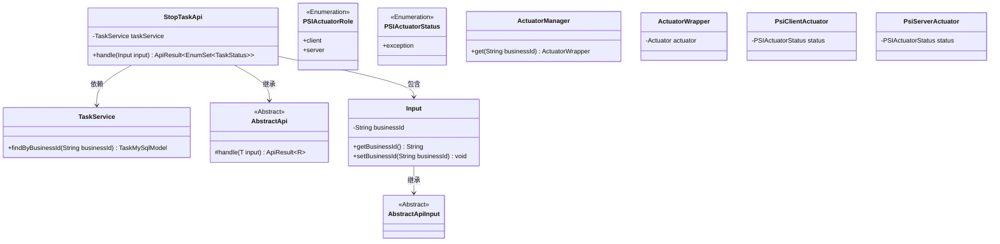
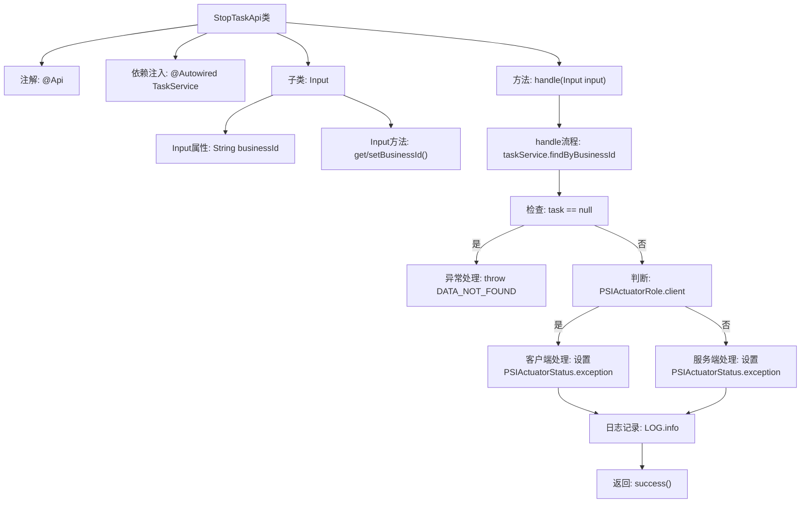

# 基础信息

|      |      |
|------|------|
| 名称 | StopTaskApi |
| 编码语言 | .java |
| 代码路径 | WeFe/fusion/fusion-service/src/main/java/com/welab/wefe/data/fusion/service/api/task/StopTaskApi.java |
| 包名 | com.welab.wefe.data.fusion.service.api.task |
| 依赖项 | ['com.welab.wefe.common.StatusCode.DATA_NOT_FOUND', 'java.util.EnumSet', 'org.springframework.beans.factory.annotation.Autowired', 'com.welab.wefe.common.exception.StatusCodeWithException', 'com.welab.wefe.common.fieldvalidate.annotation.Check', 'com.welab.wefe.common.web.api.base.AbstractApi', 'com.welab.wefe.common.web.api.base.Api', 'com.welab.wefe.common.web.dto.AbstractApiInput', 'com.welab.wefe.common.web.dto.ApiResult', 'com.welab.wefe.data.fusion.service.actuator.rsapsi.AbstractPsiActuator', 'com.welab.wefe.data.fusion.service.actuator.rsapsi.PsiClientActuator', 'com.welab.wefe.data.fusion.service.actuator.rsapsi.PsiServerActuator', 'com.welab.wefe.data.fusion.service.database.entity.TaskMySqlModel', 'com.welab.wefe.data.fusion.service.enums.PSIActuatorRole', 'com.welab.wefe.data.fusion.service.enums.PSIActuatorStatus', 'com.welab.wefe.data.fusion.service.enums.TaskStatus', 'com.welab.wefe.data.fusion.service.manager.ActuatorManager', 'com.welab.wefe.data.fusion.service.service.TaskService'] |
| 概述说明 | 暂停任务API，需登录，通过任务ID查找任务并修改执行器状态为异常，返回成功结果。 |

# 说明

该代码定义了一个暂停任务的API类StopTaskApi，继承自AbstractApi，路径为task/stop，需要登录。API接收包含任务ID的输入参数，通过TaskService查找任务，若不存在则抛出异常。根据任务角色（客户端或服务端）修改对应的PSI执行器状态为异常，并记录日志。成功处理返回空结果。输入类Input包含必填的任务ID字段及其getter和setter方法。

# 类列表 Class Summary

| 名称   | 类型  | 说明 |
|-------|------|-------------|
| StopTaskApi | class | 暂停任务API，需登录，通过任务ID查找任务，根据角色修改执行器状态为异常，返回成功结果。 |

## 类 StopTaskApi

|      |      |
|------|------|
| 访问范围 | @Api(path = "task/stop", name = "暂停任务", desc = "暂停任务", login = true);public |
| 类型 | class |
| 名称 | StopTaskApi |
| 说明 | 暂停任务API，需登录，通过任务ID查找任务，根据角色修改执行器状态为异常，返回成功结果。 |

### UML类图

该代码实现了一个暂停任务的API接口，主要功能是通过任务ID查找任务并修改其执行器状态为异常。类图展示了StopTaskApi继承自泛型抽象类AbstractApi，包含嵌套类Input，并依赖TaskService进行任务查询。通过ActuatorManager获取执行器实例，根据角色类型(Client/Server)修改对应执行器状态。整个设计采用分层结构，输入参数通过继承AbstractApiInput实现校验逻辑。

### 内部方法调用关系图

这段代码实现了一个暂停任务的API接口，主要流程是：通过businessId查询任务，检查任务是否存在，根据执行器角色(客户端/服务端)分别设置异常状态，记录日志后返回成功。Input子类封装了必要的业务ID参数及其校验逻辑。流程图清晰展示了从参数校验到状态变更的完整处理链条，特别是对任务不存在和不同执行器角色的分支处理。

### 字段列表 Field List

| 名称  | 类型  | 说明 |
|-------|-------|------|
| taskService | TaskService | 自动注入TaskService实例。 |

### 方法列表

| 名称  | 类型  | 说明 |
|-------|-------|------|
| handle | ApiResult<EnumSet<TaskStatus>> | 该方法处理输入，检查任务是否存在。若任务角色为客户端，设置执行器状态为异常；否则设置服务端执行器状态为异常。最后返回成功结果。 |

