# 基础信息

|      |      |
|------|------|
| 名称 | TaskStatusApi |
| 编码语言 | .java |
| 代码路径 | WeFe/fusion/fusion-service/src/main/java/com/welab/wefe/data/fusion/service/api/task/TaskStatusApi.java |
| 包名 | com.welab.wefe.data.fusion.service.api.task |
| 依赖项 | ['com.welab.wefe.common.exception.StatusCodeWithException', 'com.welab.wefe.common.web.api.base.AbstractApi', 'com.welab.wefe.common.web.api.base.Api', 'com.welab.wefe.common.web.dto.AbstractApiInput', 'com.welab.wefe.common.web.dto.ApiResult', 'com.welab.wefe.data.fusion.service.enums.TaskStatus', 'java.util.EnumSet'] |
| 概述说明 | 任务状态API类，需登录访问，返回所有任务状态枚举值。输入无参数，输出为枚举集合。 |

# 说明

该代码定义了一个名为TaskStatusApi的API类，用于处理任务状态相关请求。该类继承自AbstractApi，指定了路径为"task/status"，名称为"任务状态"，描述为"任务状态"，并需要登录验证。输入参数为Input类，输出为EnumSet<TaskStatus>类型。handle方法返回所有TaskStatus枚举值的集合。Input类继承自AbstractApiInput，未定义额外字段。整个API的功能是获取系统支持的所有任务状态枚举值。

# 类列表 Class Summary

| 名称   | 类型  | 说明 |
|-------|------|-------------|
| TaskStatusApi | class | 任务状态API，需登录，返回所有任务状态枚举值。输入无参数，输出为EnumSet<TaskStatus>。 |


## 类 TaskStatusApi

|      |      |
|------|------|
| 访问范围 | @Api(path = "task/status", name = "任务状态", desc = "任务状态", login = true);public |
| 类型 | class |
| 名称 | TaskStatusApi |
| 说明 | 任务状态API，需登录，返回所有任务状态枚举值。输入无参数，输出为EnumSet<TaskStatus>。 |


### UML类图

```mermaid
classDiagram
    class AbstractApi~T, R~ {
        <<abstract>>
        +handle(T input) ApiResult~R~
    }

    class TaskStatusApi {
        +handle(Input input) ApiResult~EnumSet~TaskStatus~~
    }

    class AbstractApiInput {
        <<abstract>>
    }

    class Input {
    }

    class ApiResult~T~ {
    }

    class TaskStatus {
        <<enumeration>>
    }

    AbstractApi <|-- TaskStatusApi
    AbstractApiInput <|-- Input
    TaskStatusApi --> Input : 使用
    TaskStatusApi --> ApiResult~EnumSet~TaskStatus~~ : 返回
    TaskStatusApi --> TaskStatus : 依赖
```

类图描述：该图展示了一个任务状态API的类结构，其中TaskStatusApi继承自泛型抽象类AbstractApi，处理Input参数并返回包含TaskStatus枚举集的ApiResult。Input是AbstractApiInput的子类，用于封装输入参数。整个设计体现了清晰的层级关系和类型安全的数据处理流程，通过泛型确保了API的灵活性和类型约束。


### 内部方法调用关系图

```mermaid
graph TD
    A["类TaskStatusApi"]
    B["注解: @Api"]
    C["父类: AbstractApi<Input, EnumSet<TaskStatus>>"]
    D["方法: handle(Input input)"]
    E["创建EnumSet: EnumSet.allOf(TaskStatus.class)"]
    F["返回结果: success(statuses)"]
    G["嵌套类: Input"]
    H["父类: AbstractApiInput"]

    A --> B
    A --> C
    A --> D
    D --> E
    D --> F
    A --> G
    G --> H
```



该流程图展示了TaskStatusApi类的结构及其关键组件。类通过@Api注解定义API元信息，继承AbstractApi父类并实现handle方法处理输入。handle方法内部使用EnumSet.allOf获取所有任务状态枚举值，并通过success方法返回结果。嵌套类Input继承自AbstractApiInput，用于定义API的输入参数结构。整体流程清晰展示了从请求处理到结果返回的数据流转路径。

### 字段列表 Field List

| 名称  | 类型  | 说明 |
|-------|-------|------|

### 方法列表

| 名称  | 类型  | 说明 |
|-------|-------|------|
| handle | ApiResult<EnumSet<TaskStatus>> | 覆盖方法handle，返回包含所有TaskStatus枚举值的ApiResult，成功时返回statuses集合。 |


