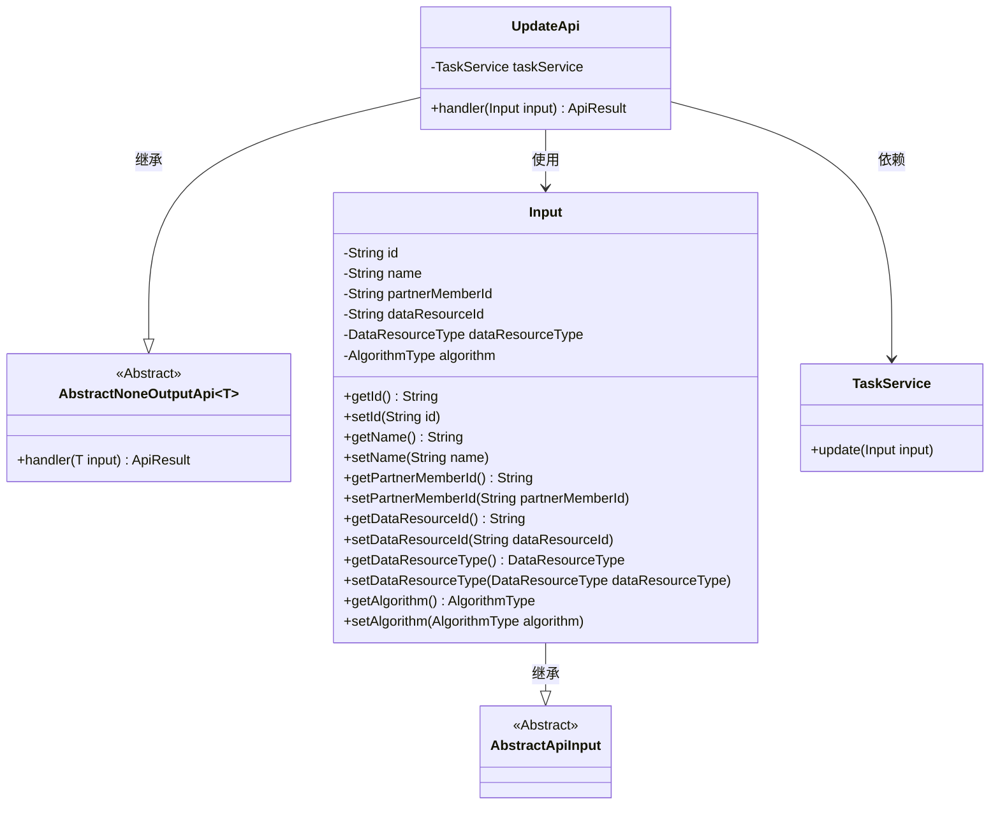

# 基础信息

|      |      |
|------|------|
| 名称 | UpdateApi |
| 编码语言 | .java |
| 代码路径 | WeFe/fusion/fusion-service/src/main/java/com/welab/wefe/data/fusion/service/api/task/UpdateApi.java |
| 包名 | com.welab.wefe.data.fusion.service.api.task |
| 依赖项 | ['com.welab.wefe.common.exception.StatusCodeWithException', 'com.welab.wefe.common.fieldvalidate.annotation.Check', 'com.welab.wefe.common.web.api.base.AbstractNoneOutputApi', 'com.welab.wefe.common.web.api.base.Api', 'com.welab.wefe.common.web.dto.AbstractApiInput', 'com.welab.wefe.common.web.dto.ApiResult', 'com.welab.wefe.data.fusion.service.enums.AlgorithmType', 'com.welab.wefe.data.fusion.service.enums.DataResourceType', 'com.welab.wefe.data.fusion.service.service.TaskService', 'org.springframework.beans.factory.annotation.Autowired'] |
| 概述说明 | 这是一个修改对齐任务的API类，需要登录，包含任务ID、名称、合作方ID、数据资源ID和类型等必填字段，默认算法为RSA_PSI。 |

# 说明

这是一个用于修改对齐任务的API类，路径为"task/update"，需要登录访问。该API继承自AbstractNoneOutputApi，输入参数为内部类Input。Input包含任务Id、名称、合作方id、数据资源id、数据资源类型和算法类型等必填或选填字段，并通过注解进行校验。API处理逻辑调用taskService的update方法更新任务，成功后返回结果。

# 类列表 Class Summary

| 名称   | 类型  | 说明 |
|-------|------|-------------|
| UpdateApi | class | 这是一个修改对齐任务的API类，需要登录，包含任务ID、名称、合作方ID、数据资源ID和类型等必填字段，默认算法为RSA_PSI。 |

## 类 UpdateApi

|      |      |
|------|------|
| 访问范围 | @Api(path = "task/update", name = "修改对齐任务", desc = "修改对齐任务", login = true);public |
| 类型 | class |
| 名称 | UpdateApi |
| 说明 | 这是一个修改对齐任务的API类，需要登录，包含任务ID、名称、合作方ID、数据资源ID和类型等必填字段，默认算法为RSA_PSI。 |

### UML类图

这段代码展示了一个任务更新API的实现结构。UpdateApi继承自AbstractNoneOutputApi泛型类，使用Input作为输入参数类型，并通过TaskService执行实际更新操作。Input类包含多个经过校验的字段，包括任务ID、名称、合作方ID等，并提供了完整的getter/setter方法。类图清晰地展示了类之间的继承关系和依赖关系，其中UpdateApi作为核心类协调输入处理和任务更新服务调用。

### 内部方法调用关系图

```mermaid
graph TD
    A["类UpdateApi"]
    B["注解: @Api"]
    C["继承: AbstractNoneOutputApi<Input>"]
    D["依赖注入: @Autowired TaskService"]
    E["重写方法: handler(Input input)"]
    F["内部类: Input"]
    G["属性: String id"]
    H["属性: String name"]
    I["属性: String partnerMemberId"]
    J["属性: String dataResourceId"]
    K["属性: DataResourceType dataResourceType"]
    L["属性: AlgorithmType algorithm"]
    M["方法: getter/setter"]
    N["调用: taskService.update(input)"]
    O["返回: ApiResult.success()"]

    A --> B
    A --> C
    A --> D
    A --> E
    A --> F
    F --> G
    F --> H
    F --> I
    F --> J
    F --> K
    F --> L
    F --> M
    E --> N
    E --> O
```

该流程图展示了UpdateApi类的结构，它是一个带有@Api注解的REST接口类，继承自AbstractNoneOutputApi模板类。核心是handler方法，通过TaskService执行更新操作后返回成功结果。Input内部类包含6个带校验注解的属性和对应的getter/setter方法，用于接收前端传入的修改任务参数。整体设计遵循了分层架构和依赖注入原则。

### 字段列表 Field List

| 名称  | 类型  | 说明 |
|-------|-------|------|
| taskService | TaskService | 自动注入TaskService实例。 |

### 方法列表

| 名称  | 类型  | 说明 |
|-------|-------|------|
| handler | ApiResult | 覆盖方法处理输入，调用任务服务更新并返回成功结果，可能抛出状态码异常。 |

