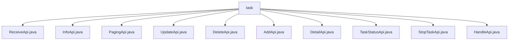

# 基础信息

|      |      |
|------|------|
| 名称 | task |
| 编码语言 | .java |
| 代码路径 | WeFe/fusion/fusion-service/src/main/java/com/welab/wefe/data/fusion/service/api/task |
| 包名 | docs.fusion.fusion-service.src.main.java.com.welab.wefe.data.fusion.service.api.task |
| 概述说明 | ReceiveApi接收对齐请求，路径task/receive，需签名。InfoApi获取任务信息，路径task/info。PagingApi处理分页列表，路径task/paging。UpdateApi修改任务，路径task/update。DeleteApi删除任务，路径task/delete。AddApi添加任务，路径task/add。DetailApi查询详情，路径task/detail。TaskStatusApi获取状态枚举，路径task/status。StopTaskApi暂停任务，路径task/stop。HandleApi处理任务，路径task/handle。 |

# 说明

## 概述  
该模块是任务管理系统的核心API组件，主要负责对齐任务的CRUD操作和状态管理。所有API均继承自抽象基类（如AbstractApi），采用统一规范的输入输出结构，例如ReceiveApi处理任务接收，InfoApi获取任务详情，PagingApi提供分页查询。关键数据结构包括TaskOutput、Input内部类及EnumSet<TaskStatus>，通过TaskService实现业务逻辑。外部依赖仅需TaskService和ActuatorManager。例如AddApi支持复杂校验逻辑，StopTaskApi实现任务中断功能。

## 主要业务场景  
模块支持任务全生命周期管理，包括创建（AddApi）、查询（DetailApi/InfoApi）、更新（UpdateApi）、删除（DeleteApi）和状态控制（StopTaskApi）。交互模式类似RESTful设计，如PagingApi实现分页查询，TaskStatusApi枚举状态集。典型应用包括：多方协作时通过ReceiveApi提交对齐请求，使用HandleApi处理数据资源。所有API均通过注解校验输入，例如businessId必填，description限制1024字符，类似表单校验机制。

### 包内部结构视图

该流程图展示了`task`目录下的11个API接口文件层级关系。所有Java文件均直接隶属于`task`节点，包括接收、信息、分页、更新、删除、新增、详情、任务状态、停止任务和处理等核心功能接口，形成扁平化结构。每个文件代表不同的业务操作端点，共同构成任务管理模块的完整API集合。

# 文件列表

| 名称   | 类型  | 说明 |
|-------|------|-------------|
| [ReceiveApi.java](ReceiveApi.md) | file | 接收对齐请求API，需传入businessId、任务名称、合作方成员ID、数据量、对齐角色、算法和描述等参数，调用taskService处理请求。 |
| [InfoApi.java](InfoApi.md) | file | 任务信息API类，通过businessId获取任务信息，输入需包含必填字段taskId。 |
| [PagingApi.java](PagingApi.md) | file | 任务分页查询API，接收业务ID、状态和角色参数，返回分页任务列表。 |
| [UpdateApi.java](UpdateApi.md) | file | 这是一个修改对齐任务的API类，需要登录，包含任务ID、名称、合作方ID、数据资源ID和类型等必填字段，默认算法为RSA_PSI。 |
| [DeleteApi.java](DeleteApi.md) | file | 删除合作方的API接口，需登录，调用taskService删除指定ID的合作方，成功返回空结果。输入参数为必填的ID字符串。 |
| [AddApi.java](AddApi.md) | file | 添加对齐任务的API接口，包含任务名称、描述、合作方成员ID、数据资源ID等参数，并进行参数校验。 |
| [DetailApi.java](DetailApi.md) | file | 任务详情API类，通过taskId查询任务详情，继承抽象API类，使用TaskService处理请求，返回任务输出结果。 |
| [TaskStatusApi.java](TaskStatusApi.md) | file | 任务状态API类，需登录访问，返回所有任务状态枚举值。输入无参数，输出为枚举集合。 |
| [StopTaskApi.java](StopTaskApi.md) | file | 暂停任务API，需登录，通过任务ID查找任务并修改执行器状态为异常，返回成功结果。 |
| [HandleApi.java](HandleApi.md) | file | 任务处理API类，接收任务ID、数据资源ID、类型、样本量等参数，验证主键和追溯字段后调用任务服务处理。 |

