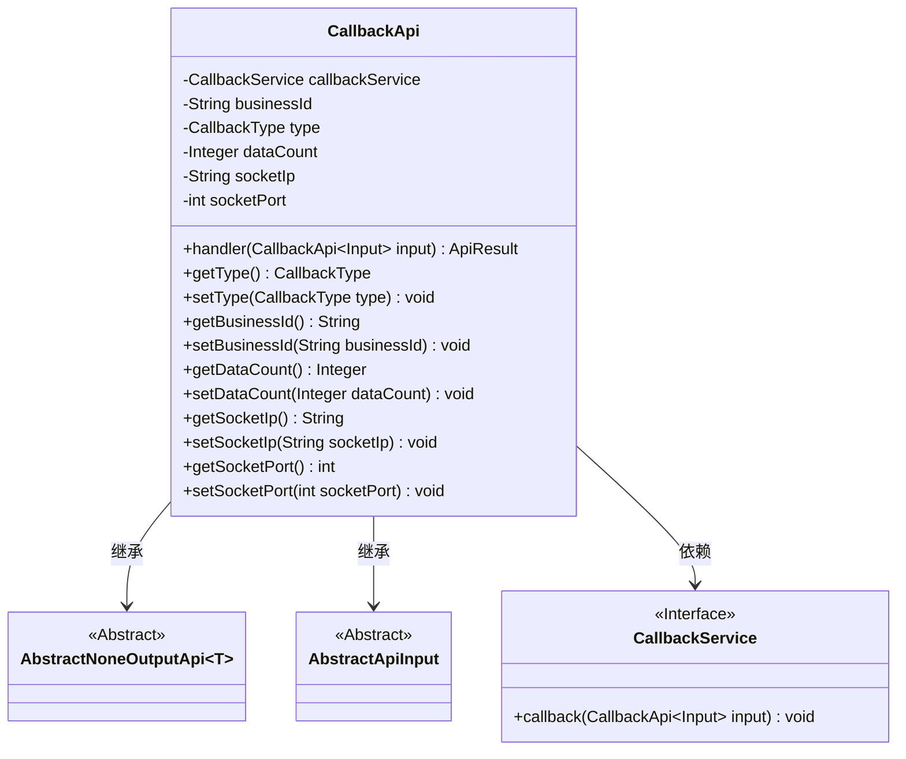

# 基础信息

|      |      |
|------|------|
| 名称 | CallbackApi |
| 编码语言 | .java |
| 代码路径 | WeFe/fusion/fusion-service/src/main/java/com/welab/wefe/data/fusion/service/api/thirdparty/CallbackApi.java |
| 包名 | com.welab.wefe.data.fusion.service.api.thirdparty |
| 依赖项 | ['com.welab.wefe.common.exception.StatusCodeWithException', 'com.welab.wefe.common.fieldvalidate.annotation.Check', 'com.welab.wefe.common.web.api.base.AbstractNoneOutputApi', 'com.welab.wefe.common.web.api.base.Api', 'com.welab.wefe.common.web.dto.AbstractApiInput', 'com.welab.wefe.common.web.dto.ApiResult', 'com.welab.wefe.data.fusion.service.enums.CallbackType', 'com.welab.wefe.data.fusion.service.service.CallbackService', 'org.springframework.beans.factory.annotation.Autowired'] |
| 概述说明 | 接收消息接口，需businessId和消息类型，可选数据量、IP和端口。调用CallbackService处理输入并返回成功。 |

# 说明

这是一个名为CallbackApi的第三方回调接口类，路径为thirdparty/callback，允许签名访问。它继承自AbstractNoneOutputApi，使用CallbackService处理输入数据。输入类Input包含必填字段businessId和CallbackType类型，以及可选字段dataCount、socketIp和socketPort。handler方法调用callbackService处理输入后返回成功结果。各字段均有getter和setter方法。

# 类列表 Class Summary

| 名称   | 类型  | 说明 |
|-------|------|-------------|
| CallbackApi | class | 接收消息接口类，路径thirdparty/callback，需签名访问。输入含businessId、消息类型等字段，调用callbackService处理。 |

## 类 CallbackApi

|      |      |
|------|------|
| 访问范围 | @Api(path = "thirdparty/callback", name = "接收消息接口", allowAccessWithSign = true);public |
| 类型 | class |
| 名称 | CallbackApi |
| 说明 | 接收消息接口类，路径thirdparty/callback，需签名访问。输入含businessId、消息类型等字段，调用callbackService处理。 |

### UML类图

该类图展示了回调接口系统的核心结构。CallbackApi继承自泛型抽象类AbstractNoneOutputApi，处理输入类型为嵌套类Input的请求。Input类继承自AbstractApiInput，包含5个带校验注解的字段。CallbackApi通过依赖注入使用CallbackService接口实现回调逻辑，体现了清晰的层次结构和依赖关系。

### 内部方法调用关系图

```mermaid
graph TD
    A["类CallbackApi"]
    B["注解: @Api"]
    C["继承: AbstractNoneOutputApi<Input>"]
    D["依赖注入: @Autowired CallbackService"]
    E["重写方法: handler(Input input)"]
    F["调用: callbackService.callback(input)"]
    G["返回: success()"]
    H["嵌套类Input"]
    I["继承: AbstractApiInput"]
    J["字段: businessId, type, dataCount, socketIp, socketPort"]
    K["校验注解: @Check"]
    L["Getter/Setter方法"]

    A --> B
    A --> C
    A --> D
    A --> E
    E --> F
    F --> G
    A --> H
    H --> I
    H --> J
    J --> K
    J --> L
```

该流程图展示了CallbackApi类的核心结构，包含API注解、服务注入和请求处理流程。Input嵌套类继承AbstractApiInput，包含5个带校验注解的字段及其访问方法。主类通过handler方法调用回调服务并返回成功结果，体现了典型的API控制器模式。

### 字段列表 Field List

| 名称  | 类型  | 说明 |
|-------|-------|------|
| callbackService | CallbackService | 自动注入回调服务实例。 |

### 方法列表

| 名称  | 类型  | 说明 |
|-------|-------|------|
| handler | ApiResult | 这是一个Java方法，重写父类handler方法，调用callbackService处理输入参数input，成功后返回ApiResult。 |

