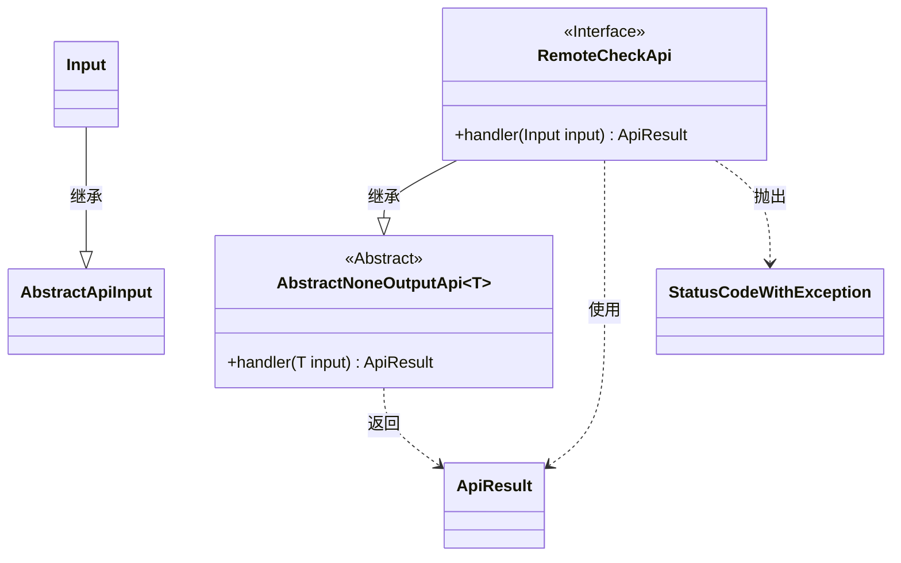

# 基础信息

|      |      |
|------|------|
| 名称 | RemoteCheckApi |
| 编码语言 | .java |
| 代码路径 | WeFe/fusion/fusion-service/src/main/java/com/welab/wefe/data/fusion/service/api/thirdparty/RemoteCheckApi.java |
| 包名 | com.welab.wefe.data.fusion.service.api.thirdparty |
| 依赖项 | ['com.welab.wefe.common.exception.StatusCodeWithException', 'com.welab.wefe.common.web.api.base.AbstractNoneOutputApi', 'com.welab.wefe.common.web.api.base.Api', 'com.welab.wefe.common.web.dto.AbstractApiInput', 'com.welab.wefe.common.web.dto.ApiResult'] |
| 概述说明 | 远程检查API，路径third_party/remote/check，测试服务状态，允许签名访问，无输出，输入为空。 |

# 说明

该代码定义了一个名为RemoteCheckApi的API类，用于测试服务状态。它继承自AbstractNoneOutputApi，泛型参数为内部类Input。API路径为third_party/remote/check，允许带签名访问。类中包含一个handler方法，返回成功结果。Input类继承自AbstractApiInput，未定义额外字段。整个API设计简洁，仅用于状态检测功能。

# 类列表 Class Summary

| 名称   | 类型  | 说明 |
|-------|------|-------------|
| RemoteCheckApi | class | 这是一个测试服务状态的API，路径为"third_party/remote/check"，允许签名访问，无输出参数。 |

## 类 RemoteCheckApi

|      |      |
|------|------|
| 访问范围 | @Api(path = "third_party/remote/check", name = "测试服务状态", desc = "测试服务状态", allowAccessWithSign = true);public |
| 类型 | class |
| 名称 | RemoteCheckApi |
| 说明 | 这是一个测试服务状态的API，路径为"third_party/remote/check"，允许签名访问，无输出参数。 |

### UML类图

这段类图展示了RemoteCheckApi及其相关类的结构关系。RemoteCheckApi继承自泛型类AbstractNoneOutputApi<Input>，并实现了handler方法。Input类继承自AbstractApiInput，作为RemoteCheckApi的输入参数类型。ApiResult是handler方法的返回类型，StatusCodeWithException是可能抛出的异常类型。整个结构体现了API处理的基本框架，其中抽象基类提供了通用处理逻辑，具体API实现专注于业务处理。

### 内部方法调用关系图

```mermaid
graph TD
    A["类RemoteCheckApi"]
    B["注解: @Api"]
    C["父类: AbstractNoneOutputApi<Input>"]
    D["方法: handler(Input input)"]
    E["嵌套类: Input"]
    F["父类: AbstractApiInput"]
    G["返回: ApiResult.success()"]

    A --> B
    A --> C
    A --> D
    A --> E
    E --> F
    D --> G
```

该流程图展示了RemoteCheckApi类的结构，包含类注解、继承关系、核心方法及嵌套类定义。类通过@Api注解定义接口元信息，继承AbstractNoneOutputApi并指定Input泛型参数。handler方法处理输入参数并返回成功结果，Input嵌套类继承自AbstractApiInput。整体结构清晰体现了API接口的封装设计模式。

### 字段列表 Field List

| 名称  | 类型  | 说明 |
|-------|-------|------|

### 方法列表

| 名称  | 类型  | 说明 |
|-------|-------|------|
| handler | ApiResult | 重写handler方法，处理输入并返回成功结果，可能抛出异常。 |

