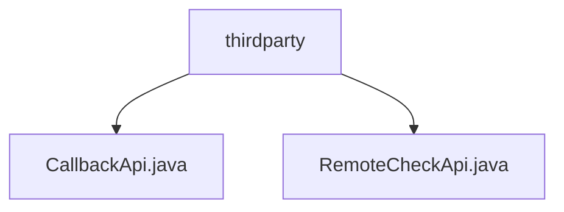

# 基础信息

|      |      |
|------|------|
| 名称 | thirdparty |
| 编码语言 | .java |
| 代码路径 | WeFe/fusion/fusion-service/src/main/java/com/welab/wefe/data/fusion/service/api/thirdparty |
| 包名 | docs.fusion.fusion-service.src.main.java.com.welab.wefe.data.fusion.service.api.thirdparty |
| 概述说明 | CallbackApi是第三方回调接口类，路径thirdparty/callback，继承AbstractNoneOutputApi，处理输入含必填businessId和CallbackType及可选字段。RemoteCheckApi用于测试服务状态，路径third_party/remote/check，继承AbstractNoneOutputApi，输入无额外字段。 |

# 说明

## 概述  
该模块核心职责是提供第三方服务交互能力，包含回调通知和远程状态检测功能。接口规范遵循签名访问机制，路径前缀均为thirdparty。关键数据结构包括带业务ID的Input类（含CallbackType枚举）和空参数检测类。依赖项为AbstractNoneOutputApi基类和CallbackService处理器。例如CallbackApi需处理socket连接信息，而RemoteCheckApi仅作空响应。

## 主要业务场景  
模块支持两种典型交互：异步回调通知（类似Webhook机制）和心跳检测。业务流程上，CallbackApi接收业务数据后触发服务处理，RemoteCheckApi则实现最小化状态探针。集成案例显示统一采用JAX-RS风格API，例如带签名的third_party/remote/check路径返回200即视为服务存活。所有交互均继承抽象类保证一致性，类似网关模式中的基础通道设计。

### 包内部结构视图

该流程图展示了thirdparty目录下的两个Java文件：CallbackApi.java和RemoteCheckApi.java。这两个文件都直接隶属于thirdparty目录，没有更深层次的嵌套结构，形成了简单的两层树形关系。

# 文件列表

| 名称   | 类型  | 说明 |
|-------|------|-------------|
| [CallbackApi.java](CallbackApi.md) | file | 接收消息接口，需businessId和消息类型，可选数据量、IP和端口。调用CallbackService处理输入并返回成功。 |
| [RemoteCheckApi.java](RemoteCheckApi.md) | file | 远程检查API，路径third_party/remote/check，测试服务状态，允许签名访问，无输出，输入为空。 |

