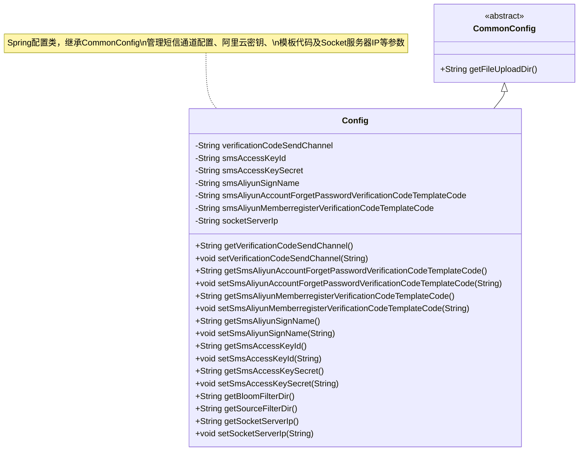

# 基础信息

|      |      |
|------|------|
| 名称 | Config |
| 编码语言 | .java |
| 代码路径 | WeFe/fusion/fusion-service/src/main/java/com/welab/wefe/data/fusion/service/config/Config.java |
| 包名 | com.welab.wefe.data.fusion.service.config |
| 依赖项 | ['com.welab.wefe.common.web.config.CommonConfig', 'org.springframework.beans.factory.annotation.Value', 'org.springframework.boot.context.properties.ConfigurationProperties', 'org.springframework.context.annotation.PropertySource', 'org.springframework.stereotype.Component', 'java.nio.file.Paths'] |
| 概述说明 | Config类继承CommonConfig，通过@PropertySource加载外部配置文件，包含短信验证码发送渠道、阿里云短信配置、服务器IP等属性，提供getter/setter方法。 |

# 说明

这是一个名为Config的Java配置类，继承自CommonConfig。该类使用@Component注解标记为Spring组件，通过@PropertySource加载外部配置文件，并支持@ConfigurationProperties配置绑定。类中定义了多个配置属性，包括短信验证码发送渠道、阿里云短信服务的访问密钥ID和密钥、签名名称、忘记密码和会员注册的验证码模板代码，以及Socket服务器IP地址。此外，还提供了获取布隆过滤器目录和源文件过滤目录的方法。所有属性都配有对应的getter和setter方法，支持属性值的读取和修改。

# 类列表 Class Summary

| 名称   | 类型  | 说明 |
|-------|------|-------------|
| Config | class | Java配置类，继承CommonConfig，加载外部配置文件，包含短信验证码发送渠道、阿里云短信配置、Socket服务器IP等属性，提供getter/setter方法。 |

## 类 Config

|      |      |
|------|------|
| 访问范围 | @Component;@PropertySource(value = {"file:${config.path}"}, encoding = "utf-8");@ConfigurationProperties;public |
| 类型 | class |
| 名称 | Config |
| 说明 | Java配置类，继承CommonConfig，加载外部配置文件，包含短信验证码发送渠道、阿里云短信配置、Socket服务器IP等属性，提供getter/setter方法。 |

### UML类图

类图描述：Config类继承自抽象类CommonConfig，是一个Spring配置类，通过@Value注解注入外部配置参数。主要管理短信发送通道选择、阿里云短信服务的访问密钥、签名名称、密码找回和会员注册的验证码模板代码，以及Socket服务器IP地址等配置信息。类中提供了完整的getter/setter方法，并扩展了父类的文件目录处理方法。

### 内部方法调用关系图

这段代码是一个Spring配置类Config，继承自CommonConfig，用于管理短信验证码发送渠道、阿里云短信服务配置和Socket服务器IP等参数。通过@PropertySource注解加载外部配置文件，使用@Value注解注入属性值，并提供了一系列getter和setter方法。类中还包含两个特殊方法getBloomFilterDir()和getSourceFilterDir()，用于构建文件存储路径。该配置类通过@Component注解被Spring容器管理，方便其他组件依赖注入使用。

### 字段列表 Field List

| 名称  | 类型  | 说明 |
|-------|-------|------|
| smsAliyunMemberregisterVerificationCodeTemplateCode | String | 阿里云短信服务会员注册验证码模板配置项，默认值xxx。 |
| smsAccessKeyId | String | 配置项：短信服务访问密钥ID，默认值xxx。 |
| smsAliyunSignName | String | 阿里云短信服务签名名称配置，默认值"xxx"。 |
| verificationCodeSendChannel | String | 配置项verificationCodeSendChannel默认值为sms，用于指定验证码发送渠道。 |
| smsAccessKeySecret | String | 配置项：短信服务密钥，默认值xxx。 |
| smsAliyunAccountForgetPasswordVerificationCodeTemplateCode | String | 阿里云短信服务配置项，用于指定忘记密码验证码的短信模板代码，默认值为xxx。 |
| socketServerIp | String | 代码片段定义了一个私有字符串变量socketServerIp，其值通过@Value注解从配置属性socket.server.ip注入。 |

### 方法列表

| 名称  | 类型  | 说明 |
|-------|-------|------|
| getSmsAliyunSignName | String | 该方法返回阿里云短信服务的签名名称。 |
| getSmsAliyunAccountForgetPasswordVerificationCodeTemplateCode | String | 获取阿里云短信服务中用于忘记密码验证码的模板代码。 |
| getSmsAccessKeyId | String | 获取短信服务访问密钥ID的方法。 |
| getVerificationCodeSendChannel | String | 获取验证码发送渠道的方法。 |
| getSmsAliyunMemberregisterVerificationCodeTemplateCode | String | 获取阿里云短信服务会员注册验证码模板代码的方法。 |
| setSmsAliyunAccountForgetPasswordVerificationCodeTemplateCode | void | 设置阿里云短信服务中用于忘记密码验证码的模板代码。 |
| setVerificationCodeSendChannel | void | 设置验证码发送渠道的方法，将参数值赋给类成员变量verificationCodeSendChannel。 |
| setSmsAliyunMemberregisterVerificationCodeTemplateCode | void | 设置阿里云短信会员注册验证码模板代码的方法。 |
| setSmsAccessKeySecret | void | 设置短信服务的访问密钥。 |
| getBloomFilterDir | String | 该方法返回文件上传目录下"bloom_filter"子目录的完整路径字符串。 |
| setSmsAccessKeyId | void | 设置短信服务访问密钥ID的方法。 |
| setSmsAliyunSignName | void | 设置阿里云短信签名名称的方法。 |
| getSmsAccessKeySecret | String | 获取短信服务访问密钥的方法，返回存储的密钥字符串。 |
| getSourceFilterDir | String | 方法返回文件上传目录下"file"子目录的完整路径字符串。 |
| getSocketServerIp | String | 获取socket服务器IP地址的方法，返回存储的IP字符串。 |
| setSocketServerIp | void | 设置socket服务器IP地址的方法。 |

