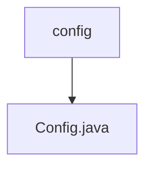

# 基础信息

|      |      |
|------|------|
| 名称 | config |
| 编码语言 | .java |
| 代码路径 | WeFe/fusion/fusion-service/src/main/java/com/welab/wefe/data/fusion/service/config |
| 包名 | docs.fusion.fusion-service.src.main.java.com.welab.wefe.data.fusion.service.config |
| 概述说明 | Config类继承CommonConfig，通过@PropertySource加载外部配置文件，包含短信验证码发送渠道、阿里云短信配置、服务器IP等属性，提供getter/setter方法。 |

# 说明

这是一个名为Config的Java配置类，继承自CommonConfig。该类使用@Component注解标记为Spring组件，通过@PropertySource加载外部配置文件，并支持@ConfigurationProperties配置绑定。类中定义了多个配置属性，包括短信验证码发送渠道、阿里云短信服务的访问密钥ID和密钥、签名名称、忘记密码和会员注册的验证码模板代码，以及Socket服务器IP地址。此外，还提供了获取布隆过滤器目录和源文件过滤目录的方法。所有属性都配有对应的getter和setter方法，支持属性值的读取和修改。

### 包内部结构视图

该流程图展示了WeFe项目中fusion-service模块的配置目录结构。根节点为config文件夹，包含一个Config.java配置文件。这是一个典型的单层Java项目配置结构，其中配置类直接存放在配置目录下，没有更深层次的嵌套关系。

# 文件列表

| 名称   | 类型  | 说明 |
|-------|------|-------------|
| [Config.java](Config.md) | file | Config类继承CommonConfig，通过@PropertySource加载外部配置文件，包含短信验证码发送渠道、阿里云短信配置、服务器IP等属性，提供getter/setter方法。 |

