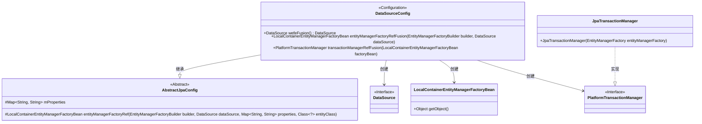
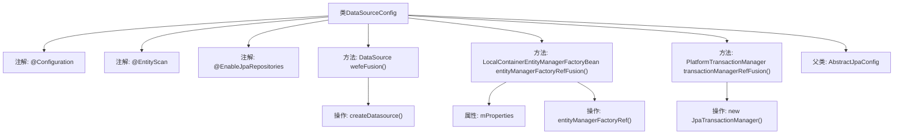

# 基础信息

|      |      |
|------|------|
| 名称 | DataSourceConfig |
| 编码语言 | .java |
| 代码路径 | WeFe/fusion/fusion-service/src/main/java/com/welab/wefe/data/fusion/service/database/DataSourceConfig.java |
| 包名 | com.welab.wefe.data.fusion.service.database |
| 依赖项 | ['com.welab.wefe.common.data.mysql.config.AbstractJpaConfig', 'com.welab.wefe.data.fusion.service.FusionService', 'com.welab.wefe.data.fusion.service.database.repository.base.BaseRepositoryFactoryBean', 'org.springframework.beans.factory.annotation.Qualifier', 'org.springframework.boot.autoconfigure.domain.EntityScan', 'org.springframework.boot.context.properties.ConfigurationProperties', 'org.springframework.boot.orm.jpa.EntityManagerFactoryBuilder', 'org.springframework.boot.orm.jpa.hibernate.SpringImplicitNamingStrategy', 'org.springframework.boot.orm.jpa.hibernate.SpringPhysicalNamingStrategy', 'org.springframework.context.annotation.Bean', 'org.springframework.context.annotation.Configuration', 'org.springframework.context.annotation.Primary', 'org.springframework.data.jpa.repository.config.EnableJpaRepositories', 'org.springframework.orm.jpa.JpaTransactionManager', 'org.springframework.orm.jpa.LocalContainerEntityManagerFactoryBean', 'org.springframework.transaction.PlatformTransactionManager', 'javax.sql.DataSource', 'java.util.Map'] |
| 概述说明 | 这是一个Spring Boot的JPA数据源配置类，定义了主数据源"fusion"、实体管理器工厂和事务管理器，并指定了实体扫描路径和JPA仓库配置。 |

# 说明

这是一个名为DataSourceConfig的Java配置类，用于设置数据源和JPA相关配置。它继承自AbstractJpaConfig，标注了@Configuration表明这是一个配置类。使用@EntityScan指定实体扫描包路径，@EnableJpaRepositories配置JPA仓库相关参数。类中定义了三个Bean：主数据源"fusion"、主实体管理器工厂"entityManagerFactoryRefFusion"和主事务管理器"transactionManagerRefFusion"。其中实体管理器工厂配置了Hibernate的物理和隐式命名策略，事务管理器基于JPA实现。整个配置针对FusionService类所在包进行定制化设置。

# 类列表 Class Summary

| 名称   | 类型  | 说明 |
|-------|------|-------------|
| DataSourceConfig | class | 这是一个Spring Boot的JPA数据源配置类，定义了主数据源、实体管理器和事务管理器，包含自定义命名策略和MySQL配置。 |

## 类 DataSourceConfig

|      |      |
|------|------|
| 访问范围 | @Configuration;@EntityScan("com.welab.wefe.data.fusion.service");@EnableJpaRepositories(basePackageClasses = FusionService.class,;        repositoryFactoryBeanClass = BaseRepositoryFactoryBean.class,;        entityManagerFactoryRef = "entityManagerFactoryRefFusion",;        transactionManagerRef = "transactionManagerRefFusion");public |
| 类型 | class |
| 名称 | DataSourceConfig |
| 说明 | 这是一个Spring Boot的JPA数据源配置类，定义了主数据源、实体管理器和事务管理器，包含自定义命名策略和MySQL配置。 |

### UML类图

这段代码展示了一个Spring Boot的JPA数据源配置类DataSourceConfig，它继承自AbstractJpaConfig抽象类。主要功能包括：1) 通过@Bean注解配置主数据源；2) 创建实体管理器工厂并设置Hibernate命名策略；3) 配置JPA事务管理器。该类通过多个@Bean方法分别创建了DataSource、LocalContainerEntityManagerFactoryBean和PlatformTransactionManager实例，其中JpaTransactionManager实现了PlatformTransactionManager接口。整个配置类使用了@Primary注解确保这些bean作为主候选对象被注入。

### 内部方法调用关系图

这段代码是一个Spring Boot的JPA数据源配置类，主要用于配置多数据源环境下的实体扫描、仓库启用和事务管理。类继承自AbstractJpaConfig，通过@Bean注解定义了主数据源(fusion)、实体管理器工厂(entityManagerFactoryRefFusion)和事务管理器(transactionManagerRefFusion)。其中entityManagerFactoryRefFusion方法还配置了Hibernate的命名策略，确保实体和表的命名符合规范。整个类通过@Primary注解标记主数据源相关配置，确保在多个数据源环境下能正确识别默认数据源。

### 字段列表 Field List

| 名称  | 类型  | 说明 |
|-------|-------|------|

### 方法列表

| 名称  | 类型  | 说明 |
|-------|-------|------|
| entityManagerFactoryRefFusion | LocalContainerEntityManagerFactoryBean | 定义主实体管理器工厂Bean，配置自定义命名策略，使用指定数据源和属性创建。 |
| wefeFusion | DataSource | Java配置类中定义主数据源"fusion"，使用MySQL前缀配置，通过createDatasource方法创建。 |
| transactionManagerRefFusion | PlatformTransactionManager | 定义主事务管理器，使用指定实体管理器工厂创建JPA事务管理器。 |

