# 基础信息

|      |      |
|------|------|
| 名称 | database |
| 编码语言 | .java |
| 代码路径 | WeFe/fusion/fusion-service/src/main/java/com/welab/wefe/data/fusion/service/database |
| 包名 | docs.fusion.fusion-service.src.main.java.com.welab.wefe.data.fusion.service.database |
| 概述说明 | 基于Spring Data JPA的通用仓库框架，提供标准化数据访问和原生SQL扩展，支持多实体CRUD、事务操作及复杂查询。包含MySqlModel系列实体，依赖Spring Data JPA和Hibernate。用于数据融合服务，涵盖任务管理、数据集处理等全生命周期。配置类DataSourceConfig设置数据源和JPA参数。 |

# 说明

## 概述  
该模块是数据融合服务的核心持久层架构，基于Spring Data JPA实现多业务域ORM映射与标准化数据访问。核心职责包括：1）提供通用仓库框架（如BaseRepository支持原生SQL扩展）；2）构建数据融合实体基础架构（如AbstractMySqlModel派生业务模型）。接口规范统一采用JPA注解，例如@Query实现条件统计、@Modifying处理事务操作。关键数据结构涵盖任务(TaskMySqlModel)、数据集(DataSetMySqlModel)等业务实体，均包含UUID主键和加密字段（如GlobalConfigMysqlModel配置项）。外部依赖集中于Spring Data JPA/Hibernate、数据库加密组件和UUID生成器。

## 主要业务场景  
模块支撑数据融合全生命周期管理，类似分布式ETL控制台。典型流程为：通过JPA仓库（如PartnerRepository）执行CRUD→组合@Query扩展查询（如countByName统计）→事务操作（如账户状态更新）。交互模式包括：1）多机构协作（通过BloomFilterMySqlModel实现隐私集合求交）；2）任务流程控制（TaskMySqlModel记录算法类型/执行角色）；3）安全审计（OperationLogMysqlModel跟踪操作）。集成案例覆盖从基础配置（如DataSourceConfig类配置多数据源）到复杂业务（如DataSetRepository处理数据来源/进度）。

### 包内部结构视图

```mermaid
graph TD
    database --> repository
    database --> entity
    database --> DataSourceConfig.java
    repository --> DataSetRepository.java
    repository --> base
    repository --> DataSourceRepository.java
    repository --> BloomFilterRepository.java
    repository --> OperationLogRepository.java
    repository --> GlobalConfigRepository.java
    repository --> GlobalSettingRepository.java
    repository --> PartnerRepository.java
    repository --> TaskRepository.java
    repository --> FieldInfoRepository.java
    repository --> AccountRepository.java
    repository --> TaskResultRepository.java
    repository --> VerificationCodeRepository.java
    base --> BaseRepositoryFactoryBean.java
    base --> BaseRepositoryImpl.java
    base --> BaseRepository.java
    entity --> AbstractBaseMySqlModel.java
    entity --> TaskMySqlModel.java
    entity --> DataSetMySqlModel.java
    entity --> TaskResultMySqlModel.java
    entity --> GlobalSettingMySqlModel.java
    entity --> DataSetColumnOutputModel.java
    entity --> GlobalConfigMysqlModel.java
    entity --> BloomFilterMySqlModel.java
    entity --> PartnerMySqlModel.java
    entity --> OperationLogMysqlModel.java
    entity --> VerificationCodeMysqlModel.java
    entity --> FieldInfoMySqlModel.java
    entity --> AccountMysqlModel.java
    entity --> DataSourceMySqlModel.java
    entity --> AbstractMySqlModel.java
```

该流程图展示了WeFe数据融合服务中数据库模块的完整结构。顶层为database目录，下分repository、entity和DataSourceConfig.java三个主要部分。repository包含多个具体仓库实现和base基础仓库组件，entity则包含所有数据库实体模型类。整个结构清晰地反映了数据访问层的组织方式，包含约25个具体实现类。

# 文件列表

| 名称   | 类型  | 说明 |
|-------|------|-------------|
| [DataSourceConfig.java](DataSourceConfig.md) | file | 这是一个Spring Boot的JPA数据源配置类，定义了主数据源"fusion"、实体管理器工厂和事务管理器，并指定了实体扫描路径和JPA仓库配置。 |
| [entity](entity/_module.md) | package | AbstractBaseMySqlModel是抽象基类，含创建/更新者字段。TaskMySqlModel描述任务信息。DataSetMySqlModel存储数据集信息。TaskResultMySqlModel记录任务结果。GlobalSettingMySqlModel存储全局设置。DataSetColumnOutputModel表示数据集列输出。GlobalConfigMysqlModel存储加密配置。BloomFilterMySqlModel描述布隆过滤器。PartnerMySqlModel存储合作伙伴数据。OperationLogMysqlModel记录操作日志。VerificationCodeMysqlModel存储验证码。FieldInfoMySqlModel描述字段信息。AccountMysqlModel表示账户实体。DataSourceMySqlModel描述数据源。AbstractMySqlModel是通用父类，含ID和时间字段。 |
| [repository](repository/_module.md) | package | 多个Spring Data JPA仓库接口继承BaseRepository，提供CRUD和自定义SQL查询功能，支持不同实体类型如DataSet、Account等。 |

