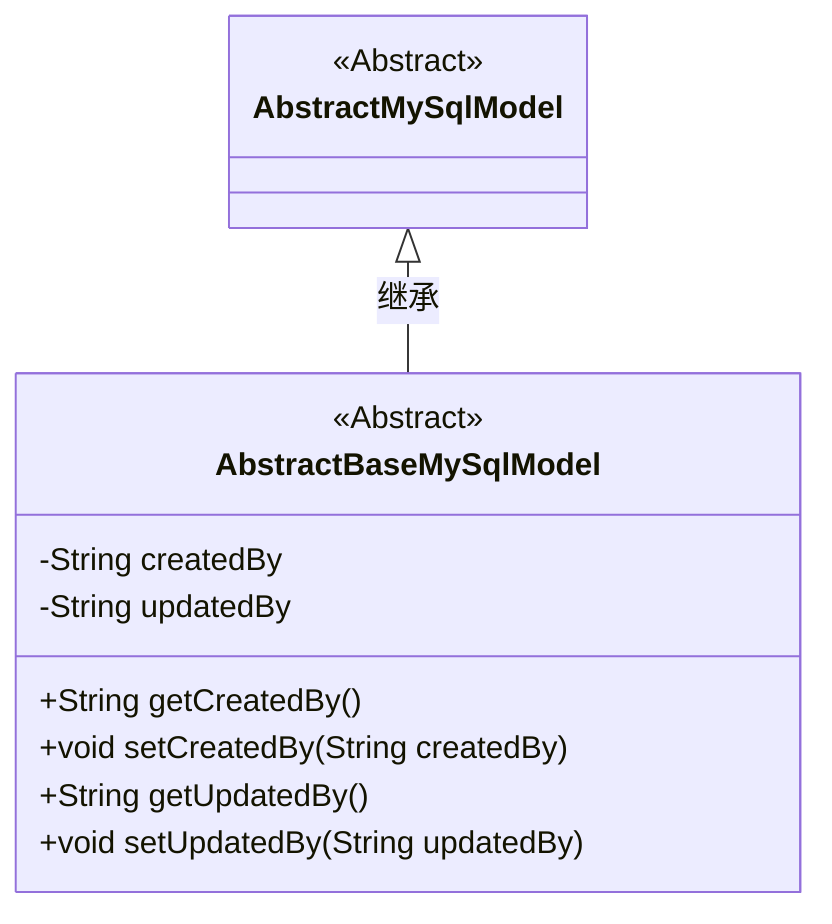
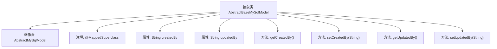

# 基础信息

|      |      |
|------|------|
| 名称 | AbstractBaseMySqlModel |
| 编码语言 | .java |
| 代码路径 | WeFe/fusion/fusion-service/src/main/java/com/welab/wefe/data/fusion/service/database/entity/AbstractBaseMySqlModel.java |
| 包名 | com.welab.wefe.data.fusion.service.database.entity |
| 依赖项 | ['javax.persistence.MappedSuperclass'] |
| 概述说明 | 抽象类AbstractBaseMySqlModel继承AbstractMySqlModel，包含创建者和更新者字段及其getter/setter方法。 |

# 说明

这是一个名为AbstractBaseMySqlModel的抽象类，继承自AbstractMySqlModel，并使用@MappedSuperclass注解标注。该类定义了两个私有字符串字段：createdBy表示创建者，updatedBy表示更新者。提供了这两个字段的公共getter和setter方法，分别用于获取和设置它们的值。这个类作为基础模型，可能用于其他实体类的扩展。

# 类列表 Class Summary

| 名称   | 类型  | 说明 |
|-------|------|-------------|
| AbstractBaseMySqlModel | class | 抽象类AbstractBaseMySqlModel继承AbstractMySqlModel，包含创建者和更新者字段及其getter/setter方法。 |

## 类 AbstractBaseMySqlModel

|      |      |
|------|------|
| 访问范围 | @MappedSuperclass;public abstract |
| 类型 | class |
| 名称 | AbstractBaseMySqlModel |
| 说明 | 抽象类AbstractBaseMySqlModel继承AbstractMySqlModel，包含创建者和更新者字段及其getter/setter方法。 |

### UML类图

这段类图展示了一个MySQL基础模型类的继承结构。AbstractBaseMySqlModel作为抽象类继承自AbstractMySqlModel，添加了两个核心字段createdBy和updatedBy用于记录创建者和更新者信息，并提供了对应的getter和setter方法。该设计模式体现了模板方法模式的思想，通过抽象基类规范子类的数据模型结构，特别适合需要记录操作人信息的业务场景。

### 内部方法调用关系图

这段代码展示了一个名为AbstractBaseMySqlModel的抽象类，它继承自AbstractMySqlModel并使用@MappedSuperclass注解标注。该类包含两个字符串类型的属性createdBy和updatedBy，分别表示创建者和更新者，并为这两个属性提供了标准的getter和setter方法。这个类作为基类设计，主要用于扩展其他具体的数据模型类，提供通用的创建和更新者字段管理功能。

### 字段列表 Field List

| 名称  | 类型  | 说明 |
|-------|-------|------|
| updatedBy | String | 字段updatedBy记录最后更新者信息。 |
| createdBy | String | 私有字符串类型变量，记录创建者信息。 |

### 方法列表

| 名称  | 类型  | 说明 |
|-------|-------|------|
| getCreatedBy | String | 获取创建者信息的方法，返回字符串类型变量createdBy。 |
| setCreatedBy | void | 定义了一个公共方法setCreatedBy，用于设置createdBy属性的值。 |
| getUpdatedBy | String | 获取更新者信息的方法，返回updatedBy字段值。 |
| setUpdatedBy | void | 设置更新者方法，将参数updatedBy赋值给类成员变量updatedBy。 |

