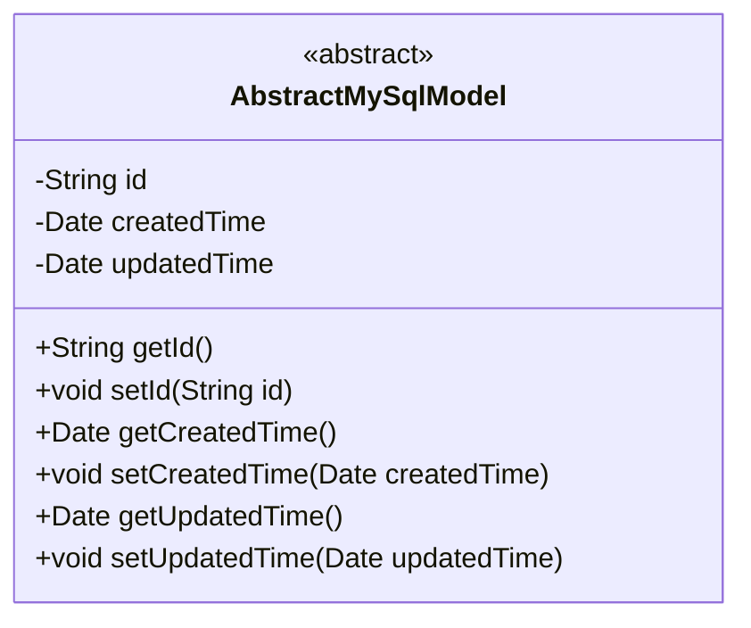
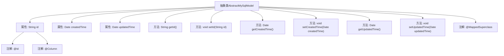

# 基础信息

|      |      |
|------|------|
| 名称 | AbstractMySqlModel |
| 编码语言 | .java |
| 代码路径 | WeFe/fusion/fusion-service/src/main/java/com/welab/wefe/data/fusion/service/database/entity/AbstractMySqlModel.java |
| 包名 | com.welab.wefe.data.fusion.service.database.entity |
| 依赖项 | ['javax.persistence.Column', 'javax.persistence.Id', 'javax.persistence.MappedSuperclass', 'java.io.Serializable', 'java.util.Date', 'java.util.UUID'] |
| 概述说明 | 抽象MySQL模型基类，包含ID（UUID生成）、创建时间和更新时间字段及对应getter/setter方法。 |

# 说明

这是一个名为AbstractMySqlModel的抽象基类，使用@MappedSuperclass注解标注，实现了Serializable接口。类中包含三个核心字段：id作为不可更新的主键字段，使用UUID生成并去除横线；createdTime记录创建时间，默认值为当前时间；updatedTime记录更新时间。类提供了这三个字段的标准getter和setter方法，用于数据访问和修改。该设计可作为MySQL实体类的通用父类。

# 类列表 Class Summary

| 名称   | 类型  | 说明 |
|-------|------|-------------|
| AbstractMySqlModel | class | 抽象类AbstractMySqlModel定义MySQL模型基类，包含ID、创建时间和更新时间字段，实现序列化接口。ID自动生成无横线UUID，创建时间默认当前时间。提供各字段getter和setter方法。 |

## 类 AbstractMySqlModel

|      |      |
|------|------|
| 访问范围 | @MappedSuperclass;public abstract |
| 类型 | class |
| 名称 | AbstractMySqlModel |
| 说明 | 抽象类AbstractMySqlModel定义MySQL模型基类，包含ID、创建时间和更新时间字段，实现序列化接口。ID自动生成无横线UUID，创建时间默认当前时间。提供各字段getter和setter方法。 |

### UML类图

这段代码定义了一个名为`AbstractMySqlModel`的抽象类，实现了`Serializable`接口，用作MySQL数据库模型的基类。类中包含三个私有字段：`id`（使用UUID生成并去除连字符）、`createdTime`（创建时自动初始化）和`updatedTime`（更新时设置），以及对应的getter和setter方法。通过`@MappedSuperclass`注解表明这是一个JPA实体基类，其字段将被继承到子类中。该设计提供了通用的主键和审计字段管理功能，适用于需要记录创建/修改时间的持久化实体。

### 内部方法调用关系图

这段代码定义了一个名为AbstractMySqlModel的抽象类，该类实现了Serializable接口，并使用@MappedSuperclass注解标识。类中包含三个主要属性：id（使用UUID生成并去除连字符）、createdTime（创建时间）和updatedTime（更新时间），每个属性都有对应的getter和setter方法。id属性还使用了@Id和@Column注解进行进一步配置。该类的设计目的是作为其他实体类的基类，提供通用的字段和功能。

### 字段列表 Field List

| 名称  | 类型  | 说明 |
|-------|-------|------|
| createdTime = new Date() | Date | 声明一个私有Date类型变量createdTime，初始化为当前时间。 |
| updatedTime | Date | 字段updatedTime，类型Date，表示更新时间。 |
| id = UUID.randomUUID().toString().replaceAll("-", "") | String | 实体类ID字段，使用UUID生成唯一标识并去除连字符，禁止更新。 |

### 方法列表

| 名称  | 类型  | 说明 |
|-------|-------|------|
| setUpdatedTime | void | 方法setUpdatedTime用于设置updatedTime属性，参数为Date类型。 |
| getUpdatedTime | Date | 获取更新时间的方法，返回updatedTime变量。 |
| getCreatedTime | Date | 获取创建时间的方法，返回Date类型。 |
| setId | void | 设置对象ID的方法，将参数id赋值给对象的id属性。 |
| setCreatedTime | void | 设置创建时间的方法，将参数赋值给对象的createdTime属性。 |
| getId | String | 方法getId返回字符串类型的id值。 |

