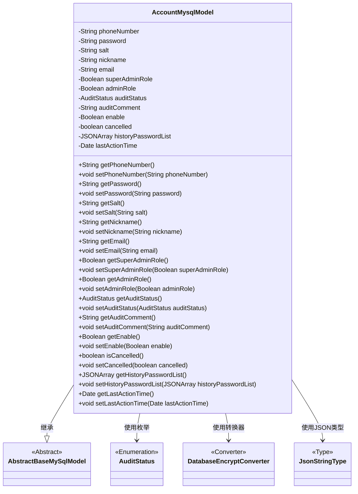

# 基础信息

|      |      |
|------|------|
| 名称 | AccountMysqlModel |
| 编码语言 | .java |
| 代码路径 | WeFe/fusion/fusion-service/src/main/java/com/welab/wefe/data/fusion/service/database/entity/AccountMysqlModel.java |
| 包名 | com.welab.wefe.data.fusion.service.database.entity |
| 依赖项 | ['com.alibaba.fastjson.JSONArray', 'com.vladmihalcea.hibernate.type.json.JsonStringType', 'com.welab.wefe.common.web.util.DatabaseEncryptConverter', 'com.welab.wefe.common.wefe.enums.AuditStatus', 'org.hibernate.annotations.Type', 'org.hibernate.annotations.TypeDef', 'javax.persistence', 'java.util.Date'] |
| 概述说明 | AccountMysqlModel类定义了账户实体，包含手机号、密码、昵称、邮箱等基本信息，以及管理员角色、审核状态、可用性等属性，支持JSON格式存储历史密码。 |

# 说明

这是一个名为AccountMysqlModel的Java类，用于表示账户实体。它继承自AbstractBaseMySqlModel，并使用@Entity注解标记为数据库实体。类中定义了多个属性，包括加密的手机号、密码、盐值、昵称、邮箱、管理员角色标识、审核状态及意见、账户状态、注销标识、历史密码列表和最后活动时间。每个属性都有对应的getter和setter方法。其中手机号使用了加密转换器，历史密码列表以JSON格式存储。

# 类列表 Class Summary

| 名称   | 类型  | 说明 |
|-------|------|-------------|
| AccountMysqlModel | class | 账户实体类，包含手机号、密码、盐、昵称、邮箱等基本信息，以及管理员角色、审核状态、历史密码和最后活动时间等属性。 |

## 类 AccountMysqlModel

|      |      |
|------|------|
| 访问范围 | @Entity(name = "account");@TypeDef(name = "json", typeClass = JsonStringType.class);public |
| 类型 | class |
| 名称 | AccountMysqlModel |
| 说明 | 账户实体类，包含手机号、密码、盐、昵称、邮箱等基本信息，以及管理员角色、审核状态、历史密码和最后活动时间等属性。 |

### UML类图

这段代码定义了一个名为`AccountMysqlModel`的实体类，继承自`AbstractBaseMySqlModel`，用于表示账户信息。该类包含多个私有字段，如手机号、密码、昵称等，以及对应的getter和setter方法。使用了JPA注解进行数据库映射，包括实体标记、类型定义和字段转换。其中`phoneNumber`字段通过`DatabaseEncryptConverter`进行加密存储，`historyPasswordList`字段使用`JsonStringType`以JSON格式存储。类中还使用了`AuditStatus`枚举来表示审核状态。整体设计体现了账户管理的核心数据结构和安全存储需求。

### 内部方法调用关系图

```mermaid
graph TD
    A["类AccountMysqlModel"]
    B["注解: @Entity('account')"]
    C["注解: @TypeDef(name='json', typeClass=JsonStringType.class)"]
    D["继承: AbstractBaseMySqlModel"]
    E["属性: @Convert phoneNumber"]
    F["属性: password"]
    G["属性: salt"]
    H["属性: nickname"]
    I["属性: email"]
    J["属性: superAdminRole"]
    K["属性: adminRole"]
    L["属性: @Enumerated auditStatus"]
    M["属性: auditComment"]
    N["属性: enable"]
    O["属性: cancelled"]
    P["属性: @Type('json') historyPasswordList"]
    Q["属性: lastActionTime"]
    R["方法区域: getter/setter"]

    A --> B
    A --> C
    A --> D
    A --> E
    A --> F
    A --> G
    A --> H
    A --> I
    A --> J
    A --> K
    A --> L
    A --> M
    A --> N
    A --> O
    A --> P
    A --> Q
    A --> R
```

这段代码定义了一个名为`AccountMysqlModel`的JPA实体类，用于映射数据库中的`account`表。类中包含多个属性，如手机号、密码、昵称等，并使用了多种注解来定义字段的特殊处理方式，如`@Convert`用于加密手机号，`@Type`用于JSON类型字段的存储。所有属性都配有标准的getter和setter方法，用于属性的访问和修改。该类继承了`AbstractBaseMySqlModel`，可能包含一些基础字段或方法。

### 字段列表 Field List

| 名称  | 类型  | 说明 |
|-------|-------|------|
| lastActionTime | Date | 私有日期类型变量，记录最后操作时间。 |
| cancelled | boolean | 布尔变量cancelled，表示是否已取消。 |
| superAdminRole | Boolean | 私有布尔类型变量，标识是否为超级管理员角色。 |
| historyPasswordList | JSONArray | 实体类字段historyPasswordList使用JSON类型存储历史密码列表，数据库列定义为json格式。 |
| email | String | 声明一个私有字符串变量email。 |
| salt | String | 私有字符串变量salt，用于存储加密盐值。 |
| auditComment | String | 私有字符串变量auditComment，用于存储审核意见。 |
| password | String | 私有字符串类型变量password |
| enable | Boolean | 私有布尔类型变量enable，用于控制功能开关。 |
| phoneNumber | String | 字段phoneNumber使用DatabaseEncryptConverter类进行数据库加密转换。 |
| auditStatus | AuditStatus | 枚举类型字段auditStatus，使用字符串形式存储。 |
| adminRole | Boolean | 布尔类型变量，标识管理员角色状态。 |
| nickname | String | 声明一个私有字符串变量nickname。 |

### 方法列表

| 名称  | 类型  | 说明 |
|-------|-------|------|
| setSalt | void | 设置字符串类型的盐值属性。 |
| getPhoneNumber | String | 获取电话号码的方法，返回字符串类型的phoneNumber。 |
| getSuperAdminRole | Boolean | 获取超级管理员角色状态的方法，返回布尔值表示是否具有该权限。 |
| getEnable | Boolean | 获取enable布尔值的公共方法。 |
| getAuditStatus | AuditStatus | 获取当前审核状态的方法，返回auditStatus属性值。 |
| setNickname | void | 这是一个Java方法，用于设置对象的昵称属性。方法接收一个字符串参数nickname，并将其赋值给当前对象的同名成员变量。 |
| getNickname | String | 获取昵称的方法，返回字符串类型变量nickname。 |
| getPassword | String | 获取密码的公共方法，返回字符串类型密码。 |
| getSalt | String | 获取salt值的公共方法。 |
| isCancelled | boolean | 方法isCancelled返回布尔值cancelled，表示是否已取消。 |
| setAuditStatus | void | 设置审计状态的方法，将传入的auditStatus赋值给当前对象的auditStatus字段。 |
| setPhoneNumber | void | 设置电话号码的方法，将输入参数赋值给类的成员变量phoneNumber。 |
| setEmail | void | 设置对象邮箱属性的方法，参数为字符串类型email。 |
| getHistoryPasswordList | JSONArray | 获取历史密码列表的方法，返回JSONArray类型数据。 |
| setHistoryPasswordList | void | 方法setHistoryPasswordList接收JSONArray参数，用于设置历史密码列表。 |
| getLastActionTime | Date | 方法返回最后操作时间。 |
| setLastActionTime | void | 设置最后操作时间的方法，将参数lastActionTime赋值给对象的同名属性。 |
| getEmail | String | 获取email字符串的方法。 |
| setCancelled | void | 设置取消状态的公共方法，参数为布尔值cancelled，用于更新内部状态。 |
| setAdminRole | void | 定义方法setAdminRole，参数adminRole为布尔值，用于设置类的adminRole属性。 |
| setSuperAdminRole | void | 设置用户是否为超级管理员角色的方法。 |
| getAuditComment | String | 获取审计评语的方法，返回auditComment字符串。 |
| getAdminRole | Boolean | 获取管理员角色状态的方法，返回布尔值adminRole。 |
| setAuditComment | void | 这是一个Java方法，用于设置auditComment属性的值。方法接收一个字符串参数auditComment，并将其赋值给类的同名成员变量。 |
| setEnable | void | 这是一个Java方法，用于设置布尔类型的enable属性值。方法接收一个Boolean参数，并将其赋值给类的成员变量enable。 |
| setPassword | void | 设置密码方法，将输入字符串赋值给类成员变量password。 |

