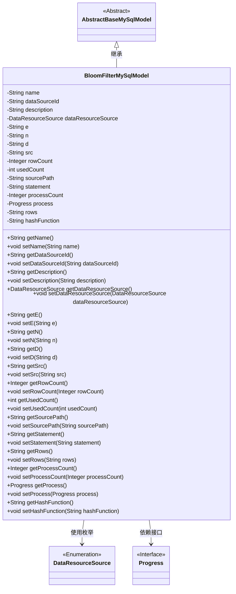

# 基础信息

|      |      |
|------|------|
| 名称 | BloomFilterMySqlModel |
| 编码语言 | .java |
| 代码路径 | WeFe/fusion/fusion-service/src/main/java/com/welab/wefe/data/fusion/service/database/entity/BloomFilterMySqlModel.java |
| 包名 | com.welab.wefe.data.fusion.service.database.entity |
| 依赖项 | ['com.welab.wefe.data.fusion.service.enums.DataResourceSource', 'com.welab.wefe.data.fusion.service.enums.Progress', 'javax.persistence.Entity', 'javax.persistence.EnumType', 'javax.persistence.Enumerated'] |
| 概述说明 | BloomFilterMySqlModel类定义了布隆过滤器的MySQL模型，包含名称、数据源ID、描述、公钥私钥参数、文件路径、SQL语句、进度状态等字段及其getter和setter方法。 |

# 说明

该内容定义了一个名为BloomFilterMySqlModel的Java实体类，用于表示布隆过滤器的MySQL数据模型。类中包含多个字段，包括名称、数据源ID、描述、数据资源来源、公钥指数e、公钥模数n、私钥指数d、源文件地址src、数据行数rowCount、使用次数usedCount、文件路径sourcePath、SQL语句statement、进度计数processCount、进度状态process、选择列rows以及哈希函数hashFunction。每个字段都有对应的getter和setter方法，用于访问和修改字段值。该类继承自AbstractBaseMySqlModel，表明它是一个基础模型类的扩展。

# 类列表 Class Summary

| 名称   | 类型  | 说明 |
|-------|------|-------------|
| BloomFilterMySqlModel | class | BloomFilterMySqlModel类包含名称、数据源ID、描述、数据来源、公钥私钥参数、源文件地址、行数、使用次数、文件路径、SQL语句、进度状态、选择列和哈希函数等属性。 |

## 类 BloomFilterMySqlModel

|      |      |
|------|------|
| 访问范围 | @Entity(name = "bloom_filter");public |
| 类型 | class |
| 名称 | BloomFilterMySqlModel |
| 说明 | BloomFilterMySqlModel类包含名称、数据源ID、描述、数据来源、公钥私钥参数、源文件地址、行数、使用次数、文件路径、SQL语句、进度状态、选择列和哈希函数等属性。 |

### UML类图

该类图展示了BloomFilterMySqlModel继承自AbstractBaseMySqlModel，并包含多个私有字段及其对应的getter/setter方法。该类使用了DataResourceSource枚举类型和Progress接口，主要功能是管理布隆过滤器的元数据信息，包括名称、数据源ID、描述、加密密钥参数、文件路径、SQL语句等属性，用于在MySQL数据库中存储和操作布隆过滤器的相关配置和状态信息。

### 内部方法调用关系图

该流程图展示了BloomFilterMySqlModel类的完整结构，包括其继承关系、实体注解、18个属性字段以及对应的getter/setter方法。这个类是一个MySQL数据模型，用于存储布隆过滤器相关配置信息，包含数据源标识、密钥参数、文件路径、SQL语句等业务属性，并通过继承AbstractBaseMySqlModel获得基础数据库操作能力。所有属性都配有完整的访问方法，体现了标准的Java Bean设计模式。

### 字段列表 Field List

| 名称  | 类型  | 说明 |
|-------|-------|------|
| description | String | 私有字符串类型变量description。 |
| n | String | 声明一个私有字符串变量n。 |
| processCount = 0 | Integer | 定义一个私有整型变量processCount，初始值为0。 |
| name | String | 私有字符串类型变量name |
| sourcePath | String | 私有字符串变量sourcePath，用于存储路径信息。 |
| dataResourceSource | DataResourceSource | 使用@Enumerated注解将枚举类型DataResourceSource以字符串形式存储到数据库。 |
| process | Progress | 私有进度对象process |
| src | String | 私有字符串变量src |
| statement | String | 私有字符串变量statement。 |
| d | String | 声明一个私有字符串变量d。 |
| rowCount = 0 | Integer | 声明一个私有整型变量rowCount，初始值为0。 |
| rows | String | 声明一个私有字符串变量rows。 |
| usedCount = 0 | int | 私有整型变量usedCount，初始值为0。 |
| hashFunction | String | 私有字符串变量hashFunction，用于存储哈希函数名称。 |
| dataSourceId | String | 声明一个私有字符串变量dataSourceId。 |
| e | String | 私有字符串变量e。 |

### 方法列表

| 名称  | 类型  | 说明 |
|-------|-------|------|
| setSrc | void | 设置源字符串方法，将输入参数赋值给类的src成员变量。 |
| getRows | String | 获取rows字符串的方法。 |
| getUsedCount | int | 方法返回已使用次数。 |
| getStatement | String | 获取statement字符串的方法。 |
| setN | void | 这是一个Java方法，用于设置变量n的值。方法名为setN，接受一个字符串参数n，并将其赋值给类的成员变量this.n。 |
| getDataResourceSource | DataResourceSource | 这是一个Java方法，返回DataResourceSource类型的对象dataResourceSource。 |
| getN | String | 这是一个Java方法，返回字符串类型的成员变量n的值。 |
| setDataSourceId | void | 设置数据源ID的方法，将输入参数赋值给类的成员变量dataSourceId。 |
| setDataResourceSource | void | 该方法用于设置数据资源来源，将传入的DataResourceSource对象赋值给类的成员变量dataResourceSource。 |
| getName | String | 方法返回字符串类型的name变量值。 |
| setProcessCount | void | 设置进程数量的方法，参数为整数类型。 |
| getSourcePath | String | 获取源路径的字符串方法。 |
| getD | String | 方法getD返回字符串类型变量d的值。 |
| setRowCount | void | 方法setRowCount用于设置行数，参数为Integer类型的rowCount，将其赋值给类的成员变量rowCount。 |
| getSrc | String | 这是一个Java方法，返回字符串类型的成员变量src的值。 |
| getDescription | String | 获取描述信息的公共方法，返回字符串类型的description值。 |
| setStatement | void | 设置语句内容的方法，将输入参数赋值给类成员变量statement。 |
| getProcess | Progress | 获取进度对象的方法，返回process变量。 |
| setProcess | void | 设置进度对象的方法，将传入的process赋值给当前对象的process属性。 |
| getHashFunction | String | 获取哈希函数名称的方法。 |
| setHashFunction | void | Java方法：设置哈希函数，参数为字符串类型，赋值给类成员变量hashFunction。 |
| getDataSourceId | String | 这是一个Java方法，返回字符串类型的dataSourceId成员变量值。 |
| getProcessCount | Integer | 这是一个Java方法，返回整型变量processCount的值。 |
| setSourcePath | void | 设置源路径的方法，将输入字符串赋值给类的sourcePath成员变量。 |
| getRowCount | Integer | 获取行数的方法，返回整型变量rowCount的值。 |
| setUsedCount | void | 设置已使用次数的方法，将参数usedCount赋值给成员变量this.usedCount。 |
| setD | void | 设置字符串d的值。 |
| getE | String | 获取字符串类型变量e的值的方法。 |
| setDescription | void | 设置对象描述的方法，将输入字符串赋值给对象的description属性。 |
| setName | void | 设置对象名称的方法，将参数name赋值给对象的name属性。 |
| setRows | void | 设置字符串类型的行属性值。 |
| setE | void | 这是一个Java方法，用于设置类成员变量e的值。方法名为setE，接受一个字符串参数e，并将其赋值给当前对象的e属性。 |

