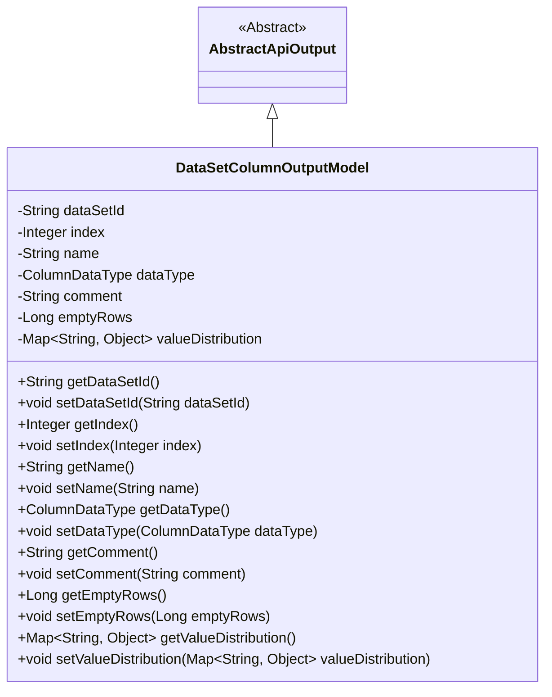

# 基础信息

|      |      |
|------|------|
| 名称 | DataSetColumnOutputModel |
| 编码语言 | .java |
| 代码路径 | WeFe/fusion/fusion-service/src/main/java/com/welab/wefe/data/fusion/service/database/entity/DataSetColumnOutputModel.java |
| 包名 | com.welab.wefe.data.fusion.service.database.entity |
| 依赖项 | ['com.welab.wefe.common.web.dto.AbstractApiOutput', 'com.welab.wefe.common.wefe.enums.ColumnDataType', 'java.util.Map'] |
| 概述说明 | 数据集列输出模型类，包含数据集ID、序号、字段名、数据类型、注释、空行数和数值分布等属性及对应getter/setter方法。 |

# 说明

DataSetColumnOutputModel类继承自AbstractApiOutput，用于表示数据集列的输出模型。包含以下字段：dataSetId表示数据集ID，index表示序列号，name表示字段名称，dataType表示数据类型，comment表示注释，emptyRows表示空数据行数，valueDistribution表示数值分布。每个字段都有对应的getter和setter方法。

# 类列表 Class Summary

| 名称   | 类型  | 说明 |
|-------|------|-------------|
| DataSetColumnOutputModel | class | 数据集列输出模型类，包含数据集ID、序号、字段名、数据类型、注释、空行数和数值分布等属性及其getter/setter方法。 |

## 类 DataSetColumnOutputModel

|      |      |
|------|------|
| 访问范围 | public |
| 类型 | class |
| 名称 | DataSetColumnOutputModel |
| 说明 | 数据集列输出模型类，包含数据集ID、序号、字段名、数据类型、注释、空行数和数值分布等属性及其getter/setter方法。 |

### UML类图

这段代码定义了一个`DataSetColumnOutputModel`类，继承自抽象类`AbstractApiOutput`。该类用于表示数据集列的输出模型，包含数据集ID、序号、字段名、数据类型、注释、空行数以及数值分布等属性，并提供了相应的getter和setter方法。这些属性主要用于描述数据集列的元数据和统计信息，便于在API中返回结构化的列信息。

### 内部方法调用关系图

```mermaid
graph TD
    A["类DataSetColumnOutputModel"]
    B["继承: AbstractApiOutput"]
    C["属性: String dataSetId"]
    D["属性: Integer index"]
    E["属性: String name"]
    F["属性: ColumnDataType dataType"]
    G["属性: String comment"]
    H["属性: Long emptyRows"]
    I["属性: Map<String,Object> valueDistribution"]
    J["方法: getDataSetId/setDataSetId"]
    K["方法: getIndex/setIndex"]
    L["方法: getName/setName"]
    M["方法: getDataType/setDataType"]
    N["方法: getComment/setComment"]
    O["方法: getEmptyRows/setEmptyRows"]
    P["方法: getValueDistribution/setValueDistribution"]

    A --> B
    A --> C
    A --> D
    A --> E
    A --> F
    A --> G
    A --> H
    A --> I
    A --> J
    A --> K
    A --> L
    A --> M
    A --> N
    A --> O
    A --> P
```

该流程图展示了DataSetColumnOutputModel类的结构，它继承自AbstractApiOutput类，包含7个私有属性和对应的getter/setter方法。属性包括数据集ID(dataSetId)、序号(index)、字段名称(name)、数据类型(dataType)、注释(comment)、空行数(emptyRows)和数值分布(valueDistribution)。每个属性都有对应的访问方法，用于封装数据访问逻辑。类结构清晰，符合JavaBean规范，适用于API数据输出场景。

### 字段列表 Field List

| 名称  | 类型  | 说明 |
|-------|-------|------|
| valueDistribution | Map<String, Object> | 存储键值对的映射，键为字符串类型，值为任意对象类型。 |
| name | String | 声明一个私有字符串变量name。 |
| index | Integer | 私有整型变量index |
| dataType | ColumnDataType | 私有字段dataType，类型为ColumnDataType。 |
| emptyRows | Long | 空行数量，长整型变量。 |
| dataSetId | String | 私有字符串类型变量dataSetId，用于存储数据集ID。 |
| comment | String | 私有字符串类型变量comment。 |

### 方法列表

| 名称  | 类型  | 说明 |
|-------|-------|------|
| getComment | String | 方法返回字符串类型的comment变量值。 |
| getEmptyRows | Long | 获取空行数的方法，返回空行数量。 |
| setDataType | void | 这是一个Java方法，用于设置列的数据类型。方法接收一个ColumnDataType参数，并将其赋值给类的dataType成员变量。 |
| getIndex | Integer | 方法返回整型变量index的值。 |
| setDataSetId | void | 设置数据集ID的方法，将输入参数赋值给类的dataSetId成员变量。 |
| setIndex | void | 设置整型索引值的方法。 |
| getDataSetId | String | 这是一个Java方法，返回名为dataSetId的字符串变量值。 |
| setName | void | 设置对象名称的方法，将输入参数name赋值给对象的name属性。 |
| getValueDistribution | Map<String, Object> | 获取值分布映射的方法，返回键为字符串、值为对象的Map。 |
| getName | String | 获取名称的方法，返回字符串类型的name变量值。 |
| getDataType | ColumnDataType | 获取当前列的数据类型。 |
| setComment | void | Java方法：设置comment属性值为输入参数。 |
| setEmptyRows | void | 设置空行数方法，参数为emptyRows，赋值给当前对象的emptyRows属性。 |
| setValueDistribution | void | Java方法：设置键值对映射到类的valueDistribution属性。 |

