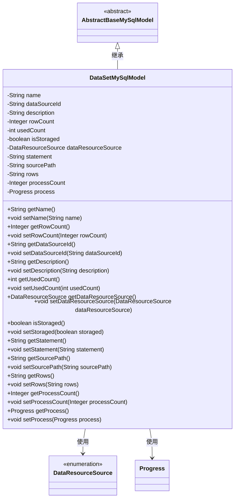

# 基础信息

|      |      |
|------|------|
| 名称 | DataSetMySqlModel |
| 编码语言 | .java |
| 代码路径 | WeFe/fusion/fusion-service/src/main/java/com/welab/wefe/data/fusion/service/database/entity/DataSetMySqlModel.java |
| 包名 | com.welab.wefe.data.fusion.service.database.entity |
| 依赖项 | ['com.welab.wefe.data.fusion.service.enums.DataResourceSource', 'com.welab.wefe.data.fusion.service.enums.Progress', 'javax.persistence.Entity', 'javax.persistence.EnumType', 'javax.persistence.Enumerated'] |
| 概述说明 | DataSetMySqlModel类表示数据集实体，包含名称、数据源ID、描述、行数、使用次数、存储状态、数据来源、SQL语句、源文件路径、选择列、进度计数和进度状态等属性及其getter/setter方法。 |

# 说明

DataSetMySqlModel是一个继承自AbstractBaseMySqlModel的实体类，映射到数据库表data_set。该类包含多个字段：name表示数据集名称，dataSourceId标识数据源，description为描述信息，rowCount记录数据条目数，usedCount统计使用次数，isStoraged标记是否存储，dataResourceSource枚举数据来源。statement存储SQL语句，sourcePath记录源文件路径，rows保存选定列，processCount和process分别表示进度数值和状态。每个字段都有对应的getter和setter方法用于访问和修改属性值。

# 类列表 Class Summary

| 名称   | 类型  | 说明 |
|-------|------|-------------|
| DataSetMySqlModel | class | DataSetMySqlModel类表示数据集实体，包含名称、数据源ID、描述、行数、使用次数、存储状态、数据来源、SQL语句、源文件路径、选择列、进度计数和进度状态等属性。 |

## 类 DataSetMySqlModel

|      |      |
|------|------|
| 访问范围 | @Entity(name = "data_set");public |
| 类型 | class |
| 名称 | DataSetMySqlModel |
| 说明 | DataSetMySqlModel类表示数据集实体，包含名称、数据源ID、描述、行数、使用次数、存储状态、数据来源、SQL语句、源文件路径、选择列、进度计数和进度状态等属性。 |

### UML类图

这段类图描述了一个MySQL数据集模型(DataSetMySqlModel)，它继承自抽象基类AbstractBaseMySqlModel，并包含多个字段如名称、数据源ID、描述、行数等。该类使用了枚举类型DataResourceSource表示数据资源来源，以及Progress类表示进度状态。所有字段都有对应的getter和setter方法，用于访问和修改这些私有属性。这个模型主要用于在数据库中存储和管理数据集的相关信息。

### 内部方法调用关系图

```mermaid
graph TD
    A["类DataSetMySqlModel"]
    B["继承: AbstractBaseMySqlModel"]
    C["注解: @Entity(name='data_set')"]
    D["属性: String name"]
    E["属性: String dataSourceId"]
    F["属性: String description"]
    G["属性: Integer rowCount = 0"]
    H["属性: int usedCount = 0"]
    I["属性: boolean isStoraged = false"]
    J["属性: DataResourceSource dataResourceSource"]
    K["属性: String statement"]
    L["属性: String sourcePath"]
    M["属性: String rows"]
    N["属性: Integer processCount = 0"]
    O["属性: Progress process"]
    P["方法: getName/setName"]
    Q["方法: getRowCount/setRowCount"]
    R["方法: getDataSourceId/setDataSourceId"]
    S["方法: getDescription/setDescription"]
    T["方法: getUsedCount/setUsedCount"]
    U["方法: getDataResourceSource/setDataResourceSource"]
    V["方法: isStoraged/setStoraged"]
    W["方法: getStatement/setStatement"]
    X["方法: getSourcePath/setSourcePath"]
    Y["方法: getRows/setRows"]
    Z["方法: getProcessCount/setProcessCount"]
    AA["方法: getProcess/setProcess"]

    A --> B
    A --> C
    A --> D
    A --> E
    A --> F
    A --> G
    A --> H
    A --> I
    A --> J
    A --> K
    A --> L
    A --> M
    A --> N
    A --> O
    A --> P
    A --> Q
    A --> R
    A --> S
    A --> T
    A --> U
    A --> V
    A --> W
    A --> X
    A --> Y
    A --> Z
    A --> AA
```

该流程图展示了DataSetMySqlModel类的完整结构，包括继承关系、类注解、12个属性字段及其数据类型，以及对应的getter/setter方法。所有属性均通过标准JavaBean规范封装，其中dataResourceSource使用枚举类型并通过@Enumerated注解标注序列化方式，process属性为自定义Progress类型。类继承自AbstractBaseMySqlModel并标注为JPA实体@Entity，映射数据库表名为'data_set'。

### 字段列表 Field List

| 名称  | 类型  | 说明 |
|-------|-------|------|
| dataResourceSource | DataResourceSource | 枚举字段dataResourceSource使用字符串类型存储。 |
| processCount = 0 | Integer | 变量processCount初始化为0，类型为Integer，用于计数。 |
| isStoraged = false | boolean | 变量isStoraged为布尔类型，初始值为false，表示未存储状态。 |
| usedCount = 0 | int | 声明一个私有整型变量usedCount，初始值为0。 |
| statement | String | 私有字符串变量statement。 |
| sourcePath | String | 私有字符串变量sourcePath，用于存储路径信息。 |
| process | Progress | 私有进度对象process |
| rows | String | 字符串类型变量rows的私有声明。 |
| name | String | 私有字符串变量name |
| rowCount = 0 | Integer | 声明一个私有整型变量rowCount，初始值为0。 |
| description | String | 私有字符串类型变量description，用于存储描述信息。 |
| dataSourceId | String | 私有字符串类型变量dataSourceId。 |

### 方法列表

| 名称  | 类型  | 说明 |
|-------|-------|------|
| setUsedCount | void | 设置已使用次数的公共方法，参数为整型usedCount。 |
| setDescription | void | 这是一个Java方法，用于设置对象的描述属性。方法名为setDescription，接收一个字符串参数description，并将其赋值给对象的description字段。 |
| setName | void | 这是一个Java方法，用于设置对象的名称属性，将传入的字符串赋值给成员变量name。 |
| isStoraged | boolean | 检查存储状态的布尔方法，返回isStoraged值。 |
| setStoraged | void | 设置存储状态的布尔值方法，将参数赋值给isStoraged变量。 |
| getDataResourceSource | DataResourceSource | 获取数据资源源对象的方法，返回成员变量dataResourceSource。 |
| setRowCount | void | 设置行数方法，参数为整型rowCount，赋值给类成员变量rowCount。 |
| getDescription | String | 这是一个Java方法，返回字符串类型的description属性值。 |
| setDataResourceSource | void | 设置数据资源源的方法，将输入参数赋值给类的成员变量。 |
| getRowCount | Integer | 获取行数的方法，返回整型值rowCount。 |
| getSourcePath | String | 获取sourcePath值的公共方法。 |
| getName | String | 这是一个Java方法，返回字符串类型的name变量值。 |
| setProcessCount | void | 设置进程数量的方法，将输入参数赋给类变量processCount。 |
| setRows | void | 设置字符串类型的行数据。 |
| setProcess | void | 设置进度对象的方法，将传入的进度对象赋值给当前对象的进度属性。 |
| getDataSourceId | String | 获取数据源ID的方法，返回字符串类型的数据源ID。 |
| getProcess | Progress | 获取当前进度对象的方法。 |
| getProcessCount | Integer | 获取当前进程数量。 |
| getStatement | String | 获取statement字符串的方法。 |
| getRows | String | 方法返回字符串类型的rows变量值。 |
| getUsedCount | int | 方法返回已使用次数变量值。 |
| setStatement | void | 设置语句内容的方法，将输入参数赋值给类成员变量。 |
| setDataSourceId | void | 设置数据源ID的方法，将输入参数赋值给类的成员变量dataSourceId。 |
| setSourcePath | void | 定义方法setSourcePath，用于设置成员变量sourcePath的值。 |

