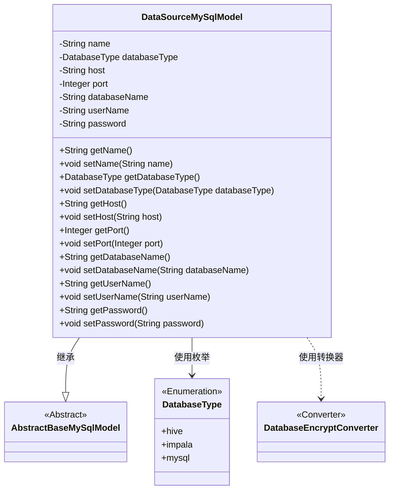

# 基础信息

|      |      |
|------|------|
| 名称 | DataSourceMySqlModel |
| 编码语言 | .java |
| 代码路径 | WeFe/fusion/fusion-service/src/main/java/com/welab/wefe/data/fusion/service/database/entity/DataSourceMySqlModel.java |
| 包名 | com.welab.wefe.data.fusion.service.database.entity |
| 依赖项 | ['com.welab.wefe.common.jdbc.base.DatabaseType', 'com.welab.wefe.common.web.util.DatabaseEncryptConverter', 'javax.persistence.Convert', 'javax.persistence.Entity', 'javax.persistence.EnumType', 'javax.persistence.Enumerated'] |
| 概述说明 | MySQL数据源实体类，包含名称、类型、主机、端口、数据库名、用户名和加密密码等属性及其getter/setter方法。 |

# 说明

这是一个名为DataSourceMySqlModel的Java实体类，用于表示数据源信息。该类继承自AbstractBaseMySqlModel，映射到数据库表data_source。主要属性包括：数据源名称name、数据库类型databaseType（枚举值包括hive、impala、mysql）、主机地址host、端口号port、数据库名称databaseName、用户名userName和密码password。其中密码字段使用了DatabaseEncryptConverter进行加密转换。类中为每个属性提供了标准的getter和setter方法。

# 类列表 Class Summary

| 名称   | 类型  | 说明 |
|-------|------|-------------|
| DataSourceMySqlModel | class | MySQL数据源实体类，包含名称、类型、主机、端口、数据库名、用户名和加密密码等字段及其getter/setter方法。 |

## 类 DataSourceMySqlModel

|      |      |
|------|------|
| 访问范围 | @Entity(name = "data_source");public |
| 类型 | class |
| 名称 | DataSourceMySqlModel |
| 说明 | MySQL数据源实体类，包含名称、类型、主机、端口、数据库名、用户名和加密密码等字段及其getter/setter方法。 |

### UML类图

该类图展示了DataSourceMySqlModel作为AbstractBaseMySqlModel的子类，包含数据库连接相关的属性（如主机名、端口、用户名等）及其getter/setter方法。其中databaseType使用DatabaseType枚举，password字段通过DatabaseEncryptConverter进行加密转换。整体结构体现了JPA实体类的典型设计模式，通过继承和组合实现数据库模型的定义。

### 内部方法调用关系图

```mermaid
graph TD
    A["类DataSourceMySqlModel"]
    B["继承: AbstractBaseMySqlModel"]
    C["注解: @Entity(name='data_source')"]
    D["属性: String name"]
    E["属性: DatabaseType databaseType<br>注解: @Enumerated(EnumType.STRING)"]
    F["属性: String host"]
    G["属性: Integer port"]
    H["属性: String databaseName"]
    I["属性: String userName"]
    J["属性: String password<br>注解: @Convert(converter=DatabaseEncryptConverter.class)"]
    K["方法: getName/setName"]
    L["方法: getDatabaseType/setDatabaseType"]
    M["方法: getHost/setHost"]
    N["方法: getPort/setPort"]
    O["方法: getDatabaseName/setDatabaseName"]
    P["方法: getUserName/setUserName"]
    Q["方法: getPassword/setPassword"]

    A --> B
    A --> C
    A --> D
    A --> E
    A --> F
    A --> G
    A --> H
    A --> I
    A --> J
    A --> K
    A --> L
    A --> M
    A --> N
    A --> O
    A --> P
    A --> Q
```

这段代码定义了一个名为DataSourceMySqlModel的JPA实体类，继承自AbstractBaseMySqlModel，用于表示数据源配置信息。类中包含7个核心属性：数据源名称(name)、数据库类型(databaseType)、主机地址(host)、端口号(port)、数据库名(databaseName)、用户名(userName)和加密存储的密码(password)。每个属性都有对应的getter和setter方法，其中databaseType使用枚举类型并通过@Enumerated注解指定字符串存储方式，password属性通过@Convert注解指定了加密转换器。该实体映射到数据库中的"data_source"表。

### 字段列表 Field List

| 名称  | 类型  | 说明 |
|-------|-------|------|
| port | Integer | 私有整型变量port，用于存储端口号。 |
| userName | String | 私有字符串变量userName |
| password | String | 数据库密码字段使用加密转换器进行存储加密。 |
| databaseType | DatabaseType | 实体类字段使用字符串枚举类型标注数据库类型。 |
| name | String | 私有字符串变量name |
| host | String | 私有字符串变量host。 |
| databaseName | String | 声明一个私有字符串变量databaseName。 |

### 方法列表

| 名称  | 类型  | 说明 |
|-------|-------|------|
| getPassword | String | 这是一个Java方法，返回字符串类型的password字段值。 |
| setHost | void | 设置主机地址的方法，将输入参数host赋值给类成员变量host。 |
| getUserName | String | 获取用户名的公共方法，返回字符串类型的userName。 |
| getHost | String | 方法getHost返回字符串host的值。 |
| setUserName | void | 设置用户名的Java方法，将输入参数userName赋值给当前对象的userName属性。 |
| getPort | Integer | 获取端口号的方法，返回整数类型。 |
| setPort | void | 设置端口号的方法，将参数port赋值给类变量this.port。 |
| setDatabaseName | void | 设置数据库名称的方法，将输入参数赋值给类的成员变量databaseName。 |
| setDatabaseType | void | 设置数据库类型的方法，将参数databaseType赋值给类的同名属性。 |
| getName | String | 这是一个Java方法，返回字符串类型的name变量值。 |
| setName | void | 设置对象名称的方法，将参数name赋值给对象的name属性。 |
| getDatabaseType | DatabaseType | 获取当前数据库类型的方法，返回值为DatabaseType对象。 |
| getDatabaseName | String | 方法返回数据库名称字符串。 |
| setPassword | void | 设置密码的方法，将输入字符串赋值给类成员变量password。 |

