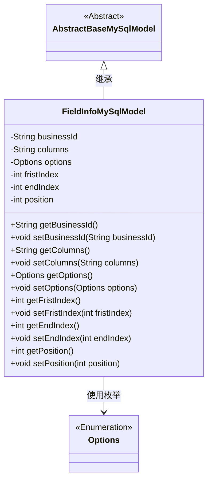

# 基础信息

|      |      |
|------|------|
| 名称 | FieldInfoMySqlModel |
| 编码语言 | .java |
| 代码路径 | WeFe/fusion/fusion-service/src/main/java/com/welab/wefe/data/fusion/service/database/entity/FieldInfoMySqlModel.java |
| 包名 | com.welab.wefe.data.fusion.service.database.entity |
| 依赖项 | ['com.welab.wefe.data.fusion.service.enums.Options', 'javax.persistence.Entity', 'javax.persistence.EnumType', 'javax.persistence.Enumerated'] |
| 概述说明 | FieldInfoMySqlModel类映射数据库表field_info，包含businessId、columns、options枚举、fristIndex、endIndex和position字段及其getter/setter方法。 |

# 说明

该内容定义了一个名为FieldInfoMySqlModel的Java实体类，映射到数据库表field_info。类继承自AbstractBaseMySqlModel，包含六个属性：businessId（字符串类型）、columns（字符串类型）、options（枚举类型，存储为字符串）、fristIndex（整型，疑似拼写错误应为firstIndex）、endIndex（整型）和position（整型）。每个属性都有对应的getter和setter方法，用于访问和修改属性值。

# 类列表 Class Summary

| 名称   | 类型  | 说明 |
|-------|------|-------------|
| FieldInfoMySqlModel | class | FieldInfoMySqlModel是MySQL实体类，包含业务ID、列名、枚举选项、起始结束索引和位置字段。 |

## 类 FieldInfoMySqlModel

|      |      |
|------|------|
| 访问范围 | @Entity(name = "field_info");public |
| 类型 | class |
| 名称 | FieldInfoMySqlModel |
| 说明 | FieldInfoMySqlModel是MySQL实体类，包含业务ID、列名、枚举选项、起始结束索引和位置字段。 |

### UML类图

这段代码展示了一个名为FieldInfoMySqlModel的实体类，它继承自抽象基类AbstractBaseMySqlModel，并包含多个字段及其对应的getter和setter方法。该类使用了JPA注解@Entity标记为数据库实体，其中包含业务ID、列信息、枚举类型的选项配置以及多个索引位置字段。特别值得注意的是options字段通过@Enumerated注解以字符串形式存储枚举值，且类中可能存在拼写错误（fristIndex应为firstIndex）。该类设计用于持久化存储字段相关的配置信息，体现了面向对象编程中的封装特性和继承关系。

### 内部方法调用关系图

```mermaid
graph TD
    A["类FieldInfoMySqlModel"]
    B["继承: AbstractBaseMySqlModel"]
    C["注解: @Entity(name='field_info')"]
    D["属性: String businessId"]
    E["属性: String columns"]
    F["属性: Options options @Enumerated(EnumType.STRING)"]
    G["属性: int fristIndex"]
    H["属性: int endIndex"]
    I["属性: int position"]
    J["方法: getBusinessId/setBusinessId"]
    K["方法: getColumns/setColumns"]
    L["方法: getOptions/setOptions"]
    M["方法: getFristIndex/setFristIndex"]
    N["方法: getEndIndex/setEndIndex"]
    O["方法: getPosition/setPosition"]

    A --> B
    A --> C
    A --> D
    A --> E
    A --> F
    A --> G
    A --> H
    A --> I
    A --> J
    A --> K
    A --> L
    A --> M
    A --> N
    A --> O
```

这段代码定义了一个名为FieldInfoMySqlModel的JPA实体类，继承自AbstractBaseMySqlModel，包含6个属性和对应的getter/setter方法。其中options属性使用@Enumerated注解指定枚举存储方式为字符串，类上通过@Entity注解映射到数据库表"field_info"。该流程图清晰展示了类的继承关系、属性定义和方法结构，体现了JPA实体类的基本组成要素。

### 字段列表 Field List

| 名称  | 类型  | 说明 |
|-------|-------|------|
| position | int | 私有整型变量position，用于存储位置信息。 |
| fristIndex | int | 私有整型变量fristIndex。 |
| endIndex | int | 私有整型变量endIndex，用于标记结束位置。 |
| options | Options | 枚举类型字段options，使用字符串形式存储枚举值。 |
| columns | String | 私有字符串变量columns |
| businessId | String | 定义私有字符串类型变量businessId。 |

### 方法列表

| 名称  | 类型  | 说明 |
|-------|-------|------|
| getOptions | Options | 获取options对象的方法。 |
| getFristIndex | int | 方法getFristIndex返回整型变量fristIndex的值。 |
| getBusinessId | String | 获取业务ID的方法，直接返回成员变量businessId的值。 |
| setFristIndex | void | 设置类成员变量fristIndex的值。 |
| setOptions | void | 设置选项方法，将传入的options参数赋值给当前对象的options属性。 |
| setColumns | void | 该方法用于设置字符串类型的列属性，将输入参数赋值给类的成员变量columns。 |
| setBusinessId | void | 设置业务ID的方法，将输入参数赋值给类的成员变量businessId。 |
| getColumns | String | 这是一个Java方法，返回名为columns的字符串变量。 |
| getEndIndex | int | 方法返回endIndex的值。 |
| setEndIndex | void | 设置结束索引的方法，将参数值赋给类的endIndex成员变量。 |
| setPosition | void | 设置对象位置的方法，将输入参数赋值给内部变量position。 |
| getPosition | int | 获取当前位置的方法，返回整型数值position。 |

