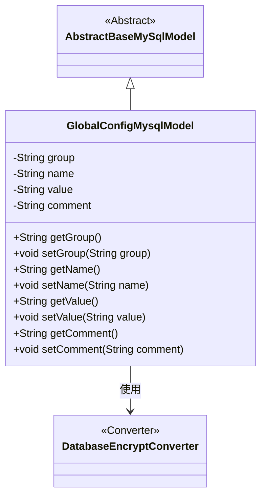
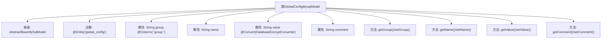

# 基础信息

|      |      |
|------|------|
| 名称 | GlobalConfigMysqlModel |
| 编码语言 | .java |
| 代码路径 | WeFe/fusion/fusion-service/src/main/java/com/welab/wefe/data/fusion/service/database/entity/GlobalConfigMysqlModel.java |
| 包名 | com.welab.wefe.data.fusion.service.database.entity |
| 依赖项 | ['com.welab.wefe.common.web.util.DatabaseEncryptConverter', 'javax.persistence.Column', 'javax.persistence.Convert', 'javax.persistence.Entity'] |
| 概述说明 | 这是一个名为GlobalConfigMysqlModel的Java实体类，用于映射数据库表global_config，包含组名、配置项名称、加密存储的值和说明注释字段，并提供了各字段的getter和setter方法。 |

# 说明

这是一个名为GlobalConfigMysqlModel的实体类，映射到数据库表global_config。它继承自AbstractBaseMySqlModel，包含四个字段：group表示配置项所在组，name表示配置项名称，value表示配置项值并使用DatabaseEncryptConverter进行加密转换，comment用于解释说明配置项。类中为每个字段提供了对应的getter和setter方法。

# 类列表 Class Summary

| 名称   | 类型  | 说明 |
|-------|------|-------------|
| GlobalConfigMysqlModel | class | GlobalConfigMysqlModel是存储全局配置的实体类，包含组名、配置项名称、加密值和说明注释字段，并提供getter/setter方法。 |

## 类 GlobalConfigMysqlModel

|      |      |
|------|------|
| 访问范围 | @Entity(name = "global_config");public |
| 类型 | class |
| 名称 | GlobalConfigMysqlModel |
| 说明 | GlobalConfigMysqlModel是存储全局配置的实体类，包含组名、配置项名称、加密值和说明注释字段，并提供getter/setter方法。 |

### UML类图

该代码定义了一个名为GlobalConfigMysqlModel的实体类，用于表示数据库中的全局配置项。它继承自AbstractBaseMySqlModel抽象类，包含group、name、value和comment四个私有属性及其对应的getter/setter方法。其中value字段使用了DatabaseEncryptConverter进行数据转换，表明该字段在存储时会进行加密处理。类图清晰地展示了继承关系和字段加密转换的依赖关系。

### 内部方法调用关系图

这段代码定义了一个名为GlobalConfigMysqlModel的JPA实体类，继承自AbstractBaseMySqlModel，映射到数据库表global_config。类包含四个属性：group（带特殊列名注解）、name、value（使用加密转换器）和comment，每个属性都有对应的getter/setter方法。该模型用于存储全局配置项，支持分组、加密存储等特性，体现了JPA实体与数据库表之间的映射关系。

### 字段列表 Field List

| 名称  | 类型  | 说明 |
|-------|-------|------|
| comment | String | 私有字符串类型变量comment。 |
| name | String | 私有字符串变量name。 |
| group | String | 数据库字段映射：group列对应String类型的group属性。 |
| value | String | 数据库字段加密转换注解，使用DatabaseEncryptConverter类处理value字段。 |

### 方法列表

| 名称  | 类型  | 说明 |
|-------|-------|------|
| getGroup | String | 获取group字符串值的方法。 |
| getName | String | 这是一个Java方法，返回字符串类型的name变量值。 |
| getValue | String | 获取value值的公共方法。 |
| setGroup | void | 设置对象的组别属性。 |
| setName | void | 这是一个Java方法，用于设置对象的名称属性。方法接收一个字符串参数name，并将其赋值给对象的name字段。 |
| setValue | void | 设置字符串值的方法，将输入值赋给类成员变量value。 |
| getComment | String | 获取comment字符串的方法。 |
| setComment | void | 这是一个Java方法，用于设置对象的comment属性值。方法接收一个字符串参数comment，并将其赋值给当前对象的comment成员变量。 |

