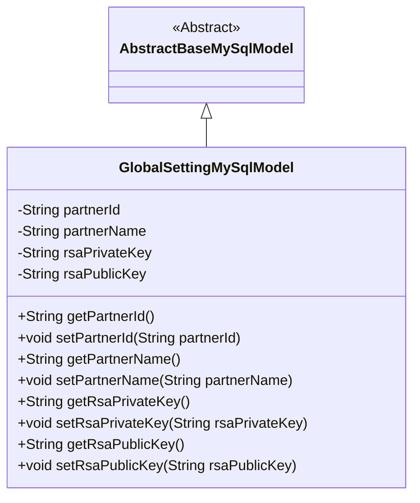

# 基础信息

|      |      |
|------|------|
| 名称 | GlobalSettingMySqlModel |
| 编码语言 | .java |
| 代码路径 | WeFe/fusion/fusion-service/src/main/java/com/welab/wefe/data/fusion/service/database/entity/GlobalSettingMySqlModel.java |
| 包名 | com.welab.wefe.data.fusion.service.database.entity |
| 依赖项 | ['javax.persistence.Entity', 'java.util.UUID'] |
| 概述说明 | GlobalSettingMySqlModel类表示全局设置，包含partnerId、名称及RSA密钥对，继承自AbstractBaseMySqlModel。 |

# 说明

这是一个名为GlobalSettingMySqlModel的JPA实体类，继承自AbstractBaseMySqlModel。该类包含四个主要字段：partnerId（默认值为去除连字符的随机UUID字符串）、partnerName、rsaPrivateKey和rsaPublicKey。每个字段都有对应的getter和setter方法。注释中提到一个被注释掉的openSocketPort字段，默认值为8080，但当前未使用。该实体映射到数据库表global_setting。

# 类列表 Class Summary

| 名称   | 类型  | 说明 |
|-------|------|-------------|
| GlobalSettingMySqlModel | class | GlobalSettingMySqlModel实体类，包含partnerId、partnerName、rsaPrivateKey和rsaPublicKey字段及对应getter/setter方法。 |

## 类 GlobalSettingMySqlModel

|      |      |
|------|------|
| 访问范围 | @Entity(name = "global_setting");public |
| 类型 | class |
| 名称 | GlobalSettingMySqlModel |
| 说明 | GlobalSettingMySqlModel实体类，包含partnerId、partnerName、rsaPrivateKey和rsaPublicKey字段及对应getter/setter方法。 |

### UML类图

这段代码定义了一个名为`GlobalSettingMySqlModel`的实体类，继承自抽象基类`AbstractBaseMySqlModel`。该类包含四个私有字符串字段：`partnerId`（默认值为去除连字符的UUID）、`partnerName`、`rsaPrivateKey`和`rsaPublicKey`，并为每个字段提供了公有的getter和setter方法。类通过`@Entity`注解标记为JPA实体，映射到数据库表"global_setting"。该设计用于存储全局配置信息，特别是与合作伙伴相关的RSA密钥对数据。

### 内部方法调用关系图

```mermaid
graph TD
    A["类GlobalSettingMySqlModel"]
    B["继承: AbstractBaseMySqlModel"]
    C["注解: @Entity('global_setting')"]
    D["属性: String partnerId = UUID生成"]
    E["属性: String partnerName"]
    F["属性: String rsaPrivateKey"]
    G["属性: String rsaPublicKey"]
    H["方法: getPartnerId()"]
    I["方法: setPartnerId(String)"]
    J["方法: getPartnerName()"]
    K["方法: setPartnerName(String)"]
    L["方法: getRsaPrivateKey()"]
    M["方法: setRsaPrivateKey(String)"]
    N["方法: getRsaPublicKey()"]
    O["方法: setRsaPublicKey(String)"]

    A --> B
    A --> C
    A --> D
    A --> E
    A --> F
    A --> G
    A --> H
    A --> I
    A --> J
    A --> K
    A --> L
    A --> M
    A --> N
    A --> O
```

这段代码定义了一个名为GlobalSettingMySqlModel的JPA实体类，继承自AbstractBaseMySqlModel，用于存储全局配置信息。类中包含四个主要属性：自动生成的partnerId、partnerName以及RSA密钥对，每个属性都有对应的getter和setter方法。特别值得注意的是partnerId属性在初始化时会通过UUID生成并移除连字符，而其他属性需要显式设置。该类通过@Entity注解映射到数据库中的"global_setting"表，体现了JPA实体与数据库表的映射关系。

### 字段列表 Field List

| 名称  | 类型  | 说明 |
|-------|-------|------|
| rsaPublicKey | String | RSA公钥字符串变量。 |
| rsaPrivateKey | String | RSA私钥字符串变量。 |
| partnerName | String | 声明字符串类型变量partnerName |
| partnerId = UUID.randomUUID().toString().replaceAll("-", "") | String | 生成随机UUID并去除连字符，存储为partnerId字符串。 |

### 方法列表

| 名称  | 类型  | 说明 |
|-------|-------|------|
| setPartnerName | void | 这是一个Java方法，用于设置成员变量partnerName的值。方法接收一个字符串参数，并将其赋值给当前对象的partnerName属性。 |
| setPartnerId | void | 设置合作伙伴ID的方法，将输入字符串赋值给成员变量partnerId。 |
| getPartnerId | String | 获取partnerId的公共方法。 |
| getRsaPrivateKey | String | 获取RSA私钥的方法，返回字符串类型的私钥值。 |
| getPartnerName | String | 这是一个Java方法，返回成员变量partnerName的值。方法名为getPartnerName，无参数，返回类型为String。 |
| setRsaPrivateKey | void | 设置RSA私钥的方法，将传入的字符串赋值给类的私有变量rsaPrivateKey。 |
| getRsaPublicKey | String | 获取RSA公钥的方法。 |
| setRsaPublicKey | void | 设置RSA公钥的方法，参数为字符串类型。 |

