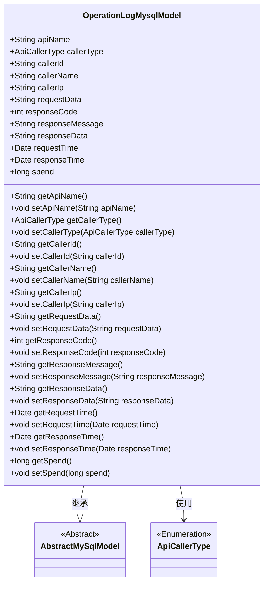

# 基础信息

|      |      |
|------|------|
| 名称 | OperationLogMysqlModel |
| 编码语言 | .java |
| 代码路径 | WeFe/fusion/fusion-service/src/main/java/com/welab/wefe/data/fusion/service/database/entity/OperationLogMysqlModel.java |
| 包名 | com.welab.wefe.data.fusion.service.database.entity |
| 依赖项 | ['com.welab.wefe.common.web.delegate.api_log.ApiCallerType', 'javax.persistence.Entity', 'java.util.Date'] |
| 概述说明 | 操作日志实体类，记录API名称、调用者信息、请求响应数据及时间耗时等。 |

# 说明

该代码定义了一个名为OperationLogMysqlModel的实体类，用于记录API操作日志。类中包含请求接口名称、调用者类型、ID、名称、IP地址、请求参数、响应状态码、消息、数据、请求时间、响应时间及耗时等字段。所有字段均提供了对应的getter和setter方法，便于数据存取。该类继承自AbstractMySqlModel，表明其用于MySQL数据库存储。

# 类列表 Class Summary

| 名称   | 类型  | 说明 |
|-------|------|-------------|
| OperationLogMysqlModel | class | 操作日志实体类，包含接口名称、调用者信息、请求响应数据和耗时等字段。 |

## 类 OperationLogMysqlModel

|      |      |
|------|------|
| 访问范围 | @Entity(name = "operator_log");public |
| 类型 | class |
| 名称 | OperationLogMysqlModel |
| 说明 | 操作日志实体类，包含接口名称、调用者信息、请求响应数据和耗时等字段。 |

### UML类图

这段代码定义了一个名为OperationLogMysqlModel的实体类，用于记录API操作日志，继承自AbstractMySqlModel基类。该类包含API名称、调用者信息、请求/响应数据、时间戳等字段，并通过getter/setter方法提供对这些字段的访问和修改。其中callerType字段使用了ApiCallerType枚举类型。该模型主要用于将API操作日志持久化到MySQL数据库中，记录了完整的请求-响应生命周期信息，包括调用者身份、请求参数、响应状态和执行耗时等关键数据。

### 内部方法调用关系图

```mermaid
graph TD
    A["类OperationLogMysqlModel"]
    B["继承: AbstractMySqlModel"]
    C["注解: @Entity(name='operator_log')"]
    D["属性: String apiName"]
    E["属性: ApiCallerType callerType"]
    F["属性: String callerId"]
    G["属性: String callerName"]
    H["属性: String callerIp"]
    I["属性: String requestData"]
    J["属性: int responseCode"]
    K["属性: String responseMessage"]
    L["属性: String responseData"]
    M["属性: Date requestTime"]
    N["属性: Date responseTime"]
    O["属性: long spend"]
    P["Getter/Setter方法组"]

    A --> B
    A --> C
    A --> D
    A --> E
    A --> F
    A --> G
    A --> H
    A --> I
    A --> J
    A --> K
    A --> L
    A --> M
    A --> N
    A --> O
    A --> P
```

该流程图展示了OperationLogMysqlModel类的完整结构，包含从AbstractMySqlModel继承关系、@Entity注解标记、12个不同数据类型的属性字段（如接口名称、调用者信息、请求响应数据等时间戳），以及对应的getter/setter方法组。这个实体类主要用于记录API操作日志，包含完整的请求-响应全链路信息，适合作为数据库持久化对象使用。

### 字段列表 Field List

| 名称  | 类型  | 说明 |
|-------|-------|------|
| responseTime | Date | 类成员变量responseTime，类型为Date，表示响应时间。 |
| responseCode | int | 整型变量responseCode，用于存储响应代码。 |
| responseMessage | String | 声明了一个公共字符串变量responseMessage，用于存储响应消息。 |
| callerId | String | 定义了一个公共字符串变量callerId。 |
| requestTime | Date | 声明一个公共的Date类型变量requestTime。 |
| responseData | String | 公开字符串变量responseData，用于存储响应数据。 |
| callerName | String | 声明一个公共字符串变量callerName。 |
| callerIp | String | 公共字符串变量callerIp，用于存储调用者IP地址。 |
| requestData | String | 请求数据的公共字符串变量。 |
| apiName | String | 声明一个公共字符串变量apiName。 |
| spend | long | 变量spend为长整型，表示支出金额。 |
| callerType = ApiCallerType.User | ApiCallerType | API调用者类型设置为用户。 |

### 方法列表

| 名称  | 类型  | 说明 |
|-------|-------|------|
| getCallerId | String | 方法返回调用者ID字符串。 |
| getRequestTime | Date | 获取请求时间的方法，返回Date类型的requestTime值。 |
| getResponseCode | int | 获取HTTP响应状态码的方法，返回整型变量responseCode的值。 |
| setRequestData | void | 定义了一个公共方法setRequestData，用于设置类成员变量requestData的值。参数为字符串类型。 |
| getApiName | String | 方法返回字符串类型变量apiName的值。 |
| getSpend | long | 获取spend值的公共方法，返回long类型数据。 |
| getResponseMessage | String | 获取响应消息的方法，返回字符串类型的responseMessage。 |
| setResponseData | void | 设置响应数据的方法，将传入的字符串赋值给类的responseData成员变量。 |
| setResponseCode | void | 设置HTTP响应状态码的方法，接收整型参数responseCode并赋值给类成员变量。 |
| getCallerType | ApiCallerType | 这是一个Java方法，返回ApiCallerType类型的callerType属性值。 |
| setRequestTime | void | 设置请求时间的方法，将传入的Date对象赋值给类的requestTime属性。 |
| setCallerName | void | 设置调用者名称的方法，将输入参数赋值给类成员变量callerName。 |
| getCallerIp | String | 获取调用者IP地址的方法，返回字符串类型的callerIp值。 |
| getResponseData | String | 获取响应数据的方法，返回字符串类型变量responseData。 |
| setApiName | void | Java方法：设置apiName属性值。 |
| setResponseTime | void | 设置响应时间的方法，将传入的Date对象赋值给类的responseTime属性。 |
| setCallerType | void | 设置调用者类型的方法，将传入的callerType赋值给当前对象的callerType属性。 |
| setSpend | void | 这是一个Java方法，用于设置spend变量的值。方法接收一个long类型参数，并将其赋值给类的成员变量spend。 |
| setCallerIp | void | 设置调用者IP地址的方法。 |
| getCallerName | String | 获取调用者名称的方法，返回字符串类型的callerName。 |
| getRequestData | String | 获取请求数据的方法，返回字符串类型的requestData。 |
| setCallerId | void | 设置调用者ID的方法，将参数callerId赋值给当前对象的callerId字段。 |
| setResponseMessage | void | 这是一个Java方法，用于设置类的responseMessage属性值。方法接收一个字符串参数，并将其赋值给类的成员变量responseMessage。 |
| getResponseTime | Date | 获取响应时间的方法，返回Date类型值responseTime。 |

