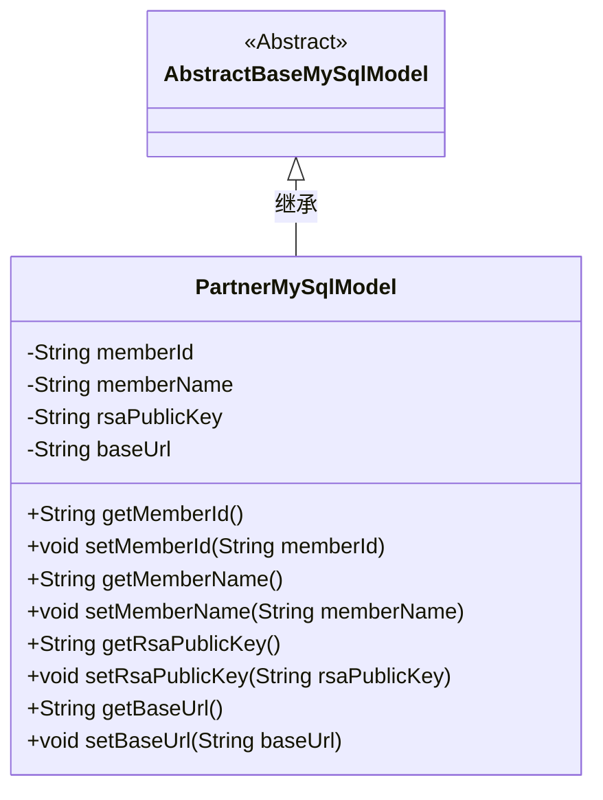

# 基础信息

|      |      |
|------|------|
| 名称 | PartnerMySqlModel |
| 编码语言 | .java |
| 代码路径 | WeFe/fusion/fusion-service/src/main/java/com/welab/wefe/data/fusion/service/database/entity/PartnerMySqlModel.java |
| 包名 | com.welab.wefe.data.fusion.service.database.entity |
| 依赖项 | ['javax.persistence.Entity'] |
| 概述说明 | PartnerMySqlModel类定义了合作伙伴实体，包含成员ID、名称、RSA公钥和基础URL字段及其getter/setter方法。 |

# 说明

这是一个名为PartnerMySqlModel的Java实体类，映射到数据库表partner。它继承自AbstractBaseMySqlModel，包含四个主要字段：memberId（成员ID）、memberName（成员名称）、rsaPublicKey（RSA公钥）和baseUrl（基础URL）。类中为每个字段提供了标准的getter和setter方法，用于访问和修改这些属性。注释掉的openSocketPort字段表明该功能当前未被使用。这个类主要用于存储合作伙伴相关的数据信息。

# 类列表 Class Summary

| 名称   | 类型  | 说明 |
|-------|------|-------------|
| PartnerMySqlModel | class | PartnerMySqlModel实体类包含成员ID、名称、RSA公钥和基础URL字段，提供对应的getter和setter方法。 |

## 类 PartnerMySqlModel

|      |      |
|------|------|
| 访问范围 | @Entity(name = "partner");public |
| 类型 | class |
| 名称 | PartnerMySqlModel |
| 说明 | PartnerMySqlModel实体类包含成员ID、名称、RSA公钥和基础URL字段，提供对应的getter和setter方法。 |

### UML类图

这段类图展示了PartnerMySqlModel继承自AbstractBaseMySqlModel的关系。PartnerMySqlModel是一个实体类（通过@Entity标注），包含四个私有字符串类型字段：memberId、memberName、rsaPublicKey和baseUrl，并为每个字段提供了标准的getter和setter方法。注释掉的openSocketPort字段未被包含在类图中。该类作为MySQL数据模型，主要用于存储合作伙伴的基本信息、RSA公钥和基础URL等数据。

### 内部方法调用关系图

```mermaid
graph TD
    A["类PartnerMySqlModel"]
    B["继承: AbstractBaseMySqlModel"]
    C["属性: String memberId"]
    D["属性: String memberName"]
    E["属性: String rsaPublicKey"]
    F["属性: String baseUrl"]
    G["方法: getMemberId()"]
    H["方法: setMemberId(String)"]
    I["方法: getMemberName()"]
    J["方法: setMemberName(String)"]
    K["方法: getRsaPublicKey()"]
    L["方法: setRsaPublicKey(String)"]
    M["方法: getBaseUrl()"]
    N["方法: setBaseUrl(String)"]

    A --> B
    A --> C
    A --> D
    A --> E
    A --> F
    A --> G
    A --> H
    A --> I
    A --> J
    A --> K
    A --> L
    A --> M
    A --> N
```

该流程图展示了PartnerMySqlModel类的结构，包括其继承关系、属性和方法。该类继承自AbstractBaseMySqlModel，包含四个字符串类型的属性（memberId、memberName、rsaPublicKey和baseUrl），以及对应的getter和setter方法。每个方法都与类直接关联，清晰地反映了类的封装特性。

### 字段列表 Field List

| 名称  | 类型  | 说明 |
|-------|-------|------|
| memberName | String | 成员变量memberName，字符串类型。 |
| memberId | String | 成员ID字符串变量 |
| rsaPublicKey | String | RSA公钥字符串变量。 |
| baseUrl | String | 字符串类型的基础URL变量。 |

### 方法列表

| 名称  | 类型  | 说明 |
|-------|-------|------|
| setMemberName | void | 设置成员名称的方法，将输入参数赋值给类的成员变量。 |
| getMemberName | String | 获取成员名称的方法，直接返回成员变量memberName的值。 |
| getRsaPublicKey | String | 该方法返回一个RSA公钥字符串。 |
| getMemberId | String | 获取成员ID的方法，返回字符串类型的memberId。 |
| setMemberId | void | 设置成员ID的方法，将传入的字符串参数赋值给类的成员变量memberId。 |
| setRsaPublicKey | void | 这是一个Java方法，用于设置RSA公钥字符串。方法接受一个字符串参数，并将其赋值给类的成员变量rsaPublicKey。 |
| getBaseUrl | String | 获取基础URL的方法，直接返回baseUrl变量值。 |
| setBaseUrl | void | 设置基础URL的方法，将输入参数baseUrl赋值给类的成员变量this.baseUrl。 |

