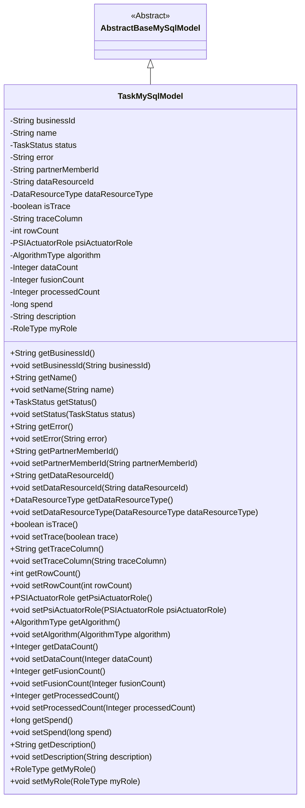

# 基础信息

|      |      |
|------|------|
| 名称 | TaskMySqlModel |
| 编码语言 | .java |
| 代码路径 | WeFe/fusion/fusion-service/src/main/java/com/welab/wefe/data/fusion/service/database/entity/TaskMySqlModel.java |
| 包名 | com.welab.wefe.data.fusion.service.database.entity |
| 依赖项 | ['com.welab.wefe.data.fusion.service.enums', 'javax.persistence.Column', 'javax.persistence.Entity', 'javax.persistence.EnumType', 'javax.persistence.Enumerated'] |
| 概述说明 | TaskMySqlModel类定义任务实体，包含业务ID、名称、状态、错误信息、成员ID、资源类型、跟踪标记、行数、算法类型、角色类型及各类计数等字段，用于数据库映射。 |

# 说明

这是一个名为TaskMySqlModel的Java类，作为数据库实体映射到MySQL中的task表。该类继承自AbstractBaseMySqlModel，包含多个字段用于描述任务信息，如业务ID、名称、状态、错误信息、合作伙伴成员ID、数据资源ID和类型等。还包含枚举类型字段如任务状态、数据资源类型、PSI执行角色和算法类型。此外，该类提供了所有字段的getter和setter方法，用于访问和修改这些属性。

# 类列表 Class Summary

| 名称   | 类型  | 说明 |
|-------|------|-------------|
| TaskMySqlModel | class | TaskMySqlModel是任务实体类，包含业务ID、名称、状态、错误信息、成员ID、资源ID、资源类型、跟踪标记、行数、角色、算法类型、数据计数、处理计数、耗时、描述等字段。 |

## 类 TaskMySqlModel

|      |      |
|------|------|
| 访问范围 | @Entity(name = "task");public |
| 类型 | class |
| 名称 | TaskMySqlModel |
| 说明 | TaskMySqlModel是任务实体类，包含业务ID、名称、状态、错误信息、成员ID、资源ID、资源类型、跟踪标记、行数、角色、算法类型、数据计数、处理计数、耗时、描述等字段。 |

### UML类图

该代码定义了一个名为`TaskMySqlModel`的实体类，继承自抽象基类`AbstractBaseMySqlModel`，用于表示数据库中的任务表结构。类中包含多个字段，如业务ID、任务名称、状态、错误信息、合作伙伴成员ID、数据资源信息等，并提供了相应的getter和setter方法。这些字段通过JPA注解映射到数据库表，其中枚举类型字段使用`@Enumerated(EnumType.STRING)`指定存储方式。该类主要用于持久化任务相关数据，支持多种业务场景下的任务信息存储和查询。

### 内部方法调用关系图

这段代码定义了一个名为`TaskMySqlModel`的JPA实体类，继承自`AbstractBaseMySqlModel`，用于表示任务数据模型。类中包含多个属性字段，如业务ID、任务名称、状态、错误信息等，并提供了对应的getter和setter方法。该模型还包含枚举类型字段如任务状态、数据资源类型等，以及用于跟踪和统计的字段如行数、处理计数等。整体结构清晰，属性覆盖了任务管理的核心数据需求，适合作为数据库持久化对象使用。

### 字段列表 Field List

| 名称  | 类型  | 说明 |
|-------|-------|------|
| rowCount | int | 变量rowCount用于存储行数。 |
| partnerMemberId | String | partnerMemberId是字符串类型的成员ID变量。 |
| myRole | RoleType | 使用@Enumerated注解将RoleType枚举类型以字符串形式存储到数据库的my_role列中。 |
| traceColumn | String | 声明一个公共字符串变量traceColumn。 |
| dataCount | Integer | 整型变量dataCount，用于存储数据数量。 |
| businessId | String | 业务标识字符串 |
| description | String | 公共字符串类型变量description。 |
| error | String | 字符串错误变量。 |
| isTrace | boolean | 布尔变量isTrace用于标识是否启用跟踪功能。 |
| psiActuatorRole | PSIActuatorRole | 使用@Enumerated注解将枚举类型PSIActuatorRole以字符串形式存入数据库表的psi_actuator_role字段。 |
| algorithm | AlgorithmType | 使用@Enumerated注解将枚举类型AlgorithmType以字符串形式存储到数据库表的algorithm列中。 |
| dataResourceType | DataResourceType | 使用@Enumerated注解将枚举类型DataResourceType以字符串形式存储到数据库表的data_resource_type字段中。 |
| status | TaskStatus | 使用@Enumerated注解将TaskStatus枚举类型以字符串形式存储到数据库。 |
| name | String | 声明一个字符串变量name。 |
| processedCount | Integer | 已处理的计数，整数类型。 |
| dataResourceId | String | 字符串类型的数据资源标识符。 |
| fusionCount | Integer | 变量fusionCount，整数类型，公共访问权限。 |
| spend | long | 变量spend为长整型，用于存储支出金额。 |

### 方法列表

| 名称  | 类型  | 说明 |
|-------|-------|------|
| setDataResourceId | void | 设置数据资源ID的方法，将参数值赋给类的成员变量dataResourceId。 |
| getPartnerMemberId | String | 获取合作伙伴成员ID的方法，返回字符串类型的partnerMemberId。 |
| setProcessedCount | void | 设置已处理数量的方法，参数为整型processedCount。 |
| setAlgorithm | void | 设置算法类型的方法，将输入参数赋值给类成员变量algorithm。 |
| setDataResourceType | void | 设置数据资源类型的方法，将传入的DataResourceType参数赋值给当前对象的dataResourceType属性。 |
| setDescription | void | 设置对象描述信息的方法，将输入字符串赋值给对象的description属性。 |
| setError | void | 设置错误信息的公共方法，将输入字符串赋值给类成员变量error。 |
| getFusionCount | Integer | 获取融合计数值的方法，返回整数类型fusionCount。 |
| setFusionCount | void | 设置融合计数值的方法，将输入参数赋给类成员变量fusionCount。 |
| getAlgorithm | AlgorithmType | 获取当前算法类型的方法。 |
| getDataResourceType | DataResourceType | 获取数据资源类型的方法，返回值为DataResourceType类型。 |
| getDescription | String | 获取描述信息的方法，返回字符串类型的description值。 |
| getProcessedCount | Integer | 获取已处理数量的整数值。 |
| getTraceColumn | String | 获取traceColumn值的公共方法。 |
| getName | String | 获取名称的方法，返回字符串类型的name变量值。 |
| getDataResourceId | String | 获取数据资源ID的方法，返回字符串类型的dataResourceId。 |
| setBusinessId | void | 设置业务ID的方法，将输入字符串赋值给类的businessId成员变量。 |
| getError | String | 获取错误信息的公共方法，返回字符串类型变量error。 |
| setName | void | 设置对象名称的方法，将参数name赋值给对象的name属性。 |
| setPsiActuatorRole | void | 设置PSI执行器角色。 |
| getRowCount | int | 方法返回行数rowCount的值。 |
| setTrace | void | 设置跟踪状态的方法，将布尔参数trace赋值给isTrace变量。 |
| setSpend | void | 设置花费金额的方法，参数为长整型spend。 |
| setMyRole | void | 方法setMyRole用于设置当前对象的myRole属性，参数为RoleType类型。 |
| setDataCount | void | 这是一个Java方法，用于设置类的dataCount属性值。方法接收一个Integer参数，并将其赋值给类的成员变量dataCount。 |
| setStatus | void | 方法设置任务状态，将传入的状态参数赋值给当前对象的status属性。 |
| getBusinessId | String | 方法返回businessId字符串。 |
| getSpend | long | 获取消费金额的方法，返回长整型数值spend。 |
| getPsiActuatorRole | PSIActuatorRole | 获取PSI执行器角色对象。 |
| setTraceColumn | void | 定义了一个公共方法setTraceColumn，用于设置类成员变量traceColumn的值。 |
| getMyRole | RoleType | 获取当前角色类型的方法，返回myRole变量值。 |
| getStatus | TaskStatus | 获取当前任务状态的方法，返回TaskStatus类型的状态值。 |
| setPartnerMemberId | void | 设置合作伙伴成员ID的方法，将参数值赋给类的成员变量partnerMemberId。 |
| setRowCount | void | 设置行数方法，将参数rowCount赋值给类的rowCount成员变量。 |
| isTrace | boolean | 这是一个Java方法，返回布尔值isTrace的状态。 |
| getDataCount | Integer | 获取数据计数值的方法，返回整数类型。 |

