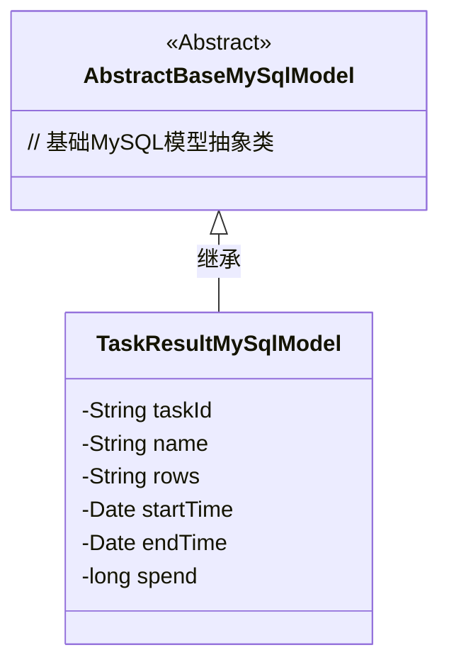
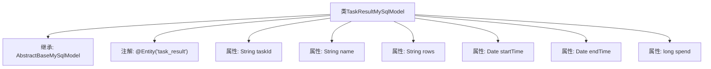

# 基础信息

|      |      |
|------|------|
| 名称 | TaskResultMySqlModel |
| 编码语言 | .java |
| 代码路径 | WeFe/fusion/fusion-service/src/main/java/com/welab/wefe/data/fusion/service/database/entity/TaskResultMySqlModel.java |
| 包名 | com.welab.wefe.data.fusion.service.database.entity |
| 依赖项 | ['javax.persistence.Entity', 'java.util.Date'] |
| 概述说明 | TaskResultMySqlModel是存储任务结果的实体类，包含任务ID、名称、行数、开始结束时间及耗时等字段。 |

# 说明

该内容定义了一个名为TaskResultMySqlModel的JPA实体类，对应数据库表task_result。该类继承自AbstractBaseMySqlModel，包含六个字段：taskId表示任务ID，name记录任务名称，rows存储行数信息，startTime和endTime分别记录任务开始和结束时间，spend存储任务耗时。所有字段均为基本数据类型或常用对象类型。

# 类列表 Class Summary

| 名称   | 类型  | 说明 |
|-------|------|-------------|
| TaskResultMySqlModel | class | TaskResultMySqlModel是数据库实体类，包含任务ID、名称、行数、开始时间、结束时间和耗时字段。 |

## 类 TaskResultMySqlModel

|      |      |
|------|------|
| 访问范围 | @Entity(name = "task_result");public |
| 类型 | class |
| 名称 | TaskResultMySqlModel |
| 说明 | TaskResultMySqlModel是数据库实体类，包含任务ID、名称、行数、开始时间、结束时间和耗时字段。 |

### UML类图

该类图展示了TaskResultMySqlModel继承自AbstractBaseMySqlModel的关系。TaskResultMySqlModel是一个实体类，包含taskId、name、rows等私有字段，用于存储任务执行结果的相关信息。作为具体实现类，它继承了抽象基类的特性，符合JPA实体规范，适合作为数据库表映射对象使用。类图中明确体现了面向对象的继承关系，层级结构清晰。

### 内部方法调用关系图

该流程图展示了TaskResultMySqlModel类的结构，它是一个继承自AbstractBaseMySqlModel的实体类，使用@Entity注解标记表名为'task_result'。类包含6个属性字段：taskId、name、rows三个字符串类型，startTime和endTime两个日期类型，以及spend长整型。所有属性均未标注访问修饰符，默认包级可见。

### 字段列表 Field List

| 名称  | 类型  | 说明 |
|-------|-------|------|
| startTime | Date | 声明一个日期类型的开始时间变量。 |
| rows | String | 字符串变量rows的声明。 |
| endTime | Date | 声明一个名为endTime的日期类型变量。 |
| taskId | String | 任务ID字符串变量声明。 |
| name | String | 声明字符串变量name。 |
| spend | long | long spend; 表示声明一个长整型变量spend，用于存储大数值的时间或金额数据。 |

### 方法列表

| 名称  | 类型  | 说明 |
|-------|-------|------|

