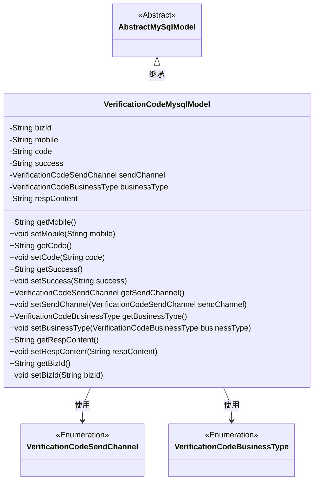
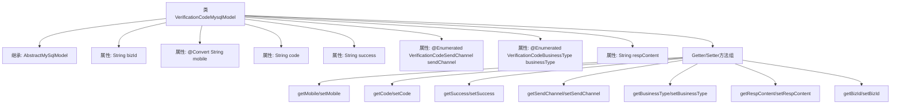

# 基础信息

|      |      |
|------|------|
| 名称 | VerificationCodeMysqlModel |
| 编码语言 | .java |
| 代码路径 | WeFe/fusion/fusion-service/src/main/java/com/welab/wefe/data/fusion/service/database/entity/VerificationCodeMysqlModel.java |
| 包名 | com.welab.wefe.data.fusion.service.database.entity |
| 依赖项 | ['com.welab.wefe.common.web.util.DatabaseEncryptConverter', 'com.welab.wefe.common.wefe.enums.VerificationCodeBusinessType', 'com.welab.wefe.common.wefe.enums.VerificationCodeSendChannel', 'javax.persistence.Convert', 'javax.persistence.Entity', 'javax.persistence.EnumType', 'javax.persistence.Enumerated'] |
| 概述说明 | 验证码MySQL实体类，包含业务ID、加密手机号、验证码、发送状态、发送渠道、业务类型及响应内容等字段及对应getter/setter方法。 |

# 说明

这是一个名为VerificationCodeMysqlModel的实体类，用于存储验证码相关信息。它继承自AbstractMySqlModel，包含以下字段：bizId用于关联业务信息，mobile经过加密存储，code表示验证码，success标记发送状态，sendChannel和businessType是枚举类型分别表示发送渠道和业务类型，respContent存储响应内容。类中为每个字段提供了getter和setter方法。该实体映射到数据库表verification_code。

# 类列表 Class Summary

| 名称   | 类型  | 说明 |
|-------|------|-------------|
| VerificationCodeMysqlModel | class | VerificationCodeMysqlModel类包含业务ID、加密手机号、验证码、发送状态、发送渠道、业务类型和响应内容等字段，用于存储验证码相关信息。 |

## 类 VerificationCodeMysqlModel

|      |      |
|------|------|
| 访问范围 | @Entity(name = "verification_code");public |
| 类型 | class |
| 名称 | VerificationCodeMysqlModel |
| 说明 | VerificationCodeMysqlModel类包含业务ID、加密手机号、验证码、发送状态、发送渠道、业务类型和响应内容等字段，用于存储验证码相关信息。 |

### UML类图

这段代码定义了一个名为VerificationCodeMysqlModel的实体类，用于存储验证码相关信息。该类继承自AbstractMySqlModel，包含业务ID、手机号、验证码、发送状态、发送渠道、业务类型和响应内容等字段。其中手机号字段使用了数据库加密转换器，发送渠道和业务类型是枚举类型。该类提供了所有字段的getter和setter方法，用于数据的存取操作。这个类主要用于在MySQL数据库中存储和管理验证码相关的数据记录。

### 内部方法调用关系图

该流程图展示了VerificationCodeMysqlModel类的完整结构，包含7个核心属性和对应的访问方法。作为数据库实体类，它特别标注了加密字段(mobile)和枚举类型字段(sendChannel/businessType)的特殊注解，同时继承了AbstractMySqlModel基类。所有属性都配备了标准的Getter/Setter方法，形成典型的数据模型结构。

### 字段列表 Field List

| 名称  | 类型  | 说明 |
|-------|-------|------|
| bizId | String | 声明一个私有字符串变量bizId。 |
| respContent | String | 私有字符串变量respContent，用于存储响应内容。 |
| mobile | String | 字段mobile使用DatabaseEncryptConverter类进行数据库加密转换。 |
| sendChannel | VerificationCodeSendChannel | 枚举类型字段sendChannel，使用字符串形式存储，表示验证码发送渠道。 |
| code | String | 定义了一个私有字符串变量code。 |
| success | String | 定义私有字符串变量success。 |
| businessType | VerificationCodeBusinessType | 定义枚举类型字段businessType，使用字符串形式存储。 |

### 方法列表

| 名称  | 类型  | 说明 |
|-------|-------|------|
| getSendChannel | VerificationCodeSendChannel | 获取发送验证码的通道方法。 |
| setSendChannel | void | 设置验证码发送渠道的方法，参数为发送渠道对象。 |
| setCode | void | 这是一个Java方法，用于设置类的code属性值。方法接收一个字符串参数code，并将其赋值给当前对象的code成员变量。 |
| getBusinessType | VerificationCodeBusinessType | 该方法返回VerificationCodeBusinessType类型的businessType属性值。 |
| setMobile | void | 这是一个Java方法，用于设置类的mobile属性值。方法接收一个字符串参数mobile，并将其赋值给类的同名成员变量。 |
| setRespContent | void | 设置响应内容的方法，将参数respContent赋值给类的respContent成员变量。 |
| getBizId | String | 获取业务ID的方法，直接返回bizId字段值。 |
| getMobile | String | 获取手机号的方法，返回字符串类型变量mobile。 |
| getCode | String | 获取code值的公共方法。 |
| getSuccess | String | 方法getSuccess返回字符串success的值。 |
| setSuccess | void | 这是一个Java方法，用于设置字符串类型的success变量值。方法名为setSuccess，接受一个String参数，并将其赋值给类的success成员变量。 |
| setBusinessType | void | 设置业务类型方法，将传入的VerificationCodeBusinessType类型参数赋值给当前对象的businessType属性。 |
| getRespContent | String | 方法返回字符串respContent的值。 |
| setBizId | void | 设置业务ID的方法，将参数bizId赋值给当前对象的bizId属性。 |

