# 基础信息

|      |      |
|------|------|
| 名称 | entity |
| 编码语言 | .java |
| 代码路径 | WeFe/fusion/fusion-service/src/main/java/com/welab/wefe/data/fusion/service/database/entity |
| 包名 | docs.fusion.fusion-service.src.main.java.com.welab.wefe.data.fusion.service.database.entity |
| 概述说明 | AbstractBaseMySqlModel是抽象基类，含创建/更新者字段。TaskMySqlModel描述任务信息。DataSetMySqlModel存储数据集信息。TaskResultMySqlModel记录任务结果。GlobalSettingMySqlModel存储全局设置。DataSetColumnOutputModel表示数据集列输出。GlobalConfigMysqlModel存储加密配置。BloomFilterMySqlModel描述布隆过滤器。PartnerMySqlModel存储合作伙伴数据。OperationLogMysqlModel记录操作日志。VerificationCodeMysqlModel存储验证码。FieldInfoMySqlModel描述字段信息。AccountMysqlModel表示账户实体。DataSourceMySqlModel描述数据源。AbstractMySqlModel是通用父类，含ID和时间字段。 |

# 说明

## 概述  
该模块核心职责是为数据融合服务提供MySQL数据库实体映射基础架构，包含通用抽象基类和多种业务实体模型。接口规范统一采用JPA注解实现ORM映射，所有实体均继承自AbstractMySqlModel或其子类AbstractBaseMySqlModel，提供标准getter/setter方法。关键数据结构包括任务(TaskMySqlModel)、数据集(DataSetMySqlModel)、布隆过滤器(BloomFilterMySqlModel)等业务实体，均包含基础字段如ID、时间戳和扩展字段如业务状态、加密数据等。外部依赖主要为JPA规范、UUID生成器和数据库加密转换器。例如GlobalConfigMysqlModel使用DatabaseEncryptConverter加密配置项值。

## 主要业务场景  
模块支持数据融合全生命周期管理，类似ETL流程控制台。典型交互模式包括：任务创建（TaskMySqlModel记录PSI算法类型/执行角色）、数据集处理（DataSetMySqlModel跟踪数据来源/进度）、结果存储（TaskResultMySqlModel保存耗时统计）。完整功能覆盖合作伙伴管理(PartnerMySqlModel)、全局配置(GlobalSettingMySqlModel)和安全审计(OperationLogMysqlModel)。API集成案例包含加密字段访问（如AccountMysqlModel手机号）和枚举类型处理（如DataSourceMySqlModel数据库类型）。典型应用模式为多机构数据协作，例如通过BloomFilterMySqlModel实现隐私集合求交。

### 包内部结构视图

```mermaid
graph TD
    entity --> AbstractBaseMySqlModel.java
    entity --> TaskMySqlModel.java
    entity --> DataSetMySqlModel.java
    entity --> TaskResultMySqlModel.java
    entity --> GlobalSettingMySqlModel.java
    entity --> DataSetColumnOutputModel.java
    entity --> GlobalConfigMysqlModel.java
    entity --> BloomFilterMySqlModel.java
    entity --> PartnerMySqlModel.java
    entity --> OperationLogMysqlModel.java
    entity --> VerificationCodeMysqlModel.java
    entity --> FieldInfoMySqlModel.java
    entity --> AccountMysqlModel.java
    entity --> DataSourceMySqlModel.java
    entity --> AbstractMySqlModel.java
```

该流程图展示了WeFe数据融合服务中数据库实体类的层级结构，所有实体类文件均位于entity目录下，包含任务模型、数据集模型、全局配置模型等15个具体实现类，这些类都继承自抽象基类AbstractBaseMySqlModel或AbstractMySqlModel，形成了清晰的数据持久层结构。

# 文件列表

| 名称   | 类型  | 说明 |
|-------|------|-------------|
| [AbstractBaseMySqlModel.java](AbstractBaseMySqlModel.md) | file | 抽象类AbstractBaseMySqlModel继承AbstractMySqlModel，包含创建者和更新者字段及其getter/setter方法。 |
| [TaskMySqlModel.java](TaskMySqlModel.md) | file | TaskMySqlModel类定义任务实体，包含业务ID、名称、状态、错误信息、成员ID、资源类型、跟踪标记、行数、算法类型、角色类型及各类计数等字段，用于数据库映射。 |
| [DataSetMySqlModel.java](DataSetMySqlModel.md) | file | DataSetMySqlModel类表示数据集实体，包含名称、数据源ID、描述、行数、使用次数、存储状态、数据来源、SQL语句、源文件路径、选择列、进度计数和进度状态等属性及其getter/setter方法。 |
| [TaskResultMySqlModel.java](TaskResultMySqlModel.md) | file | TaskResultMySqlModel是存储任务结果的实体类，包含任务ID、名称、行数、开始结束时间及耗时等字段。 |
| [GlobalSettingMySqlModel.java](GlobalSettingMySqlModel.md) | file | GlobalSettingMySqlModel类表示全局设置，包含partnerId、名称及RSA密钥对，继承自AbstractBaseMySqlModel。 |
| [DataSetColumnOutputModel.java](DataSetColumnOutputModel.md) | file | 数据集列输出模型类，包含数据集ID、序号、字段名、数据类型、注释、空行数和数值分布等属性及对应getter/setter方法。 |
| [GlobalConfigMysqlModel.java](GlobalConfigMysqlModel.md) | file | 这是一个名为GlobalConfigMysqlModel的Java实体类，用于映射数据库表global_config，包含组名、配置项名称、加密存储的值和说明注释字段，并提供了各字段的getter和setter方法。 |
| [BloomFilterMySqlModel.java](BloomFilterMySqlModel.md) | file | BloomFilterMySqlModel类定义了布隆过滤器的MySQL模型，包含名称、数据源ID、描述、公钥私钥参数、文件路径、SQL语句、进度状态等字段及其getter和setter方法。 |
| [PartnerMySqlModel.java](PartnerMySqlModel.md) | file | PartnerMySqlModel类定义了合作伙伴实体，包含成员ID、名称、RSA公钥和基础URL字段及其getter/setter方法。 |
| [OperationLogMysqlModel.java](OperationLogMysqlModel.md) | file | 操作日志实体类，记录API名称、调用者信息、请求响应数据及时间耗时等。 |
| [VerificationCodeMysqlModel.java](VerificationCodeMysqlModel.md) | file | 验证码MySQL实体类，包含业务ID、加密手机号、验证码、发送状态、发送渠道、业务类型及响应内容等字段及对应getter/setter方法。 |
| [FieldInfoMySqlModel.java](FieldInfoMySqlModel.md) | file | FieldInfoMySqlModel类映射数据库表field_info，包含businessId、columns、options枚举、fristIndex、endIndex和position字段及其getter/setter方法。 |
| [AccountMysqlModel.java](AccountMysqlModel.md) | file | AccountMysqlModel类定义了账户实体，包含手机号、密码、昵称、邮箱等基本信息，以及管理员角色、审核状态、可用性等属性，支持JSON格式存储历史密码。 |
| [DataSourceMySqlModel.java](DataSourceMySqlModel.md) | file | MySQL数据源实体类，包含名称、类型、主机、端口、数据库名、用户名和加密密码等属性及其getter/setter方法。 |
| [AbstractMySqlModel.java](AbstractMySqlModel.md) | file | 抽象MySQL模型基类，包含ID（UUID生成）、创建时间和更新时间字段及对应getter/setter方法。 |

