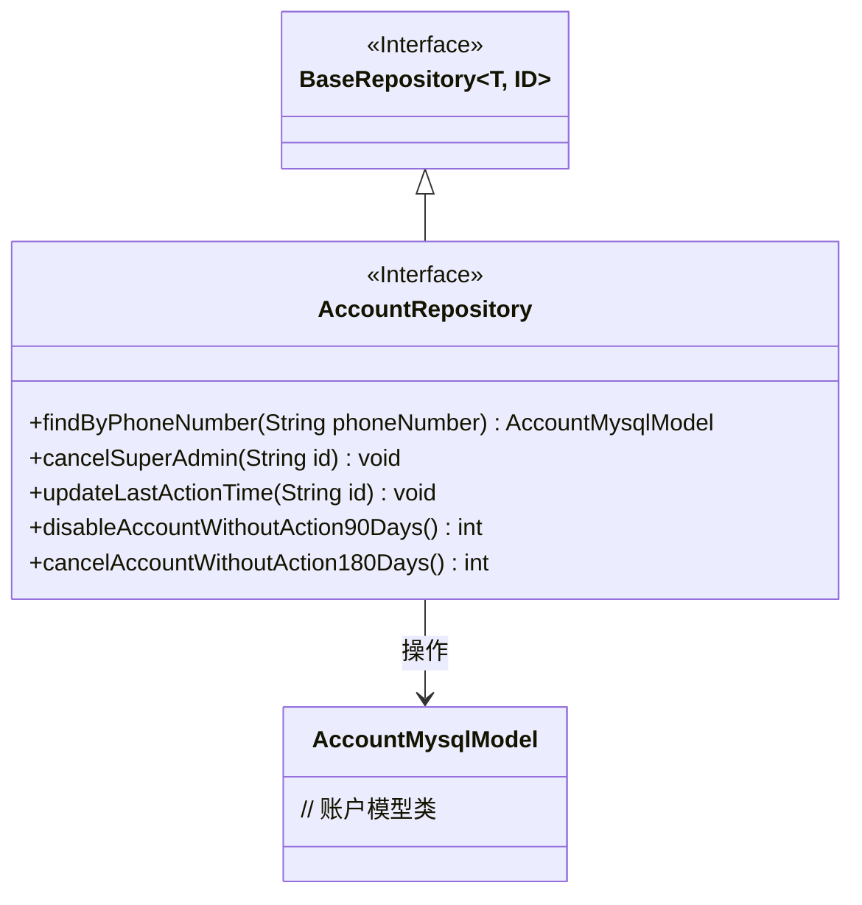
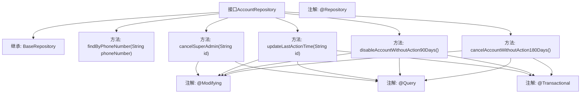

# 基础信息

|      |      |
|------|------|
| 名称 | AccountRepository |
| 编码语言 | .java |
| 代码路径 | WeFe/fusion/fusion-service/src/main/java/com/welab/wefe/data/fusion/service/database/repository/AccountRepository.java |
| 包名 | com.welab.wefe.data.fusion.service.database.repository |
| 依赖项 | ['com.welab.wefe.data.fusion.service.database.entity.AccountMysqlModel', 'com.welab.wefe.data.fusion.service.database.repository.base.BaseRepository', 'org.springframework.data.jpa.repository.Modifying', 'org.springframework.data.jpa.repository.Query', 'org.springframework.stereotype.Repository', 'org.springframework.transaction.annotation.Transactional'] |
| 概述说明 | AccountRepository接口扩展BaseRepository，包含通过手机号查询账号、取消超级管理员权限、更新最后活动时间、禁用90天未活动账号及注销180天未活动账号的方法。 |

# 说明

这是一个名为AccountRepository的Spring Data JPA仓库接口，继承自BaseRepository，用于管理AccountMysqlModel类型的数据。接口提供了多个数据库操作方法：通过手机号查询账户、取消超级管理员权限、更新最后操作时间、禁用90天未活动的账户以及注销180天未活动的账户。所有修改操作都使用了@Modifying注解并启用了自动清除缓存功能，部分方法还添加了@Transactional事务注解。查询语句使用原生SQL并通过@Query注解定义。

# 类列表 Class Summary

| 名称   | 类型  | 说明 |
|-------|------|-------------|
| AccountRepository | interface | AccountRepository接口扩展BaseRepository，提供通过手机号查询账号、取消超级管理员权限、更新最后操作时间、禁用90天未活动账号及注销180天未活动账号的方法。 |

## 类 AccountRepository

|      |      |
|------|------|
| 访问范围 | @Repository;public |
| 类型 | interface |
| 名称 | AccountRepository |
| 说明 | AccountRepository接口扩展BaseRepository，提供通过手机号查询账号、取消超级管理员权限、更新最后操作时间、禁用90天未活动账号及注销180天未活动账号的方法。 |

### UML类图

这段代码展示了一个Spring Data JPA的Repository接口`AccountRepository`，它继承自泛型接口`BaseRepository`，专门用于操作`AccountMysqlModel`实体类。接口中定义了五个方法：通过手机号查询账户、取消超级管理员权限、更新最后操作时间、禁用90天未活动的账户以及注销180天未活动的账户。所有修改操作都带有`@Modifying`和`@Transactional`注解，确保数据一致性和事务性。

### 内部方法调用关系图

该流程图展示了AccountRepository接口的结构和功能。该接口继承自BaseRepository，包含5个主要方法：通过电话号码查询账户、取消超级管理员权限、更新最后操作时间、禁用90天未活动的账户和注销180天未活动的账户。关键方法使用了@Modifying、@Query和@Transactional注解来执行数据库修改操作，体现了Spring Data JPA的声明式事务管理特性。

### 字段列表 Field List

| 名称  | 类型  | 说明 |
|-------|-------|------|

### 方法列表

| 名称  | 类型  | 说明 |
|-------|-------|------|
| updateLastActionTime | void | 使用原生SQL更新指定ID记录的last_action_time为当前时间，自动清除持久化上下文。 |
| disableAccountWithoutAction90Days | int | 使用事务注解和自动清除，通过原生SQL更新90天未活跃的账户状态为禁用。 |
| cancelSuperAdmin | void | 更新账户权限：根据ID取消超级管理员和管理员角色。 |
| cancelAccountWithoutAction180Days | int | 使用事务注解的JPA方法，自动清除缓存，执行原生SQL更新180天无活动的账户为取消状态。 |
| findByPhoneNumber | AccountMysqlModel | 根据手机号查询账户信息的MySQL模型方法。 |

