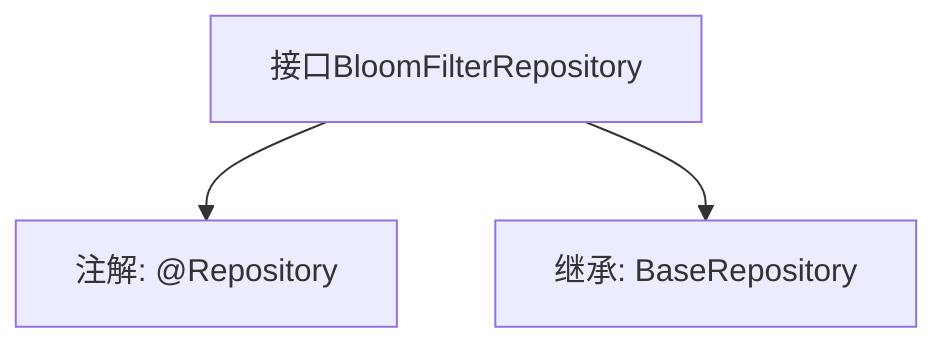

# 基础信息

|      |      |
|------|------|
| 名称 | BloomFilterRepository |
| 编码语言 | .java |
| 代码路径 | WeFe/fusion/fusion-service/src/main/java/com/welab/wefe/data/fusion/service/database/repository/BloomFilterRepository.java |
| 包名 | com.welab.wefe.data.fusion.service.database.repository |
| 依赖项 | ['com.welab.wefe.data.fusion.service.database.entity.BloomFilterMySqlModel', 'com.welab.wefe.data.fusion.service.database.repository.base.BaseRepository', 'org.springframework.stereotype.Repository'] |
| 概述说明 | 这是一个Spring Data JPA仓库接口，继承基础仓库，用于操作布隆过滤器的MySQL模型数据。 |

# 说明

该内容定义了一个名为BloomFilterRepository的Spring数据仓库接口，使用@Repository注解标记。该接口继承自BaseRepository泛型接口，指定了实体类型为BloomFilterMySqlModel，主键类型为String。这表明它是一个用于操作BloomFilterMySqlModel实体的数据访问层组件，遵循Spring Data的仓库模式设计。

# 类列表 Class Summary

| 名称   | 类型  | 说明 |
|-------|------|-------------|
| BloomFilterRepository | interface | 该代码定义了一个名为BloomFilterRepository的Spring仓库接口，继承自BaseRepository，用于操作BloomFilterMySqlModel类型的数据，主键类型为String。 |


## 类 BloomFilterRepository

|      |      |
|------|------|
| 访问范围 | @Repository;public |
| 类型 | interface |
| 名称 | BloomFilterRepository |
| 说明 | 该代码定义了一个名为BloomFilterRepository的Spring仓库接口，继承自BaseRepository，用于操作BloomFilterMySqlModel类型的数据，主键类型为String。 |


### UML类图

```mermaid
classDiagram
    class BloomFilterRepository {
        <<Interface>>
    }
    class BaseRepository~T, ID~ {
        <<Interface>>
    }
    BloomFilterRepository --|> BaseRepository : 继承
    // BaseRepository是泛型接口，BloomFilterRepository继承并指定了泛型参数
    // BloomFilterMySqlModel作为实体类型，String作为ID类型
```

这段类图展示了Spring Data JPA中的仓库接口继承关系。BloomFilterRepository是一个标记了@Repository的接口，它继承了泛型接口BaseRepository，并指定了泛型参数BloomFilterMySqlModel作为实体类型，String作为ID类型。这种设计遵循了Spring Data的仓库模式，提供了对特定实体类型的基础CRUD操作能力。


### 内部方法调用关系图



这段代码定义了一个名为BloomFilterRepository的Spring数据仓库接口，使用@Repository注解标记为持久层组件。该接口继承了BaseRepository泛型接口，指定了实体类型为BloomFilterMySqlModel，主键类型为String。流程图清晰地展示了接口的注解和继承关系，体现了Spring Data JPA中通过继承基础仓库接口快速实现CRUD操作的典型模式。

### 字段列表 Field List

| 名称  | 类型  | 说明 |
|-------|-------|------|

### 方法列表

| 名称  | 类型  | 说明 |
|-------|-------|------|


