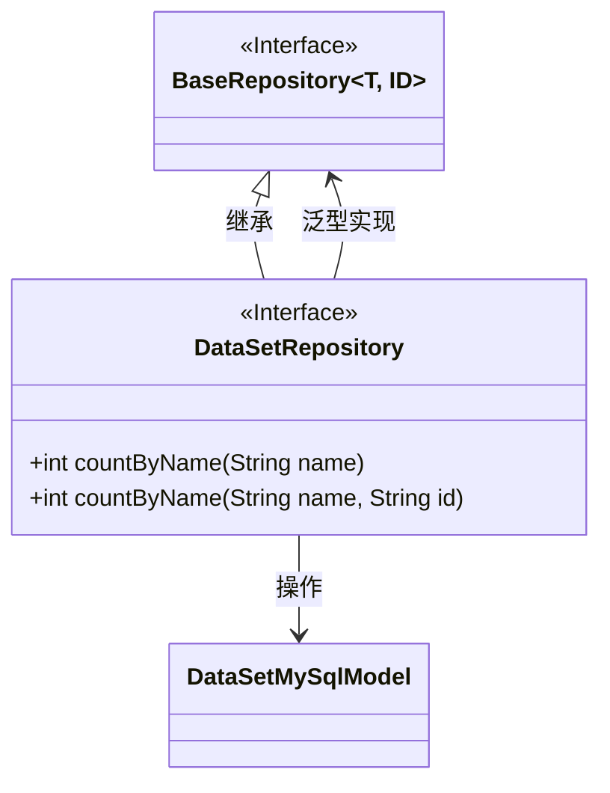
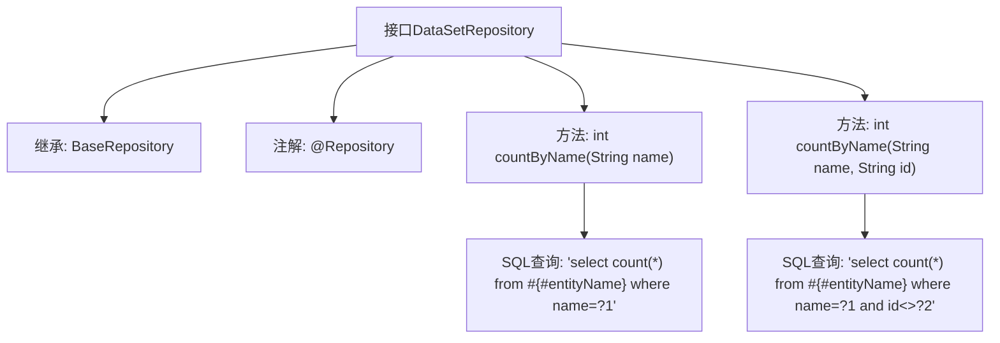

# 基础信息

|      |      |
|------|------|
| 名称 | DataSetRepository |
| 编码语言 | .java |
| 代码路径 | WeFe/fusion/fusion-service/src/main/java/com/welab/wefe/data/fusion/service/database/repository/DataSetRepository.java |
| 包名 | com.welab.wefe.data.fusion.service.database.repository |
| 依赖项 | ['com.welab.wefe.data.fusion.service.database.entity.DataSetMySqlModel', 'com.welab.wefe.data.fusion.service.database.repository.base.BaseRepository', 'org.springframework.data.jpa.repository.Query', 'org.springframework.stereotype.Repository'] |
| 概述说明 | DataSetRepository接口扩展BaseRepository，提供两个原生SQL查询方法：按名称统计记录数，以及按名称和ID（排除指定ID）统计记录数。 |

# 说明

这是一个名为DataSetRepository的Spring Data JPA仓库接口，继承自BaseRepository，泛型参数指定实体类型为DataSetMySqlModel，主键类型为String。接口定义了两个统计方法：countByName(String name)通过原生SQL查询统计指定名称的记录总数；countByName(String name, String id)统计名称匹配且ID不等于指定值的记录数。两个方法都使用@Query注解直接编写原生SQL语句，其中#{#entityName}会被替换为实体对应的表名。方法注释说明了参数和返回值的用途。

# 类列表 Class Summary

| 名称   | 类型  | 说明 |
|-------|------|-------------|
| DataSetRepository | interface | DataSetRepository接口继承BaseRepository，提供两个原生SQL查询方法：按名称统计记录数，以及按名称和排除指定ID统计记录数。 |

## 类 DataSetRepository

|      |      |
|------|------|
| 访问范围 | @Repository;public |
| 类型 | interface |
| 名称 | DataSetRepository |
| 说明 | DataSetRepository接口继承BaseRepository，提供两个原生SQL查询方法：按名称统计记录数，以及按名称和排除指定ID统计记录数。 |

### UML类图

这段代码展示了一个Spring Data JPA的Repository接口设计。DataSetRepository接口继承自泛型接口BaseRepository，指定了实体类型为DataSetMySqlModel和ID类型为String。接口中定义了两个重载的countByName方法，分别用于统计指定名称的记录数（带或不带ID排除条件），这两个方法都使用@Query注解指定了原生SQL查询语句。类图清晰地展示了接口继承关系和泛型参数绑定，体现了Spring Data JPA中Repository模式的典型实现方式。

### 内部方法调用关系图

该流程图展示了DataSetRepository接口的结构和功能。该接口继承自BaseRepository，并标注为@Repository，表明它是一个数据访问组件。接口定义了两个重载方法countByName，分别用于统计符合特定名称条件或名称加ID条件的记录数。每个方法都通过@Query注解指定了原生SQL查询语句，其中#{#entityName}会被替换为实际的实体表名。这种设计常用于需要自定义复杂查询的JPA场景。

### 字段列表 Field List

| 名称  | 类型  | 说明 |
|-------|-------|------|

### 方法列表

| 名称  | 类型  | 说明 |
|-------|-------|------|
| countByName | int | 查询数据库中指定名称的记录总数，使用原生SQL语句，返回整数结果。 |
| countByName | int | 查询同名不同ID的记录数，参数为名称和ID，返回计数结果。 |

