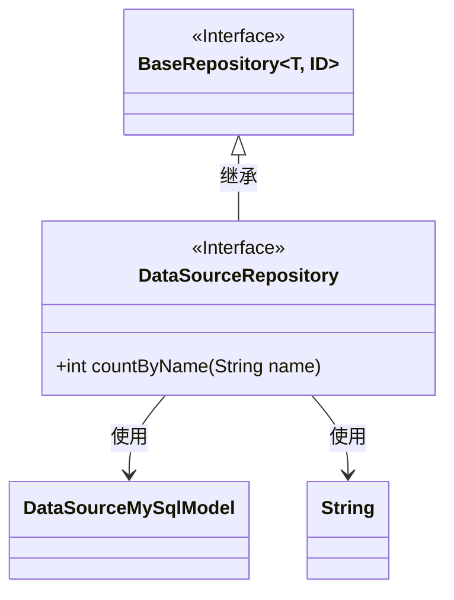
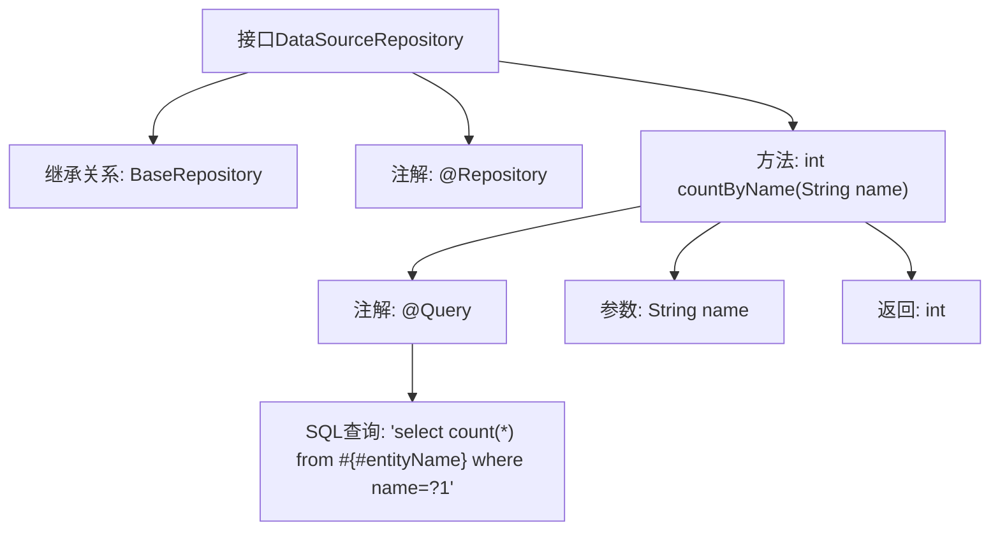

# 基础信息

|      |      |
|------|------|
| 名称 | DataSourceRepository |
| 编码语言 | .java |
| 代码路径 | WeFe/fusion/fusion-service/src/main/java/com/welab/wefe/data/fusion/service/database/repository/DataSourceRepository.java |
| 包名 | com.welab.wefe.data.fusion.service.database.repository |
| 依赖项 | ['com.welab.wefe.data.fusion.service.database.entity.DataSourceMySqlModel', 'com.welab.wefe.data.fusion.service.database.repository.base.BaseRepository', 'org.springframework.data.jpa.repository.Query', 'org.springframework.stereotype.Repository'] |
| 概述说明 | DataSourceRepository接口继承BaseRepository，提供按名称统计数量的方法countByName，使用原生SQL查询。 |

# 说明

这是一个名为DataSourceRepository的Spring Data JPA仓库接口，继承自BaseRepository，泛型参数指定了实体类型为DataSourceMySqlModel，主键类型为String。接口中定义了一个统计方法countByName，通过@Query注解指定了原生SQL查询语句，用于统计表中name字段值与输入参数匹配的记录总数。该方法接收一个String类型参数name，返回统计结果的整数值。

# 类列表 Class Summary

| 名称   | 类型  | 说明 |
|-------|------|-------------|
| DataSourceRepository | interface | DataSourceRepository接口继承BaseRepository，提供按名称统计数量的方法countByName，使用原生SQL查询。 |

## 类 DataSourceRepository

|      |      |
|------|------|
| 访问范围 | @Repository;public |
| 类型 | interface |
| 名称 | DataSourceRepository |
| 说明 | DataSourceRepository接口继承BaseRepository，提供按名称统计数量的方法countByName，使用原生SQL查询。 |

### UML类图

这段代码展示了一个Spring Data JPA的仓库接口设计。DataSourceRepository接口继承自泛型接口BaseRepository，指定了实体类型为DataSourceMySqlModel和ID类型为String。该接口定义了一个原生SQL查询方法countByName()，用于统计指定名称的数据源数量。类图清晰地展示了接口继承关系和类型参数的使用，体现了JPA仓库模式的标准实现方式。DataSourceRepository作为数据访问层组件，提供了对DataSourceMySqlModel实体的基础CRUD操作和自定义查询能力。

### 内部方法调用关系图

这段代码定义了一个Spring Data JPA的Repository接口DataSourceRepository，它继承自BaseRepository并带有@Repository注解。核心功能是通过countByName方法统计指定名称的数据记录数，该方法使用@Query注解定义了原生SQL查询语句。流程图展示了接口的继承关系、方法定义及其注解配置，清晰地呈现了从参数输入到结果返回的完整调用链路。

### 字段列表 Field List

| 名称  | 类型  | 说明 |
|-------|-------|------|

### 方法列表

| 名称  | 类型  | 说明 |
|-------|-------|------|
| countByName | int | 查询数据库中指定名称的记录总数，使用原生SQL语句，返回匹配的条目数量。 |

