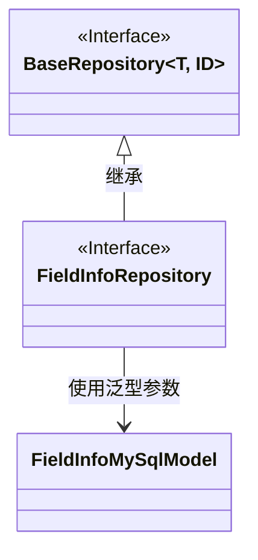
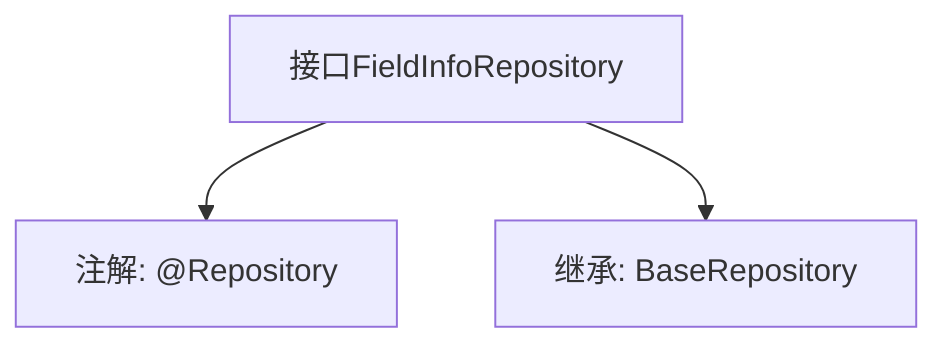

# 基础信息

|      |      |
|------|------|
| 名称 | FieldInfoRepository |
| 编码语言 | .java |
| 代码路径 | WeFe/fusion/fusion-service/src/main/java/com/welab/wefe/data/fusion/service/database/repository/FieldInfoRepository.java |
| 包名 | com.welab.wefe.data.fusion.service.database.repository |
| 依赖项 | ['com.welab.wefe.data.fusion.service.database.entity.FieldInfoMySqlModel', 'com.welab.wefe.data.fusion.service.database.repository.base.BaseRepository', 'org.springframework.stereotype.Repository'] |
| 概述说明 | 这是一个Spring的仓库接口，继承基础仓库类，用于操作FieldInfoMySqlModel类型数据，主键为String类型。 |

# 说明

该内容描述了一个名为FieldInfoRepository的Spring数据仓库接口。该接口使用@Repository注解标注，表明它是一个Spring管理的持久层组件。该接口继承了BaseRepository泛型接口，指定了实体类型为FieldInfoMySqlModel，主键类型为String。这个设计表明该仓库用于操作MySQL数据库中的FieldInfo实体数据，继承了基础仓库的通用CRUD操作方法。整个定义简洁明了，遵循了Spring Data JPA的规范。

# 类列表 Class Summary

| 名称   | 类型  | 说明 |
|-------|------|-------------|
| FieldInfoRepository | interface | 这是一个Spring Data JPA仓库接口，继承基础仓库类，用于操作FieldInfoMySqlModel实体，主键类型为String。 |

## 类 FieldInfoRepository

|      |      |
|------|------|
| 访问范围 | @Repository;public |
| 类型 | interface |
| 名称 | FieldInfoRepository |
| 说明 | 这是一个Spring Data JPA仓库接口，继承基础仓库类，用于操作FieldInfoMySqlModel实体，主键类型为String。 |

### UML类图

这段类图展示了FieldInfoRepository接口继承自泛型接口BaseRepository的关系。FieldInfoRepository是一个Spring数据仓库接口(用@Repository标注)，它继承了BaseRepository的基本CRUD操作，并指定泛型参数T为FieldInfoMySqlModel（数据库实体模型），ID为String类型。该设计遵循了Spring Data JPA的仓库模式，通过继承基础接口获得标准数据访问能力，同时保持接口的简洁性。

### 内部方法调用关系图

这段代码定义了一个名为FieldInfoRepository的Spring数据仓库接口，使用@Repository注解标识其为持久层组件。该接口继承了BaseRepository泛型接口，指定了实体类型为FieldInfoMySqlModel，主键类型为String。流程图清晰地展示了接口的注解和继承关系，体现了Spring Data JPA中通过继承基础仓库接口快速实现CRUD操作的典型模式。

### 字段列表 Field List

| 名称  | 类型  | 说明 |
|-------|-------|------|

### 方法列表

| 名称  | 类型  | 说明 |
|-------|-------|------|

