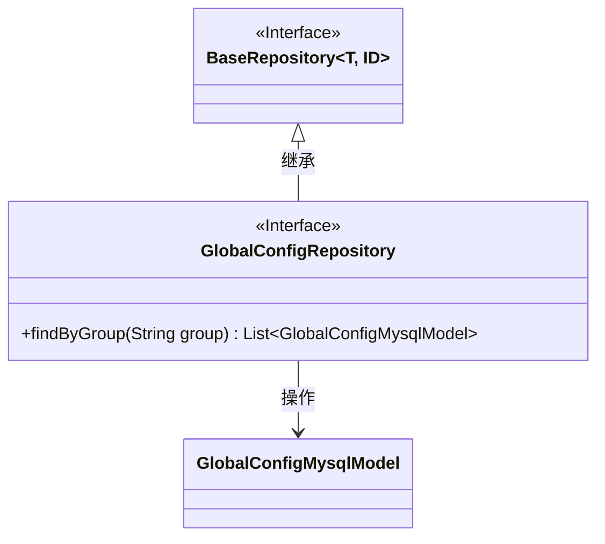
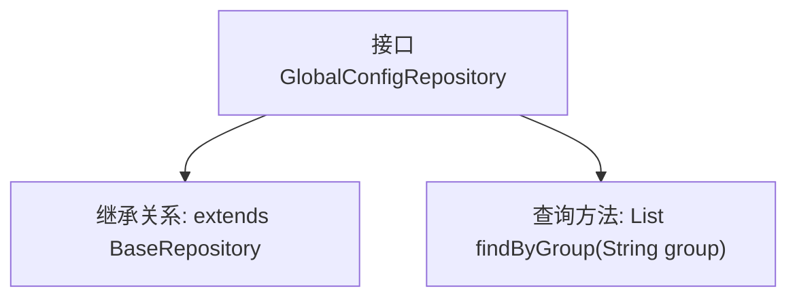

# 基础信息

|      |      |
|------|------|
| 名称 | GlobalConfigRepository |
| 编码语言 | .java |
| 代码路径 | WeFe/fusion/fusion-service/src/main/java/com/welab/wefe/data/fusion/service/database/repository/GlobalConfigRepository.java |
| 包名 | com.welab.wefe.data.fusion.service.database.repository |
| 依赖项 | ['com.welab.wefe.data.fusion.service.database.entity.GlobalConfigMysqlModel', 'com.welab.wefe.data.fusion.service.database.repository.base.BaseRepository', 'org.springframework.stereotype.Repository', 'java.util.List'] |
| 概述说明 | 这是一个Spring的Repository接口，继承BaseRepository，用于操作GlobalConfigMysqlModel数据，提供按group字段查询的功能。 |

# 说明

该内容定义了一个名为GlobalConfigRepository的Spring数据仓库接口，继承自BaseRepository基类，用于操作GlobalConfigMysqlModel类型数据，主键类型为String。接口包含一个按group字段查询的方法findByGroup，返回匹配的实体列表。该接口通过@Repository注解标记为Spring管理的持久层组件。

# 类列表 Class Summary

| 名称   | 类型  | 说明 |
|-------|------|-------------|
| GlobalConfigRepository | interface | 这是一个Spring的Repository接口，继承自BaseRepository，用于操作GlobalConfigMysqlModel数据，提供按group字段查询的功能。 |

## 类 GlobalConfigRepository

|      |      |
|------|------|
| 访问范围 | @Repository;public |
| 类型 | interface |
| 名称 | GlobalConfigRepository |
| 说明 | 这是一个Spring的Repository接口，继承自BaseRepository，用于操作GlobalConfigMysqlModel数据，提供按group字段查询的功能。 |

### UML类图

类图描述：该图展示了GlobalConfigRepository接口继承自泛型接口BaseRepository，并操作GlobalConfigMysqlModel实体类。BaseRepository定义通用仓储操作，GlobalConfigRepository扩展了按组查询的特定功能，体现了Spring Data JPA的仓储模式设计。

### 内部方法调用关系图

这段流程图展示了GlobalConfigRepository接口的结构和功能。该接口继承自BaseRepository，并指定了泛型类型为GlobalConfigMysqlModel和String。接口中定义了一个查询方法findByGroup，用于根据group参数查询并返回GlobalConfigMysqlModel类型的列表。这个接口使用了Spring Data JPA的Repository标记，表明它是一个数据访问层的组件，能够自动实现基本的CRUD操作和自定义查询方法。

### 字段列表 Field List

| 名称  | 类型  | 说明 |
|-------|-------|------|

### 方法列表

| 名称  | 类型  | 说明 |
|-------|-------|------|
| findByGroup | List<GlobalConfigMysqlModel> | 方法findByGroup按组名查询GlobalConfigMysqlModel列表。 |

