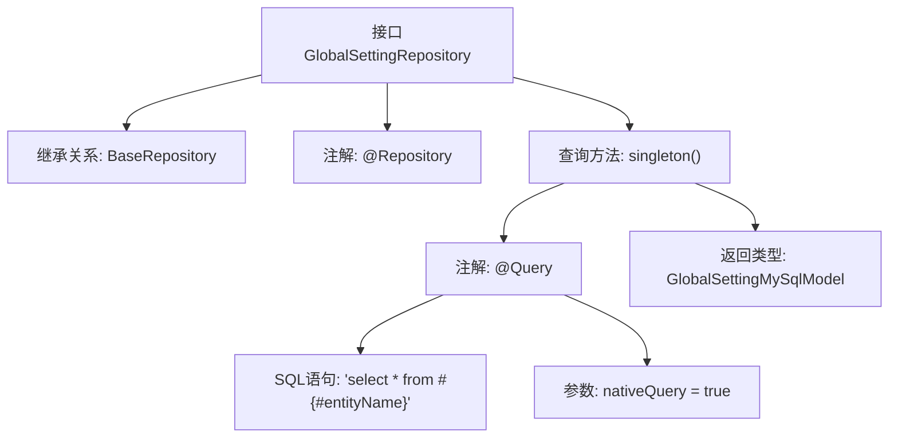

# 基础信息

|      |      |
|------|------|
| 名称 | GlobalSettingRepository |
| 编码语言 | .java |
| 代码路径 | WeFe/fusion/fusion-service/src/main/java/com/welab/wefe/data/fusion/service/database/repository/GlobalSettingRepository.java |
| 包名 | com.welab.wefe.data.fusion.service.database.repository |
| 依赖项 | ['com.welab.wefe.data.fusion.service.database.entity.GlobalSettingMySqlModel', 'com.welab.wefe.data.fusion.service.database.repository.base.BaseRepository', 'org.springframework.data.jpa.repository.Query', 'org.springframework.stereotype.Repository'] |
| 概述说明 | GlobalSettingRepository接口继承BaseRepository，提供单条查询方法singleton，使用原生SQL查询所有字段。 |

# 说明

这是一个名为GlobalSettingRepository的Spring Data JPA仓库接口，继承自BaseRepository基类。该接口操作GlobalSettingMySqlModel实体类，主键类型为String。接口中定义了一个名为singleton的查询方法，使用@Query注解指定原生SQL查询语句，查询#{#entityName}所代表的实体对应的所有数据表记录。该方法返回单个GlobalSettingMySqlModel对象，用于执行单条记录查询操作。

# 类列表 Class Summary

| 名称   | 类型  | 说明 |
|-------|------|-------------|
| GlobalSettingRepository | interface | 这是一个Spring Data JPA的Repository接口，定义了对GlobalSettingMySqlModel的单表查询方法singleton()，使用原生SQL查询所有记录。 |


## 类 GlobalSettingRepository

|      |      |
|------|------|
| 访问范围 | @Repository;public |
| 类型 | interface |
| 名称 | GlobalSettingRepository |
| 说明 | 这是一个Spring Data JPA的Repository接口，定义了对GlobalSettingMySqlModel的单表查询方法singleton()，使用原生SQL查询所有记录。 |


### UML类图

```mermaid
classDiagram
    class BaseRepository~T, ID~ {
        <<Interface>>
    }

    class GlobalSettingRepository {
        <<Interface>>
        +GlobalSettingMySqlModel singleton()
    }
    
    class GlobalSettingMySqlModel {
    }

    BaseRepository <|-- GlobalSettingRepository  // 继承
    GlobalSettingRepository --> GlobalSettingMySqlModel : 查询返回
```

这段类图展示了Spring Data JPA中的仓库接口结构。GlobalSettingRepository接口继承自泛型接口BaseRepository，指定了实体类型GlobalSettingMySqlModel和主键类型String。该接口通过@Query注解定义了一个原生SQL查询方法singleton()，用于从数据库中检索单个全局设置记录。图中清晰呈现了接口继承关系和实体类型依赖，符合JPA仓库模式的典型设计。


### 内部方法调用关系图



这段流程图展示了Spring Data JPA中GlobalSettingRepository接口的结构。该接口通过@Repository注解声明为数据访问组件，并继承BaseRepository获得基础CRUD功能。核心是使用@Query注解定义的原生SQL查询方法singleton()，该方法执行"select * from #{#entityName}"查询并返回GlobalSettingMySqlModel实体。流程图清晰呈现了注解、继承关系与查询方法的层级调用关系，体现了JPA接口式编程的特点。

### 字段列表 Field List

| 名称  | 类型  | 说明 |
|-------|-------|------|

### 方法列表

| 名称  | 类型  | 说明 |
|-------|-------|------|
| singleton | GlobalSettingMySqlModel | 查询所有实体数据并返回单例GlobalSettingMySqlModel对象。 |


