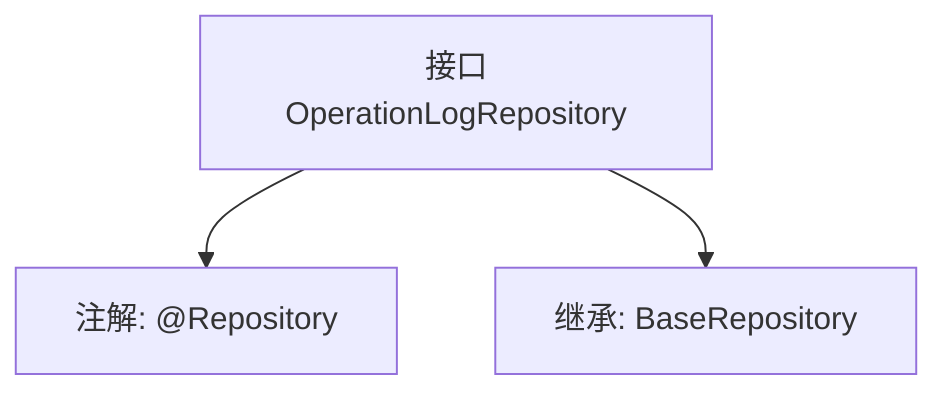

# 基础信息

|      |      |
|------|------|
| 名称 | OperationLogRepository |
| 编码语言 | .java |
| 代码路径 | WeFe/fusion/fusion-service/src/main/java/com/welab/wefe/data/fusion/service/database/repository/OperationLogRepository.java |
| 包名 | com.welab.wefe.data.fusion.service.database.repository |
| 依赖项 | ['com.welab.wefe.data.fusion.service.database.entity.OperationLogMysqlModel', 'com.welab.wefe.data.fusion.service.database.repository.base.BaseRepository', 'org.springframework.stereotype.Repository'] |
| 概述说明 | 操作日志仓库接口，继承基础仓库类，管理操作日志MySQL模型，主键类型为字符串。 |

# 说明

该代码片段定义了一个名为OperationLogRepository的Spring数据仓库接口，使用@Repository注解标识。该接口继承自BaseRepository泛型基类，指定了实体类型为OperationLogMysqlModel，主键类型为String。该接口主要用于操作日志数据在MySQL中的持久化访问，继承了基础CRUD操作能力。

# 类列表 Class Summary

| 名称   | 类型  | 说明 |
|-------|------|-------------|
| OperationLogRepository | interface | 这是一个操作日志的数据库仓库接口，继承自基础仓库类，用于操作日志的MySQL模型数据存储。 |


## 类 OperationLogRepository

|      |      |
|------|------|
| 访问范围 | @Repository;public |
| 类型 | interface |
| 名称 | OperationLogRepository |
| 说明 | 这是一个操作日志的数据库仓库接口，继承自基础仓库类，用于操作日志的MySQL模型数据存储。 |


### UML类图

```mermaid
classDiagram
    class OperationLogRepository {
        <<Interface>>
    }
    class BaseRepository~T, ID~ {
        <<Interface>>
    }
    
    OperationLogRepository --|> BaseRepository : 继承
    // OperationLogRepository 继承自泛型接口 BaseRepository，指定泛型参数为 OperationLogMysqlModel 和 String
```

这段类图展示了 OperationLogRepository 接口继承自泛型接口 BaseRepository 的关系。OperationLogRepository 是一个标记了 @Repository 的 Spring 数据访问层接口，它通过继承 BaseRepository 接口获得了基本的 CRUD 操作能力，其中泛型参数 T 被指定为 OperationLogMysqlModel 表示操作的实体类型，ID 被指定为 String 表示主键类型。这种设计遵循了 Spring Data JPA 的仓库模式，为操作日志提供了标准化的数据访问接口。


### 内部方法调用关系图



这段流程图描述了OperationLogRepository接口的结构关系。该接口被标记为Spring的@Repository组件，继承了BaseRepository泛型接口，指定了OperationLogMysqlModel作为实体类型，String作为主键类型。这种设计表明这是一个用于数据库操作的数据访问层组件，遵循了Spring Data的Repository模式，通过继承基础接口自动获得CRUD等基本操作能力。

### 字段列表 Field List

| 名称  | 类型  | 说明 |
|-------|-------|------|

### 方法列表

| 名称  | 类型  | 说明 |
|-------|-------|------|


