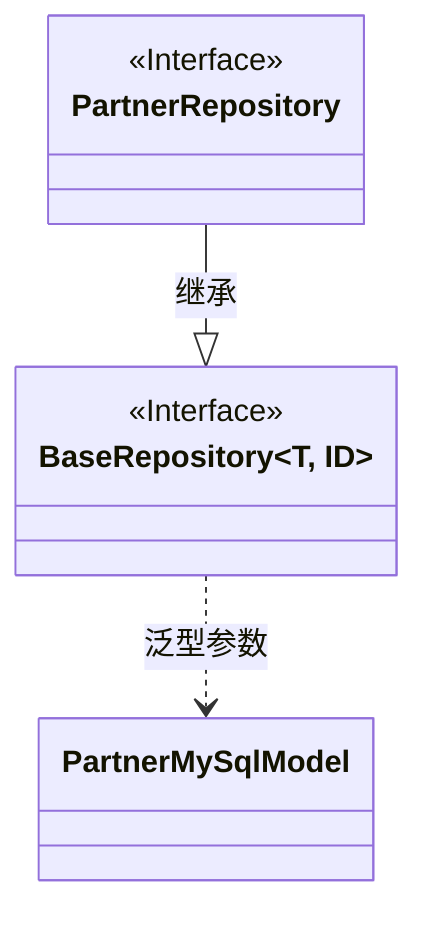
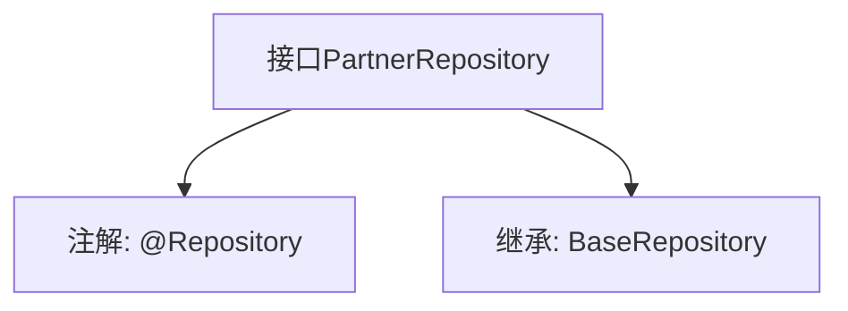

# 基础信息

|      |      |
|------|------|
| 名称 | PartnerRepository |
| 编码语言 | .java |
| 代码路径 | WeFe/fusion/fusion-service/src/main/java/com/welab/wefe/data/fusion/service/database/repository/PartnerRepository.java |
| 包名 | com.welab.wefe.data.fusion.service.database.repository |
| 依赖项 | ['com.welab.wefe.data.fusion.service.database.entity.PartnerMySqlModel', 'com.welab.wefe.data.fusion.service.database.repository.base.BaseRepository', 'org.springframework.stereotype.Repository'] |
| 概述说明 | PartnerRepository接口继承BaseRepository，用于操作PartnerMySqlModel数据，主键类型为String。 |

# 说明

这是一个名为PartnerRepository的Spring数据仓库接口，使用@Repository注解标记。它继承了BaseRepository泛型接口，指定了实体类型为PartnerMySqlModel，主键类型为String。该接口主要用于操作PartnerMySqlModel实体对应的数据库表，提供了基础的CRUD操作能力。通过继承BaseRepository，它获得了基本的数据库访问功能，无需手动实现常见的数据访问方法。

# 类列表 Class Summary

| 名称   | 类型  | 说明 |
|-------|------|-------------|
| PartnerRepository | interface | 合作伙伴仓库接口，继承基础仓库，操作PartnerMySqlModel类型数据，主键为String类型。 |

## 类 PartnerRepository

|      |      |
|------|------|
| 访问范围 | @Repository;public |
| 类型 | interface |
| 名称 | PartnerRepository |
| 说明 | 合作伙伴仓库接口，继承基础仓库，操作PartnerMySqlModel类型数据，主键为String类型。 |

### UML类图

这段类图展示了PartnerRepository接口继承自BaseRepository泛型接口的关系。BaseRepository是一个带有两个泛型参数(T和ID)的接口，其中T被具体化为PartnerMySqlModel实体类，ID类型为String。PartnerRepository作为数据访问层接口，通过继承BaseRepository获得了基础的CRUD操作能力，同时指定了操作的实体类型为PartnerMySqlModel，主键类型为String。这种设计遵循了Spring Data JPA的仓库模式，实现了对MySQL数据库中Partner数据的标准化访问。

### 内部方法调用关系图

该流程图展示了PartnerRepository接口的结构，它是一个带有@Repository注解的Spring组件，继承了泛型基类BaseRepository，指定了PartnerMySqlModel作为实体类型，String作为ID类型。这种设计模式常用于Spring Data JPA中，通过继承预定义的仓库接口来快速获得CRUD操作能力，同时保持类型安全性。

### 字段列表 Field List

| 名称  | 类型  | 说明 |
|-------|-------|------|

### 方法列表

| 名称  | 类型  | 说明 |
|-------|-------|------|

