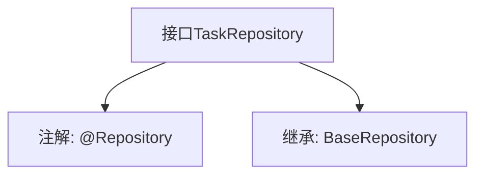

# 基础信息

|      |      |
|------|------|
| 名称 | TaskRepository |
| 编码语言 | .java |
| 代码路径 | WeFe/fusion/fusion-service/src/main/java/com/welab/wefe/data/fusion/service/database/repository/TaskRepository.java |
| 包名 | com.welab.wefe.data.fusion.service.database.repository |
| 依赖项 | ['com.welab.wefe.data.fusion.service.database.entity.TaskMySqlModel', 'com.welab.wefe.data.fusion.service.database.repository.base.BaseRepository', 'org.springframework.stereotype.Repository'] |
| 概述说明 | 这是一个Spring的TaskRepository接口，继承自BaseRepository，用于操作TaskMySqlModel类型的数据，主键类型为String。 |

# 说明

这是一个名为TaskRepository的Spring数据仓库接口，使用@Repository注解标记。它继承自BaseRepository泛型接口，指定了实体类型为TaskMySqlModel，主键类型为String。该接口主要用于数据库操作，但未定义额外方法，仅依赖基类提供的CRUD功能。

# 类列表 Class Summary

| 名称   | 类型  | 说明 |
|-------|------|-------------|
| TaskRepository | interface | 这是一个Spring的TaskRepository接口，继承自BaseRepository，用于操作TaskMySqlModel类型的数据，主键类型为String。 |


## 类 TaskRepository

|      |      |
|------|------|
| 访问范围 | @Repository;public |
| 类型 | interface |
| 名称 | TaskRepository |
| 说明 | 这是一个Spring的TaskRepository接口，继承自BaseRepository，用于操作TaskMySqlModel类型的数据，主键类型为String。 |


### UML类图

```mermaid
classDiagram
    class TaskRepository {
        <<Interface>>
    }
    class BaseRepository~T, ID~ {
        <<Interface>>
    }
    TaskRepository --|> BaseRepository : 继承
    // BaseRepository是泛型接口，TaskRepository继承并指定了泛型参数
```

这段类图展示了TaskRepository接口继承自BaseRepository泛型接口的关系。BaseRepository是一个带有两个泛型参数(T和ID)的接口，TaskRepository通过继承并指定具体类型参数(TaskMySqlModel和String)来实现特定数据访问功能。作为标记了@Repository的接口，它通常用于数据库操作，这里通过继承基础仓库接口获得了基本的CRUD操作能力。


### 内部方法调用关系图



这段代码定义了一个Spring Data JPA的仓库接口TaskRepository，通过@Repository注解标记为持久层组件。该接口继承了BaseRepository接口，指定了实体类型为TaskMySqlModel，主键类型为String。流程图展示了接口的注解和继承关系，体现了Spring Data JPA中简化数据库操作的典型设计模式。

### 字段列表 Field List

| 名称  | 类型  | 说明 |
|-------|-------|------|

### 方法列表

| 名称  | 类型  | 说明 |
|-------|-------|------|


