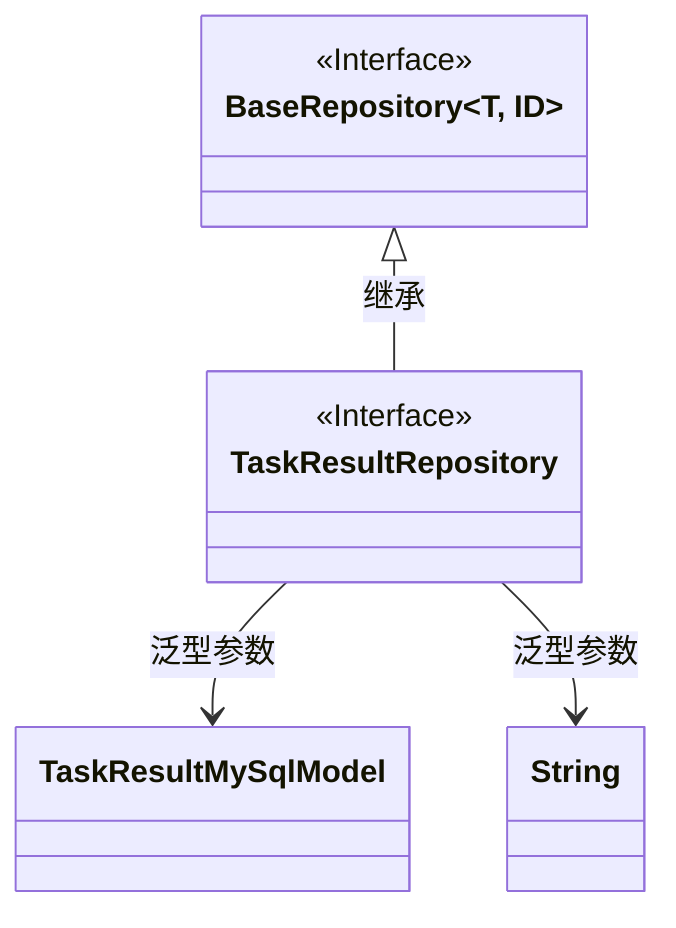
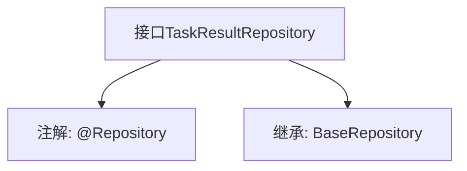

# 基础信息

|      |      |
|------|------|
| 名称 | TaskResultRepository |
| 编码语言 | .java |
| 代码路径 | WeFe/fusion/fusion-service/src/main/java/com/welab/wefe/data/fusion/service/database/repository/TaskResultRepository.java |
| 包名 | com.welab.wefe.data.fusion.service.database.repository |
| 依赖项 | ['com.welab.wefe.data.fusion.service.database.entity.TaskResultMySqlModel', 'com.welab.wefe.data.fusion.service.database.repository.base.BaseRepository', 'org.springframework.stereotype.Repository'] |
| 概述说明 | 任务结果仓库接口，继承基础仓库，操作任务结果MySQL模型，主键类型为字符串。 |

# 说明

该内容描述了一个名为TaskResultRepository的Spring Data JPA仓库接口。该接口使用@Repository注解标识为数据访问组件，继承自BaseRepository泛型基类，指定了实体类型为TaskResultMySqlModel，主键类型为String。这个接口主要用于对TaskResultMySqlModel实体进行数据库操作，继承了基类提供的通用CRUD操作方法。

# 类列表 Class Summary

| 名称   | 类型  | 说明 |
|-------|------|-------------|
| TaskResultRepository | interface | 这是一个Spring的TaskResultRepository接口，继承BaseRepository，用于操作TaskResultMySqlModel类型数据，主键为String类型。 |

## 类 TaskResultRepository

|      |      |
|------|------|
| 访问范围 | @Repository;public |
| 类型 | interface |
| 名称 | TaskResultRepository |
| 说明 | 这是一个Spring的TaskResultRepository接口，继承BaseRepository，用于操作TaskResultMySqlModel类型数据，主键为String类型。 |

### UML类图

这段类图展示了Spring Data JPA中的仓库接口继承关系。TaskResultRepository是一个标记了@Repository的接口，继承了泛型接口BaseRepository<TaskResultMySqlModel, String>，表明该仓库用于操作TaskResultMySqlModel类型实体，主键类型为String。BaseRepository作为基础仓库接口提供通用CRUD操作，而TaskResultRepository作为特定领域仓库接口可扩展自定义查询方法。

### 内部方法调用关系图

这段代码展示了一个Spring Data JPA的仓库接口定义。TaskResultRepository接口标记为@Repository，表明它是一个数据访问组件，并继承了BaseRepository接口，指定了实体类型TaskResultMySqlModel和主键类型String。该设计提供了对数据库表的基本CRUD操作能力，是典型的Spring Data JPA仓库模式实现。

### 字段列表 Field List

| 名称  | 类型  | 说明 |
|-------|-------|------|

### 方法列表

| 名称  | 类型  | 说明 |
|-------|-------|------|

