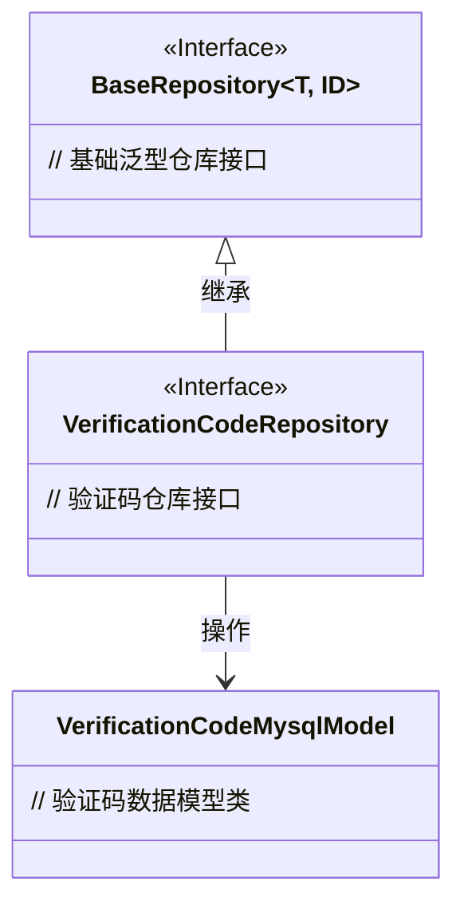
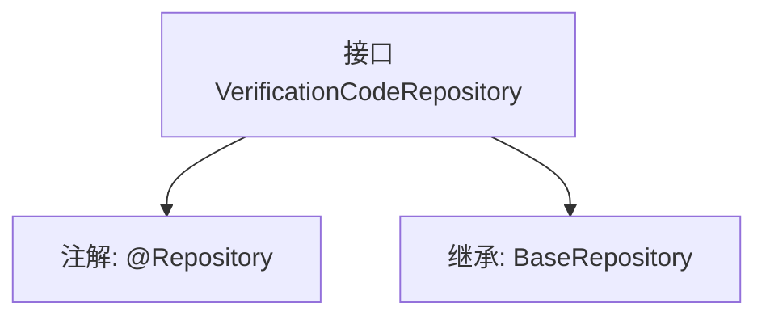

# 基础信息

|      |      |
|------|------|
| 名称 | VerificationCodeRepository |
| 编码语言 | .java |
| 代码路径 | WeFe/fusion/fusion-service/src/main/java/com/welab/wefe/data/fusion/service/database/repository/VerificationCodeRepository.java |
| 包名 | com.welab.wefe.data.fusion.service.database.repository |
| 依赖项 | ['com.welab.wefe.data.fusion.service.database.entity.VerificationCodeMysqlModel', 'com.welab.wefe.data.fusion.service.database.repository.base.BaseRepository', 'org.springframework.stereotype.Repository'] |
| 概述说明 | 这是一个验证码存储库接口，继承基础存储库，用于操作验证码的MySQL模型数据。 |

# 说明

该内容定义了一个名为VerificationCodeRepository的Spring数据仓库接口，使用@Repository注解标记为持久层组件。该接口继承自BaseRepository泛型基类，指定了实体类型为VerificationCodeMysqlModel，主键类型为String。这表明该仓库用于处理验证码数据的持久化操作，但未定义额外方法，仅依赖基类提供的标准CRUD功能。

# 类列表 Class Summary

| 名称   | 类型  | 说明 |
|-------|------|-------------|
| VerificationCodeRepository | interface | 这是一个验证码存储库接口，继承基础存储库，用于操作验证码的MySQL模型数据。 |

## 类 VerificationCodeRepository

|      |      |
|------|------|
| 访问范围 | @Repository;public |
| 类型 | interface |
| 名称 | VerificationCodeRepository |
| 说明 | 这是一个验证码存储库接口，继承基础存储库，用于操作验证码的MySQL模型数据。 |

### UML类图

这段类图展示了验证码存储的层级关系。VerificationCodeRepository接口继承自泛型接口BaseRepository，并指定泛型参数为VerificationCodeMysqlModel和String类型，表明该仓库用于操作验证码数据模型，主键类型为字符串。BaseRepository作为顶层抽象接口提供基础仓储能力，VerificationCodeRepository通过继承获得这些能力并专用于验证码领域。整个设计符合JPA仓库模式，实现了数据访问层的解耦。

### 内部方法调用关系图

这段代码定义了一个Spring Data JPA的仓库接口VerificationCodeRepository，通过@Repository注解将其标记为持久层组件。该接口继承了BaseRepository泛型接口，指定了实体类型为VerificationCodeMysqlModel，主键类型为String。这种设计提供了对验证码数据的CRUD操作基础支持，遵循了Spring Data的仓库模式规范。

### 字段列表 Field List

| 名称  | 类型  | 说明 |
|-------|-------|------|

### 方法列表

| 名称  | 类型  | 说明 |
|-------|-------|------|

