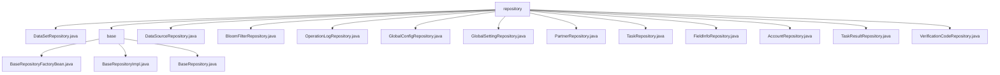

# 基础信息

|      |      |
|------|------|
| 名称 | repository |
| 编码语言 | .java |
| 代码路径 | WeFe/fusion/fusion-service/src/main/java/com/welab/wefe/data/fusion/service/database/repository |
| 包名 | docs.fusion.fusion-service.src.main.java.com.welab.wefe.data.fusion.service.database.repository |
| 概述说明 | 多个Spring Data JPA仓库接口继承BaseRepository，提供CRUD和自定义SQL查询功能，支持不同实体类型如DataSet、Account等。 |

# 说明

## 概述  
该模块是基于Spring Data JPA的通用仓库框架，核心职责是提供标准化数据访问能力及扩展原生SQL查询。接口规范统一继承BaseRepository基类，支持条件统计、字段更新及事务操作，例如通过@Query注解执行原生SQL（如countByName统计方法）。关键数据结构包括*MySqlModel系列实体（如DataSetMySqlModel、AccountMysqlModel等）及String类型主键。外部依赖集中于Spring Data JPA和Hibernate。例如AccountRepository通过@Modifying实现带事务的账户状态更新。

## 主要业务场景  
模块适用于多实体CRUD与复杂查询场景，类似增强型JPA模板。典型流程为：继承BaseRepository获得基础能力→通过@Query扩展自定义SQL→组合事务操作（如AccountRepository禁用闲置账户）。交互模式包含：1）按字段查询（如GlobalConfigRepository.findByGroup）；2）原生SQL统计（如DataSetRepository.countByName）；3）单记录操作（如GlobalSettingRepository.singleton）。集成案例覆盖日志、伙伴管理等多领域，例如PartnerRepository直接复用基类CRUD。

### 包内部结构视图

该流程图展示了数据融合服务中数据库仓库(repository)的层级结构。顶层为repository目录，包含多个具体的仓库实现类(如DataSetRepository.java)和一个base子目录。base目录下包含基础的仓库工厂类(BaseRepositoryFactoryBean.java)和基础仓库实现类(BaseRepositoryImpl.java, BaseRepository.java)。整体结构清晰，体现了代码的组织层次。

# 文件列表

| 名称   | 类型  | 说明 |
|-------|------|-------------|
| [DataSetRepository.java](DataSetRepository.md) | file | DataSetRepository接口扩展BaseRepository，提供两个原生SQL查询方法：按名称统计记录数，以及按名称和ID（排除指定ID）统计记录数。 |
| [DataSourceRepository.java](DataSourceRepository.md) | file | DataSourceRepository接口继承BaseRepository，提供按名称统计数量的方法countByName，使用原生SQL查询。 |
| [BloomFilterRepository.java](BloomFilterRepository.md) | file | 这是一个Spring Data JPA仓库接口，继承基础仓库，用于操作布隆过滤器的MySQL模型数据。 |
| [OperationLogRepository.java](OperationLogRepository.md) | file | 操作日志仓库接口，继承基础仓库类，管理操作日志MySQL模型，主键类型为字符串。 |
| [GlobalConfigRepository.java](GlobalConfigRepository.md) | file | 这是一个Spring的Repository接口，继承BaseRepository，用于操作GlobalConfigMysqlModel数据，提供按group字段查询的功能。 |
| [GlobalSettingRepository.java](GlobalSettingRepository.md) | file | GlobalSettingRepository接口继承BaseRepository，提供单条查询方法singleton，使用原生SQL查询所有字段。 |
| [PartnerRepository.java](PartnerRepository.md) | file | PartnerRepository接口继承BaseRepository，用于操作PartnerMySqlModel数据，主键类型为String。 |
| [TaskRepository.java](TaskRepository.md) | file | 这是一个Spring的TaskRepository接口，继承自BaseRepository，用于操作TaskMySqlModel类型的数据，主键类型为String。 |
| [FieldInfoRepository.java](FieldInfoRepository.md) | file | 这是一个Spring的仓库接口，继承基础仓库类，用于操作FieldInfoMySqlModel类型数据，主键为String类型。 |
| [AccountRepository.java](AccountRepository.md) | file | AccountRepository接口扩展BaseRepository，包含通过手机号查询账号、取消超级管理员权限、更新最后活动时间、禁用90天未活动账号及注销180天未活动账号的方法。 |
| [TaskResultRepository.java](TaskResultRepository.md) | file | 任务结果仓库接口，继承基础仓库，操作任务结果MySQL模型，主键类型为字符串。 |
| [VerificationCodeRepository.java](VerificationCodeRepository.md) | file | 这是一个验证码存储库接口，继承基础存储库，用于操作验证码的MySQL模型数据。 |
| [base](base/_module.md) | package | BaseRepositoryFactoryBean扩展JpaRepositoryFactoryBean，创建自定义JPA仓库实例。BaseRepositoryImpl继承SimpleJpaRepository，提供多种数据操作方法。BaseRepository接口扩展JpaRepository，定义通用数据操作功能。 |

