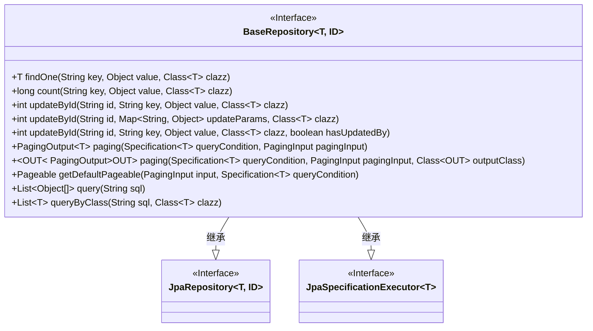

# 基础信息

|      |      |
|------|------|
| 名称 | BaseRepository |
| 编码语言 | .java |
| 代码路径 | WeFe/fusion/fusion-service/src/main/java/com/welab/wefe/data/fusion/service/database/repository/base/BaseRepository.java |
| 包名 | com.welab.wefe.data.fusion.service.database.repository.base |
| 依赖项 | ['com.welab.wefe.common.data.mysql.MySpecification', 'com.welab.wefe.data.fusion.service.dto.base.PagingInput', 'com.welab.wefe.data.fusion.service.dto.base.PagingOutput', 'org.springframework.data.domain.PageRequest', 'org.springframework.data.domain.Pageable', 'org.springframework.data.domain.Sort', 'org.springframework.data.jpa.domain.Specification', 'org.springframework.data.jpa.repository.JpaRepository', 'org.springframework.data.jpa.repository.JpaSpecificationExecutor', 'org.springframework.data.repository.NoRepositoryBean', 'org.springframework.lang.Nullable', 'org.springframework.transaction.annotation.Transactional', 'java.io.Serializable', 'java.util.List', 'java.util.Map'] |
| 概述说明 | BaseRepository接口扩展了JpaRepository和JpaSpecificationExecutor，提供自定义查询、更新、分页和原生SQL操作功能，支持按字段查询、统计、事务更新及分页转换。 |

# 说明

该接口定义了一个通用基础仓库接口，扩展了JpaRepository和JpaSpecificationExecutor，提供多种数据操作方法。包含按字段查询单条数据、统计数量、按ID更新单个或多个字段（支持事务回滚）、分页查询（支持POJO转DTO）、获取默认分页参数（支持自定义排序）以及基于原生SQL查询（返回数组或实体类）等功能。所有更新操作均添加了事务注解确保数据一致性。

# 类列表 Class Summary

| 名称   | 类型  | 说明 |
|-------|------|-------------|
| BaseRepository | interface | BaseRepository接口扩展JpaRepository和JpaSpecificationExecutor，提供按字段查询、计数、更新、分页查询及原生SQL查询等功能。 |

## 类 BaseRepository

|      |      |
|------|------|
| 访问范围 | @NoRepositoryBean;public |
| 类型 | interface |
| 名称 | BaseRepository |
| 说明 | BaseRepository接口扩展JpaRepository和JpaSpecificationExecutor，提供按字段查询、计数、更新、分页查询及原生SQL查询等功能。 |

### UML类图

该类图展示了一个泛型接口BaseRepository，它扩展了JpaRepository和JpaSpecificationExecutor接口，提供了丰富的数据库操作方法。接口包含查询单个实体、计数、更新、分页查询以及原生SQL查询等功能，其中分页查询支持泛型返回类型转换，更新操作支持事务回滚。通过继承关系，该接口整合了Spring Data JPA的核心功能，并扩展了业务常用操作。

### 内部方法调用关系图

```mermaid
graph TD
    A["接口BaseRepository<T, ID>"]
    B["继承: JpaRepository<T, ID>"]
    C["继承: JpaSpecificationExecutor<T>"]
    D["方法: T findOne(key,value,clazz)"]
    E["方法: long count(key,value,clazz)"]
    F["方法: int updateById(id,key,value,clazz)"]
    G["方法: int updateById(id,updateParams,clazz)"]
    H["方法: int updateById(id,key,value,clazz,hasUpdatedBy)"]
    I["方法: PagingOutput<T> paging(queryCondition,pagingInput)"]
    J["方法: PagingOutput<OUT> paging(queryCondition,pagingInput,outputClass)"]
    K["方法: Pageable getDefaultPageable(input,queryCondition)"]
    L["方法: List<Object[]> query(sql)"]
    M["方法: List<T> queryByClass(sql,clazz)"]

    A --> B
    A --> C
    A --> D
    A --> E
    A --> F
    A --> G
    A --> H
    A --> I
    A --> J
    A --> K
    A --> L
    A --> M
```

该流程图展示了BaseRepository接口的结构及其方法关系。作为JPA扩展接口，它继承了JpaRepository和JpaSpecificationExecutor的核心功能，并添加了12个自定义方法，包括条件查询(findOne/count)、更新操作(updateById)、分页查询(paging)、原生SQL查询(query)等。特别值得注意的是getDefaultPageable默认方法实现了分页排序逻辑，而多个重载的updateById方法提供了不同粒度的更新操作。所有事务方法均标注了@Transactional注解确保数据一致性。

### 字段列表 Field List

| 名称  | 类型  | 说明 |
|-------|-------|------|

### 方法列表

| 名称  | 类型  | 说明 |
|-------|-------|------|
| getDefaultPageable | Pageable | 方法根据输入参数生成分页请求，优先使用查询条件中的排序，若无则默认按createdTime降序排序。 |
| count | long | 方法用于统计指定键和值匹配的对象数量，返回长整型结果。 |
| updateById | int | 使用事务注解的方法，根据ID更新指定字段，异常时回滚。 |
| query | List<Object[]> | 该方法执行SQL查询并返回对象数组列表，每个数组代表一行查询结果。 |
| paging | PagingOutput<OUT> | 分页查询方法，接收查询条件、分页参数和输出类，返回分页结果。 |
| findOne | T | 根据键值查询指定类型的单个对象。 |
| paging | PagingOutput<T> | 分页查询方法，接收查询条件和分页参数，返回分页结果。 |
| updateById | int | 带事务的更新方法，异常时回滚。参数：ID、键、值、类类型、是否更新操作者标记。 |
| updateById | int | 带事务的更新方法，异常时回滚，根据ID和参数更新对象。 |
| queryByClass | List<T> | 查询数据库并返回指定类型的对象列表。参数为SQL语句和目标类。 |

