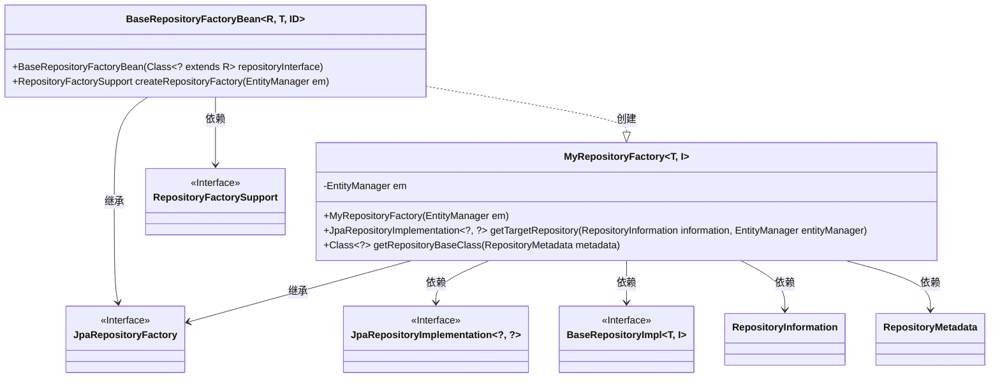
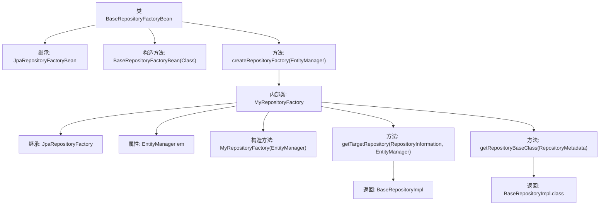

# 基础信息

|      |      |
|------|------|
| 名称 | BaseRepositoryFactoryBean |
| 编码语言 | .java |
| 代码路径 | WeFe/fusion/fusion-service/src/main/java/com/welab/wefe/data/fusion/service/database/repository/base/BaseRepositoryFactoryBean.java |
| 包名 | com.welab.wefe.data.fusion.service.database.repository.base |
| 依赖项 | ['org.springframework.data.jpa.repository.JpaRepository', 'org.springframework.data.jpa.repository.support.JpaRepositoryFactory', 'org.springframework.data.jpa.repository.support.JpaRepositoryFactoryBean', 'org.springframework.data.jpa.repository.support.JpaRepositoryImplementation', 'org.springframework.data.repository.core.RepositoryInformation', 'org.springframework.data.repository.core.RepositoryMetadata', 'org.springframework.data.repository.core.support.RepositoryFactorySupport', 'javax.persistence.EntityManager', 'java.io.Serializable'] |
| 概述说明 | BaseRepositoryFactoryBean扩展JpaRepositoryFactoryBean，自定义工厂创建BaseRepositoryImpl实例，用于特定JPA仓库实现。 |

# 说明

BaseRepositoryFactoryBean是一个扩展自JpaRepositoryFactoryBean的泛型类，用于创建自定义JPA仓库实例。它通过构造函数接收仓库接口类型，并重写了createRepositoryFactory方法以返回自定义的MyRepositoryFactory。MyRepositoryFactory内部类继承JpaRepositoryFactory，负责实例化具体的BaseRepositoryImpl实现类，并指定其为基础仓库类。整个过程围绕Spring Data JPA的仓库工厂机制展开，实现了对实体管理和仓库基础类的定制化处理。

# 类列表 Class Summary

| 名称   | 类型  | 说明 |
|-------|------|-------------|
| BaseRepositoryFactoryBean | class | 自定义JPA仓库工厂Bean，扩展JpaRepositoryFactoryBean，重写工厂创建逻辑，返回自定义BaseRepositoryImpl实现类。 |

## 类 BaseRepositoryFactoryBean

|      |      |
|------|------|
| 访问范围 | public |
| 类型 | class |
| 名称 | BaseRepositoryFactoryBean |
| 说明 | 自定义JPA仓库工厂Bean，扩展JpaRepositoryFactoryBean，重写工厂创建逻辑，返回自定义BaseRepositoryImpl实现类。 |

### UML类图

这段代码展示了一个基于Spring Data JPA的仓库工厂Bean实现。BaseRepositoryFactoryBean是一个泛型类，继承自JpaRepositoryFactoryBean，用于创建自定义的JPA仓库实例。它内部包含一个静态工厂类MyRepositoryFactory，负责实际创建BaseRepositoryImpl实例。类图清晰地展示了继承关系（BaseRepositoryFactoryBean→JpaRepositoryFactory）和依赖关系（如工厂类依赖EntityManager和各种JPA接口），体现了Spring Data JPA扩展点的典型实现方式。

### 内部方法调用关系图

这段代码展示了一个Spring Data JPA的工厂Bean实现，用于创建自定义的JPA仓库实例。流程图清晰地描述了类继承结构（BaseRepositoryFactoryBean继承JpaRepositoryFactoryBean）和内部类MyRepositoryFactory的组成，包括其构造方法、核心方法getTargetRepository（返回BaseRepositoryImpl实例）和getRepositoryBaseClass（返回BaseRepositoryImpl类对象）。该设计通过工厂模式扩展了Spring Data的标准仓库实现，允许注入自定义的EntityManager和仓库基础类。

### 字段列表 Field List

| 名称  | 类型  | 说明 |
|-------|-------|------|

### 方法列表

| 名称  | 类型  | 说明 |
|-------|-------|------|
| createRepositoryFactory | RepositoryFactorySupport | 代码重写父类方法，创建返回基于EntityManager的自定义仓库工厂实例。 |

