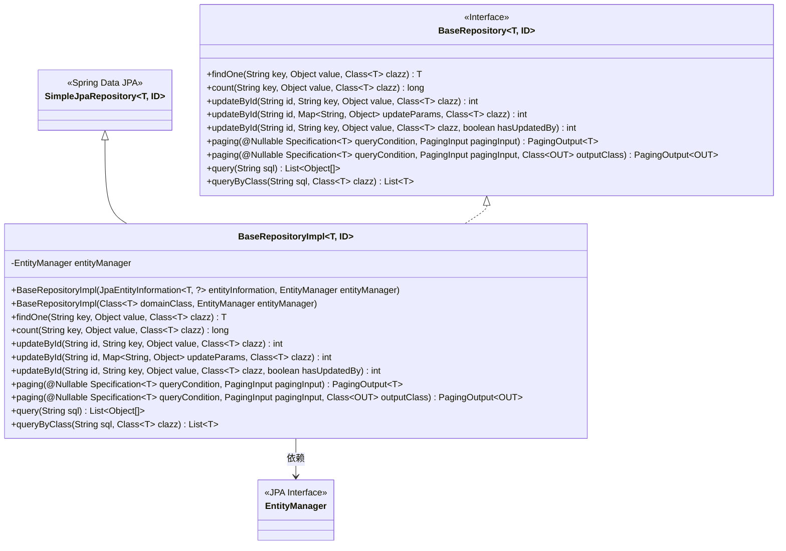

# 基础信息

|      |      |
|------|------|
| 名称 | BaseRepositoryImpl |
| 编码语言 | .java |
| 代码路径 | WeFe/fusion/fusion-service/src/main/java/com/welab/wefe/data/fusion/service/database/repository/base/BaseRepositoryImpl.java |
| 包名 | com.welab.wefe.data.fusion.service.database.repository.base |
| 依赖项 | ['com.welab.wefe.common.web.util.CurrentAccountUtil', 'com.welab.wefe.data.fusion.service.dto.base.PagingInput', 'com.welab.wefe.data.fusion.service.dto.base.PagingOutput', 'org.apache.commons.collections4.CollectionUtils', 'org.springframework.data.domain.Page', 'org.springframework.data.jpa.domain.Specification', 'org.springframework.data.jpa.repository.support.JpaEntityInformation', 'org.springframework.data.jpa.repository.support.SimpleJpaRepository', 'org.springframework.lang.Nullable', 'javax.persistence.EntityManager', 'javax.persistence.Query', 'javax.persistence.criteria.CriteriaBuilder', 'javax.persistence.criteria.CriteriaQuery', 'javax.persistence.criteria.CriteriaUpdate', 'javax.persistence.criteria.Root', 'java.io.Serializable', 'java.util.Date', 'java.util.List', 'java.util.Map'] |
| 概述说明 | BaseRepositoryImpl是JPA基础仓库实现类，提供通用CRUD操作，包括按条件查询、分页、更新及原生SQL执行功能。 |

# 说明

BaseRepositoryImpl是一个泛型JPA仓库实现类，继承SimpleJpaRepository并实现BaseRepository接口。它通过EntityManager提供多种数据操作方法：按条件查询单个实体、统计数量、根据ID更新单个或多个字段、带分页的查询以及执行原生SQL查询。更新操作会自动设置更新时间，并可选择是否设置更新人。分页查询支持直接返回实体或DTO转换。

# 类列表 Class Summary

| 名称   | 类型  | 说明 |
|-------|------|-------------|
| BaseRepositoryImpl | class | BaseRepositoryImpl是JPA通用仓库实现类，提供查询、更新、分页和原生SQL操作功能，支持按条件查找、计数、ID更新及分页查询。 |

## 类 BaseRepositoryImpl

|      |      |
|------|------|
| 访问范围 | public |
| 类型 | class |
| 名称 | BaseRepositoryImpl |
| 说明 | BaseRepositoryImpl是JPA通用仓库实现类，提供查询、更新、分页和原生SQL操作功能，支持按条件查找、计数、ID更新及分页查询。 |

### UML类图

该代码实现了一个基于Spring Data JPA的自定义仓库基类，通过泛型支持多种实体类型操作。类图显示BaseRepositoryImpl继承SimpleJpaRepository并实现BaseRepository接口，包含12个核心方法，主要提供动态条件查询、分页、批量更新和原生SQL执行能力。通过EntityManager实现JPA标准查询构造器操作，支持带审计字段的自动更新功能，体现了对JPA规范的高级封装和扩展能力。

### 内部方法调用关系图

```mermaid
graph TD
    A["类BaseRepositoryImpl<T, ID>"]
    B["属性: EntityManager entityManager"]
    C["构造方法1: BaseRepositoryImpl(JpaEntityInformation, EntityManager)"]
    D["构造方法2: BaseRepositoryImpl(Class<T>, EntityManager)"]
    E["方法: T findOne(String key, Object value, Class<T> clazz)"]
    F["方法: long count(String key, Object value, Class<T> clazz)"]
    G["方法: int updateById(String id, String key, Object value, Class<T> clazz)"]
    H["方法: int updateById(String id, Map<String, Object> updateParams, Class<T> clazz)"]
    I["方法: int updateById(String id, String key, Object value, Class<T> clazz, boolean hasUpdatedBy)"]
    J["方法: PagingOutput<T> paging(Specification<T>, PagingInput)"]
    K["方法: PagingOutput<OUT> paging(Specification<T>, PagingInput, Class<OUT>)"]
    L["方法: List<Object[]> query(String sql)"]
    M["方法: List<T> queryByClass(String sql, Class<T> clazz)"]

    A --> B
    A --> C
    A --> D
    A --> E
    A --> F
    A --> G
    A --> H
    A --> I
    A --> J
    A --> K
    A --> L
    A --> M
```

这段代码是一个基于Spring Data JPA的自定义仓库实现类，提供了对实体类的增删改查操作。流程图展示了类结构，包含两个构造方法和多个查询/更新方法。核心功能包括：通过条件查询单个实体(findOne)、统计符合条件记录数(count)、多种ID更新方式(updateById)、分页查询(paging)以及原生SQL查询(query/queryByClass)。所有操作都通过EntityManager实现，支持泛型和动态条件构建。

### 字段列表 Field List

| 名称  | 类型  | 说明 |
|-------|-------|------|
| entityManager | EntityManager | 私有不可变的实体管理器实例。 |

### 方法列表

| 名称  | 类型  | 说明 |
|-------|-------|------|
| updateById | int | 方法updateById通过JPA Criteria API更新指定ID的实体字段。若hasUpdatedBy为真，设置updatedBy为当前用户ID。同时更新指定key字段和updatedTime，最后执行更新操作并返回影响行数。 |
| updateById | int | 该方法通过ID更新实体指定字段值，同时自动设置更新时间和操作人，最后执行更新操作并返回影响行数。 |
| findOne | T | 该方法通过JPA Criteria API查询数据库，根据指定字段和值返回匹配的第一个实体对象，若无结果则返回null。 |
| paging | PagingOutput<T> | 该方法实现分页查询功能，接收查询条件和分页参数，返回分页结果。内部调用findAll获取数据，并封装总记录数和当前页数据返回。 |
| updateById | int | 该方法通过ID更新实体，使用CriteriaBuilder设置更新参数，自动更新修改时间和操作人ID，最后执行更新操作并返回影响行数。 |
| paging | PagingOutput<OUT> | 分页查询方法，根据条件获取分页数据并转换为指定输出类，返回总记录数和分页结果列表。 |
| query | List<Object[]> | Java方法：执行原生SQL查询并返回结果列表。 |
| count | long | 该方法使用JPA Criteria API统计满足条件的记录数，通过指定字段名和值构建查询条件，返回匹配的记录总数。 |
| queryByClass | List<T> | 该方法通过原生SQL查询数据库，返回指定类别的结果列表。使用实体管理器创建查询并执行，结果转换为泛型列表。 |

